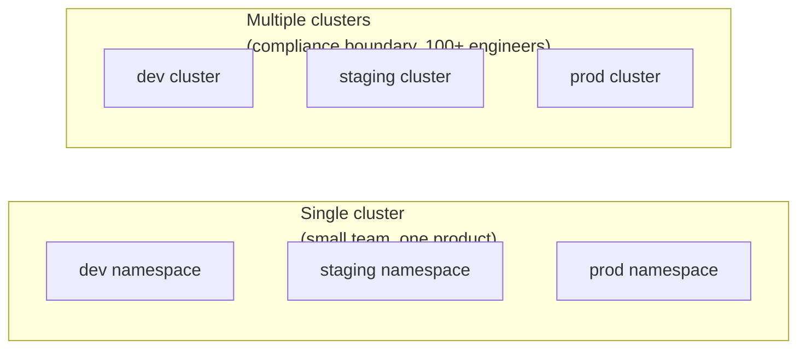
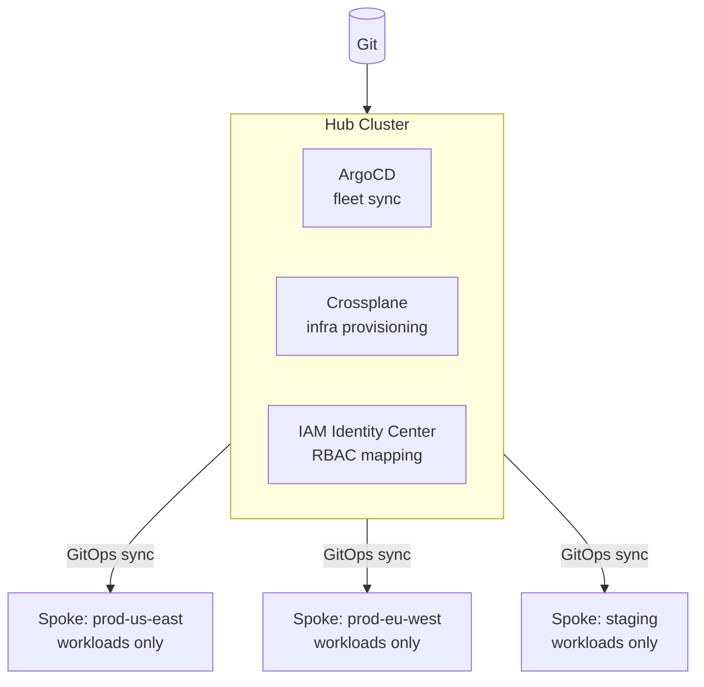
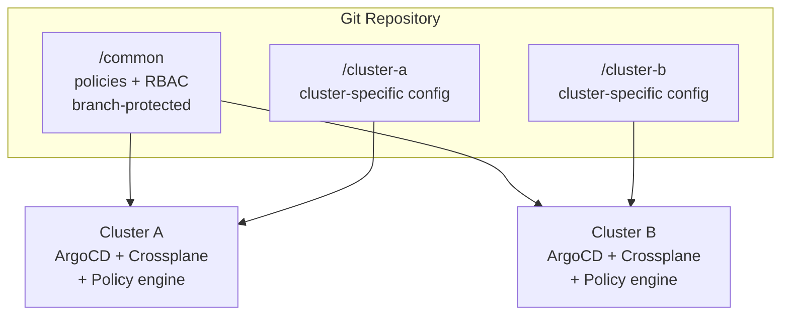

# Cluster Topology

## Single cluster vs multiple clusters

The number of clusters is driven by blast radius tolerance, compliance boundaries, and org size — not by technical preference.



| Trigger | Topology decision |
|---|---|
| Single team, single product | Single cluster per environment (dev/staging/prod) |
| Multiple teams, shared platform | Single cluster with namespace isolation until noisy-neighbor incidents appear |
| Compliance boundary (PCI, HIPAA, SOC2) | Separate cluster per compliance scope — namespace isolation is insufficient for auditors |
| 100+ engineers on shared cluster | Multiple clusters; deployment paralysis risk from shared control plane becomes real |
| Multi-region availability | Cluster per region minimum; see [../08-Multi-Cluster/](../08-Multi-Cluster/) |

**The noisy neighbor threshold**: A single cluster scales to ~100 engineers before namespace sprawl, ResourceQuota contention, and API server load from dense workloads cause visible platform degradation. At 100+ engineers, incident patterns shift from application failures to platform failures (API server latency, admission webhook timeouts, scheduler queue depth).

At 200+ engineers, multiple clusters become essential for policy enforcement consistency and cost attribution accuracy. Chargeback models break down when all teams share a single billing unit.

## Cluster per environment vs environment per namespace

Two common models:

**Cluster per environment (recommended for prod isolation)**:

- dev, staging, prod each have dedicated clusters
- Blast radius of a bad deployment or cluster misconfiguration is scoped to one environment
- Separate RBAC, separate IAM roles, separate audit log streams
- Higher cost: N×cluster_fee

**Namespace per environment (acceptable for dev/staging)**:

- dev and staging namespaces share a cluster
- Simpler to manage, lower cost
- Acceptable when dev/staging compromise doesn't threaten production
- Never acceptable for prod: a cluster-admin mistake in staging can reach production

The practical default: separate clusters for production, namespaces acceptable for lower environments.

## Hub-and-spoke management topology

A hub cluster runs management plane components (ArgoCD/Flux, Crossplane/ACK, policy engine) and manages a fleet of spoke workload clusters.



**Pros**:

- Single pane of glass: deployment status, policy compliance, and cost attribution visible in one place
- Simplified identity federation: IAM Identity Center groups mapped once at the hub, propagated to spokes
- Centralized secret distribution and certificate management

**Cons**:

- Hub is a SPOF for all deployment activity. Hub unavailability doesn't take down running workloads — pods keep running — but no new deployments, no scaling events triggered by GitOps, no automated remediation across the fleet
- Hub capacity must scale with fleet size: ArgoCD controller memory grows with number of managed resources

**Hub HA**: The hub cluster itself should be multi-AZ with multiple ArgoCD application controller replicas. A single-replica hub is operationally worse than a flat fleet.

## Flat fleet topology

Each cluster is self-contained: its own GitOps controllers, its own infrastructure controllers, its own policy enforcement.



**Pros**:

- Hub failure scope is limited: if the management infrastructure for cluster A fails, cluster B is unaffected
- Deployment continuity is independent per cluster
- Simpler mental model for cluster owners: "my cluster, my controllers"

**Cons**:

- Policy drift risk: ensuring consistent Gatekeeper/Kyverno policies across 20 independent clusters requires discipline
- Requires hierarchical Git structure: a `/common` directory with immutable policy catalogs that all clusters consume, enforced by Git branch protection
- Debugging "why did this cluster behave differently" is harder without a central view

**Flat fleet Git structure**:

```text
fleet-config/
├── common/          # All clusters must apply this — branch-protected
│   ├── policies/
│   ├── rbac/
│   └── namespaces/
├── cluster-prod-us-east-1/
├── cluster-prod-eu-west-1/
└── cluster-staging/
```

## Decision rule

Start with hub-and-spoke. It's operationally simpler and the right default for fleets under 20 clusters. Move to flat fleet when:

- Hub unavailability has caused production deployment failures (not just hub unavailability itself, but the downstream impact)
- The fleet is large enough that hub capacity becomes a scaling concern
- Cluster teams are mature enough to own local controllers without drifting from policy

See [../05-GitOps/](../05-GitOps/) for ArgoCD fleet patterns and app-of-apps implementation.
See [../08-Multi-Cluster/](../08-Multi-Cluster/) for workload federation and DR topology across clusters.
