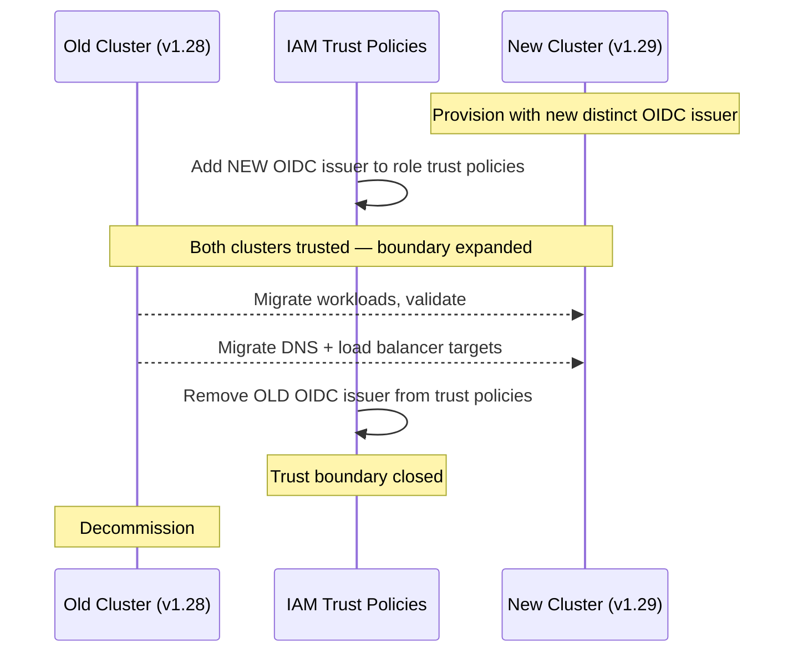
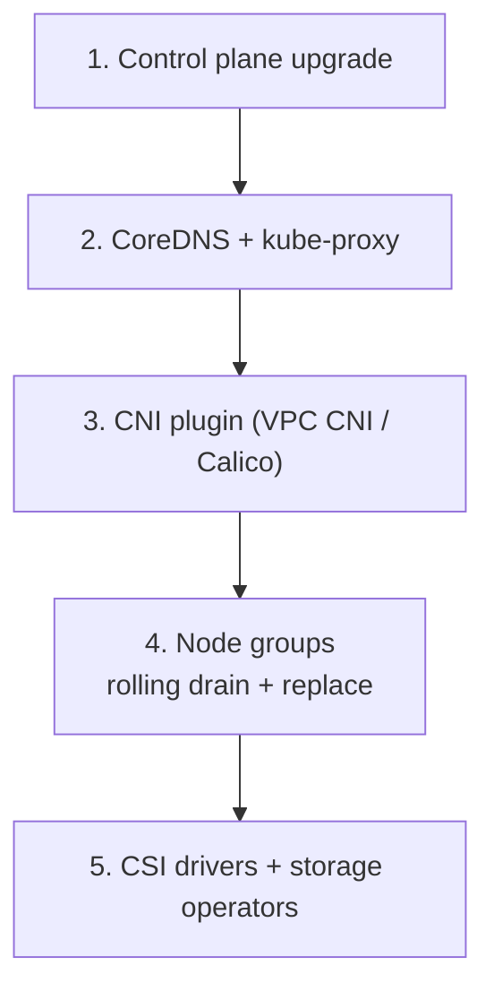

# Cluster Upgrade Strategy

## In-place rolling vs blue-green: the decision

| Factor | In-place rolling | Blue-green cluster replacement |
|---|---|---|
| Rollback | Difficult — forward-only once nodes are upgraded | Atomic — cut traffic back to old cluster |
| Configuration drift risk | High over 12–18 months | Eliminated — new cluster starts clean |
| Identity re-federation | Not required | Required — new OIDC issuer, new trust policies |
| DNS/LB migration | Not required | Required — external DNS and load balancer cutover |
| Resource cost during migration | Normal | 2× compute during migration window |
| Suitable for | Budget-constrained orgs, MNG-managed fleets | Mission-critical workloads, compliance-driven clean slate |

## In-place rolling upgrades

With Managed Node Groups, the upgrade process is: upgrade control plane version → upgrade node groups (provider-managed drain/replace cycle). The control plane upgrades first; nodes follow.

**Configuration drift**: Over multiple upgrade cycles, clusters accumulate state that deviates from the original provisioning templates. Admission webhook configurations, custom scheduler plugins, cluster-scoped resources, and mutating webhooks installed manually or by operators drift from the declared state. After 12–18 months of in-place upgrades, clusters often have undocumented deviations that only surface as failures during the next upgrade.

Mitigation: treat cluster configuration as code from day one. Every cluster-scoped resource (CRDs, ClusterRoles, ValidatingWebhookConfigurations) should exist in Git and be reconciled by GitOps. If it's not in Git, it will drift.

**Version skew**: The Kubernetes version skew policy (N-2 for nodes, N-3 for kubectl) means you cannot skip minor versions. Plan upgrades to happen at least annually to stay within the supported skew window. EKS typically supports 3 minor versions; clusters on end-of-life versions stop receiving security patches.

## Blue-green cluster replacement

Create a new cluster at the target version, migrate workloads, cut over DNS and load balancers, decommission the old cluster.

**The OIDC trust boundary risk**: If the new cluster is created with the same OIDC issuer URL as the old one (possible when using custom domain aliases with IRSA), any service account in the new cluster that presents a valid JWT for an existing role can assume that role — including service accounts that shouldn't have that access. This silently expands the trust boundary during the migration window.

**Safe practice**: New clusters should always have a new, distinct OIDC issuer URL. Update IAM role trust policies explicitly to include the new issuer. Never reuse the old issuer URL on a new cluster.

**Migration sequence for blue-green**:

1. Provision new cluster at target version with distinct OIDC issuer
2. Update IAM role trust policies to add new issuer (old issuer remains — parallel trust)
3. Deploy workloads to new cluster, validate with shadow traffic or synthetic probes
4. Migrate external DNS records (low TTL before cutover)
5. Migrate load balancer targets
6. Validate, then remove old cluster's trust from IAM policies
7. Decommission old cluster

Step 6 is often skipped. Don't skip it — it's the step that closes the expanded trust boundary.

## Upgrade sequencing for add-ons

Add-ons (CoreDNS, kube-proxy, VPC CNI, CSI drivers) have their own version compatibility matrices against the Kubernetes API version. Order matters:

1. Control plane upgrade
2. CoreDNS and kube-proxy (follow control plane version guidance)
3. VPC CNI / CNI plugin (version-specific to K8s version)
4. Node group upgrade (nodes must be ≤ control plane version)
5. CSI drivers and storage operators

Upgrading node groups before add-ons are at compatible versions causes silent failures. Test in a non-production cluster first; most managed services provide upgrade channels for add-ons that handle the compatibility matrix.

## Skew policy and upgrade cadence

Kubernetes releases 3 minor versions per year. EKS and most managed services support N-2 or N-3 concurrent minor versions. A cluster that falls 3 minor versions behind is on an unsupported version that no longer receives patches.

**Practical cadence**: upgrade every 6 months at minimum to avoid being forced into an emergency upgrade. Budget 2–4 hours per cluster for in-place rolling upgrades on managed node groups; 1–2 days for blue-green migrations including validation.

## Node upgrade automation

With Managed Node Groups, the upgrade UI/API triggers a rolling replacement: one node drained, new node launched, next node drained. The drain respects `PodDisruptionBudgets`. Workloads without a PDB will be force-deleted after the drain timeout.

Before any node upgrade: verify all production workloads have a `PodDisruptionBudget` configured. A PDB with `minAvailable: 1` is the minimum — it prevents the upgrader from draining all replicas simultaneously.

See [../02-Multi-Tenancy/](../02-Multi-Tenancy/) for PDB enforcement as a platform policy.
