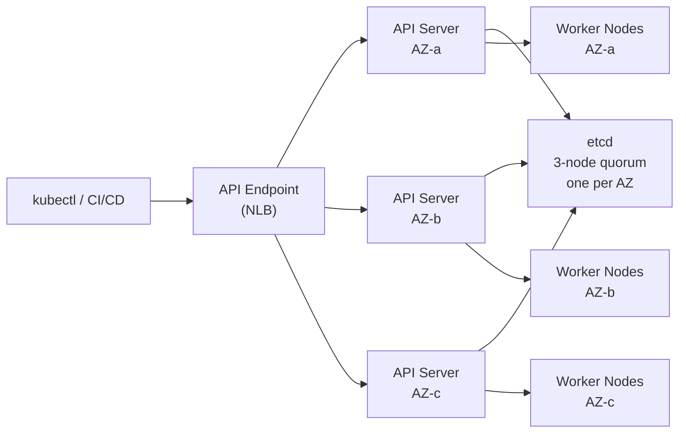
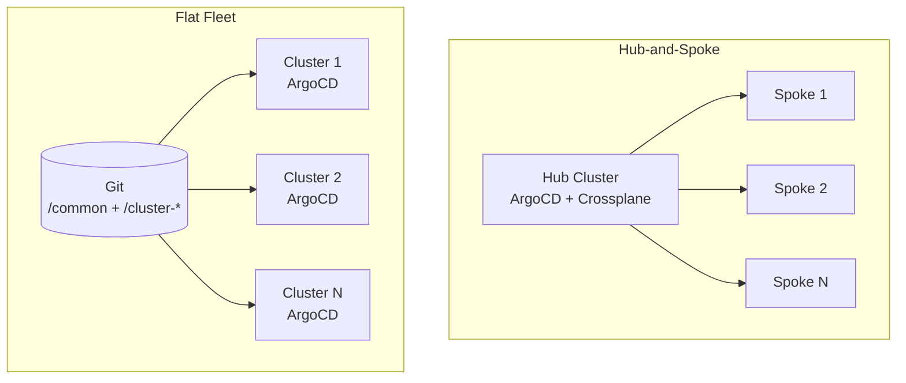

# Control Plane High Availability

## What managed K8s actually gives you

On EKS, AKS, and GKE the control plane (API server + etcd) is deployed across at least three availability zones by the provider. You don't manage etcd quorum, etcd backups, or API server load balancing. That operational surface is gone.

What remains is designing around the constraints managed control planes impose.

## API server flag restrictions

Managed control planes run with settings you cannot change. EKS runs `--anonymous-auth=true` and exposes it. You cannot disable it.

**Mitigation:** Disable the public endpoint entirely and route all API traffic through a private VPC endpoint. If public access is required, restrict it to known CIDR ranges. Anonymous auth becomes a non-issue when the network boundary is enforced.

Other flags commonly unavailable: `--audit-log-*` destination configuration, `--admission-control` ordering, `--feature-gates` for alpha features. Audit logs go to provider-managed destinations (CloudWatch, Azure Monitor, Cloud Logging) — you configure retention and export, not the logging pipeline itself.

## etcd: what you actually need to know

With managed K8s, etcd is entirely provider-managed. The decisions that remain:

- **Backup strategy**: EKS does not provide user-triggered etcd snapshots. For disaster recovery, your source of truth is Git (GitOps) and infrastructure-as-code, not etcd snapshots. If you need point-in-time cluster state recovery, design for it at the application layer.
- **API server request volume**: etcd becomes a bottleneck at high object count and write rates. Watch for clusters running thousands of frequently-updated objects (high-frequency HPA scaling events, dense NetworkPolicy churn). Use `etcd_object_counts` and `apiserver_request_duration_seconds` to detect pressure before it causes cascading latency.

## Private vs public endpoint

| Configuration | Use case | Risk |
|---|---|---|
| Public endpoint only | Dev/test, small teams | API server exposed to internet; anonymous-auth concern |
| Public + private, CIDR-restricted | Most production | Reduces exposure; nodes use private, admins use VPN |
| Private endpoint only | Regulated workloads, zero-trust | Requires VPN or bastion for all API access; breaks cloud shell |

Private-only is the right default for production. The operational cost (VPN requirement for kubectl access) is worth it.

## Multi-AZ API server behavior

The API server sits behind an NLB (EKS) or equivalent. AZ failures are handled transparently. What breaks during AZ failure:

- Pods scheduled on nodes in the failed AZ lose kubelet contact; they enter `Unknown` state after `node-monitor-grace-period` (default 40s)
- New scheduling continues on healthy AZs
- etcd leader election may cause a brief (~seconds) API server unavailability if the leader was in the failed AZ

Design implication: `topologySpreadConstraints` on workloads, not just node anti-affinity. The API server surviving a zone failure doesn't help if all your replicas were in that zone.

## Hub-and-spoke vs flat fleet

This is a management topology decision, not a HA decision — but it directly determines the blast radius of a control plane incident.

**Hub-and-spoke**: A central cluster (the hub) runs GitOps controllers and manages spoke workload clusters. One ArgoCD/Flux instance handles fleet-wide sync.

- Single pane of glass for deployment status across the fleet
- Hub failure impairs all deployment activity across all spokes simultaneously
- Identity federation is simpler: IAM Identity Center groups map to hub RBAC, hub propagates permissions

**Flat fleet**: Each cluster runs its own GitOps and infrastructure controllers.

- Hub failure affects only hub-specific management tasks, not workload cluster deployments
- Harder to enforce consistent policy across dozens of independent controllers
- Requires a hierarchical Git structure: a `/common` directory as an immutable policy catalog that all clusters consume

**Decision rule**: Hub-and-spoke is the right default when the fleet is small (under ~20 clusters) and operational simplicity matters. Flat fleet is worth the overhead when deployment continuity during management plane failures is a hard requirement, or when fleet size makes a shared hub a scaling bottleneck.

See [cluster-topology.md](cluster-topology.md) for the multi-cluster decision and [../05-GitOps/](../05-GitOps/) for ArgoCD/Flux fleet patterns.
