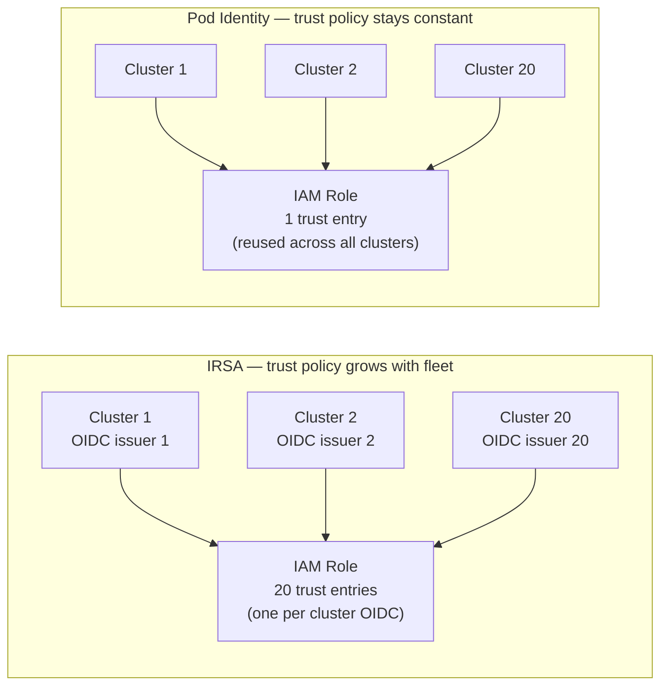

# Managed vs Self-Managed Kubernetes

## The cost physics framing

The visible cost of managed Kubernetes (EKS: $0.10/hr per cluster, GKE: $0.10/hr, AKS: free control plane) overstates the real cost comparison. The invisible cost is senior engineer hours spent on control plane operations: etcd backup/restore procedures, API server upgrade runbooks, certificate rotation, kubeadm version skew management, and incident response when any of these fail.

For most organizations, managed Kubernetes is cheaper in total. The exception is organizations with specific compliance requirements that mandate full infrastructure control, or those at a scale where cloud provider pricing becomes the dominant cost line.

## Comparison

| Dimension | Managed (EKS / AKS / GKE) | Self-Managed |
|---|---|---|
| Control plane operations | Provider-managed: HA, patching, etcd | Team-owned: etcd quorum, upgrade runbooks, cert rotation |
| Upgrade complexity | API-driven node group rolling upgrades | kubeadm upgrade, version skew management |
| Identity scalability | High: EKS Pod Identity reuses IAM roles across clusters without per-cluster OIDC federation | Moderate: manual OIDC federation required per cluster |
| API server control | Restricted: some flags unchangeable | Full: every flag, feature gate, admission controller |
| Cloud service integration | Native: IAM, LB controllers, CSI drivers maintained by provider | Manual: self-maintain or use community operators |
| Networking options | Provider CNI (VPC-native) + bring-your-own | Full choice, full responsibility |
| Audit log destination | Provider-managed pipeline (CloudWatch, Azure Monitor) | Full control |
| Cost model | Higher visible (cluster fee), lower hidden (ops time) | Lower visible, higher hidden |

## When self-managed makes sense

- **Regulatory air-gap**: Workloads that cannot run on cloud-provider infrastructure (classified environments, specific sovereign cloud requirements)
- **Hyperscaler economics**: Organizations where compute cost dwarfs operational cost and cloud markup on managed services is material
- **Non-cloud infrastructure**: On-premises or edge environments where managed services aren't available (use kubeadm, k3s, or RKE2)
- **Feature gate requirements**: Workloads needing alpha features or specific API server flags not exposed by managed services

Self-managed at scale requires dedicated platform engineers who own the full Kubernetes lifecycle. Budget for it explicitly — this isn't a part-time responsibility.

## Identity scalability: the underweighted factor

At fleet scale (10+ clusters), identity management becomes the operational bottleneck.

**IRSA (IAM Roles for Service Accounts)**: Each cluster has its own OIDC issuer. Every IAM role that a workload needs must trust that specific OIDC issuer URL. For 20 clusters running the same workload, each IAM role has 20 trust policy entries. Adding a cluster means updating every role the workload uses.

**EKS Pod Identity**: Roles are reused across clusters without modifying trust policies. The association is cluster-local, not IAM-side. Adding a cluster doesn't touch any IAM role.

This is a concrete operational multiplier. At small fleet sizes it's manageable. At 50+ clusters it becomes a primary driver toward managed Kubernetes with Pod Identity.

## Cloud service integration depth

Managed Kubernetes provides first-party controllers for cloud primitives:
- AWS Load Balancer Controller (ALB/NLB provisioning from Ingress/Service)
- EBS/EFS CSI drivers (maintained by AWS, tested against EKS versions)
- Azure Disk/File CSI (AKS-maintained)
- GKE Workload Identity (native SA → GSA binding)

On self-managed clusters these integrations exist as community or vendor-maintained operators. They work, but you own the version compatibility matrix, upgrade timing, and incident response when a cloud API change breaks the operator.

## The forensic visibility gap

In zero-trust architectures using service meshes (Istio, Cilium), transparent mTLS and eBPF-level policy enforcement can blind traditional network tap tools. Managed platforms aggregate some of this via flow logs and audit logs, but kernel-level policy decision flows (eBPF verdict logs) require explicit configuration to export to centralized logging.

This is a production readiness requirement that's easy to miss: verify that your security operations team can reconstruct network-layer decisions post-incident before deploying service mesh in managed environments. See [../04-Security/](../04-Security/) and [../07-Observability/](../07-Observability/).

## Organization size thresholds

Under 50 engineers: managed Kubernetes is correct, but building a full internal developer platform (IDP) on top of it may add more overhead than it removes. Start with a thin platform layer.

100+ engineers: a shared cluster without platform abstractions creates support ticket bottlenecks and onboarding delays. Managed Kubernetes substrate plus golden path templates become essential.

200+ engineers: multiple clusters with consistent policy enforcement and cost attribution. Self-managed at this scale requires a dedicated platform team of 4–6 engineers minimum to maintain safely.
