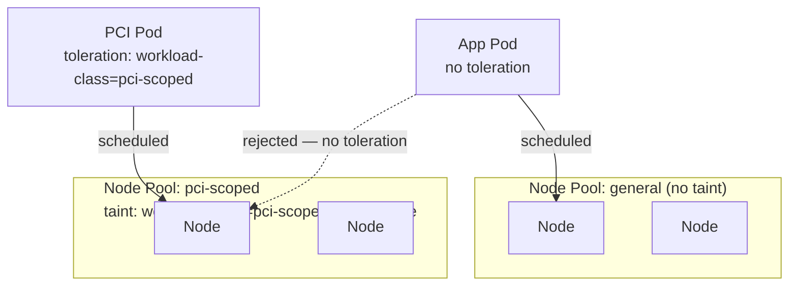
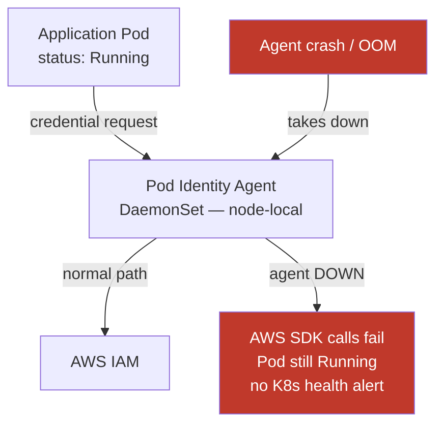

# Node Pool Design

## Automation level: Managed Node Groups vs Auto Mode

**Managed Node Groups (MNG)**: AWS provisions EC2 instances into a node group you define. You specify instance type, AMI, scaling bounds. AWS handles launch template management, draining during upgrades, and ASG integration.

**EKS Auto Mode**: Fully automated compute management. The cluster sizes nodes dynamically based on pending pod requirements — you don't define node groups. Auto Mode handles instance selection, binpacking, and lifecycle.

| Decision factor | Managed Node Groups | EKS Auto Mode |
|---|---|---|
| Instance type control | You specify per node group | Auto Mode selects; you set constraints via NodePool |
| Compliance (specific instance families) | Direct control | Constrain via `NodePool` resource |
| Workload-specific tuning (huge pages, NVME) | Full control via launch template | Limited |
| Operational overhead | Moderate (group management, scaling config) | Low |
| Karpenter integration | Optional, parallel | Auto Mode uses Karpenter internally |

Use Auto Mode when operational simplicity is the priority and workloads don't require specific instance-level configuration. Use MNG when you need deterministic instance types (regulated environments, GPU workloads, hardware-specific requirements).

## Workload isolation via dedicated node pools

The default multi-tenant pattern — namespace isolation + RBAC — shares node compute. For hard isolation requirements (compliance boundaries, egress security, noisy-neighbor prevention), dedicate node pools to specific tenants or workload classes.

**Pattern**: Apply a taint to the node group, require a matching toleration on the workload.

```yaml
# Node group taint (applied via launch template userdata or MNG taint config)
taints:
  - key: workload-class
    value: pci-scoped
    effect: NoSchedule
```

```yaml
# Pod spec toleration
tolerations:
  - key: workload-class
    operator: Equal
    value: pci-scoped
    effect: NoSchedule
```

Combined with `nodeSelector` or `nodeAffinity`, this guarantees pods only run on designated nodes. Taint alone doesn't prevent pods with the toleration from running elsewhere — add `nodeAffinity` with `requiredDuringSchedulingIgnoredDuringExecution` to enforce node binding.

**Network isolation use case**: When using VPC subnet CIDRs as source identity for on-premises firewall rules, dedicated node pools ensure workloads from a specific tenant are always on nodes in predictable subnets. Traffic from those subnets is the firewall identity.



## Instance selection for regulated workloads

**Nitro-based instances** (M5n, R5n, C5n, and most current-gen types) provide automatic hardware-level encryption for traffic between instances — no application-layer overhead. For regulated industries where in-transit encryption is mandated, selecting Nitro instances satisfies the requirement without a service mesh.

Instance selection checklist for production node pools:
- Nitro for encryption-at-transit requirements
- Memory-optimized (R-series) for JVM workloads or in-memory caches
- Compute-optimized (C-series) for CPU-bound services
- Spot instances only for fault-tolerant, stateless workloads — never for anything with local state or strict availability SLOs

## Pod Identity failure domain

EKS Pod Identity works via a node-local DaemonSet agent. When a pod needs AWS credentials, it calls the agent on its node — not a central service.

**Failure mode**: If the Pod Identity agent DaemonSet fails on a specific node (crash loop, OOM, node-local resource exhaustion), all pods on that node silently lose AWS IAM access. The pod continues running; AWS SDK calls fail with auth errors. This is not surfaced as a pod health issue unless you have explicit application-level health checks on AWS API availability.

**Mitigations**:
- Liveness and readiness probes on the Pod Identity agent DaemonSet — configure aggressive restart thresholds
- Automated node draining triggered by agent health failures
- Application-level metrics on AWS SDK call failure rates, not just pod status



This is distinct from IRSA (IAM Roles for Service Accounts), which uses the API server and OIDC — a different failure mode. See [../11-Cloud-Specific/](../11-Cloud-Specific/) for EKS identity model comparison.

## Multi-AZ node pool placement

Spread node groups across all AZs in the region. For stateful workloads, keep node groups zone-specific to avoid cross-AZ PV reattachment latency and cost.

Cluster Autoscaler has AZ-awareness built in but can balance unevenly under certain scaling patterns. Karpenter handles multi-AZ binpacking more predictably. See [../06-Autoscaling/](../06-Autoscaling/) for the Karpenter vs Cluster Autoscaler decision.
