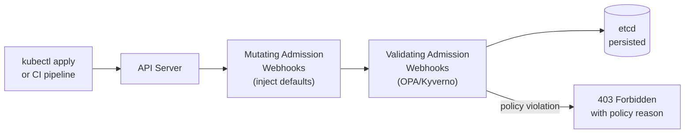
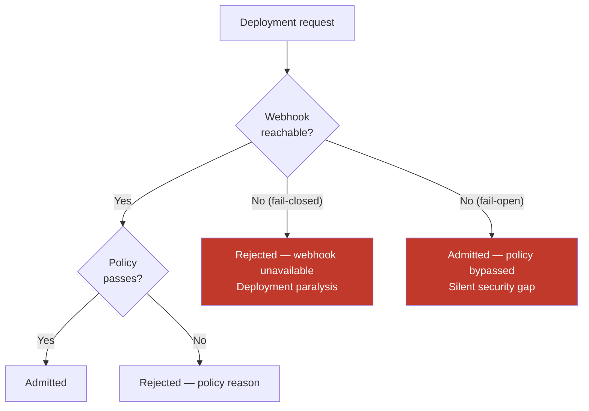

# Admission Control and Policy Enforcement

## What admission control gives you

Admission webhooks intercept API server requests before resources are persisted to etcd. They're the enforcement layer that makes platform policies real — not aspirational documentation, but hard rejections at deploy time.

Without admission control, tenants can deploy non-compliant images, create pods without resource limits, or bypass naming conventions. Policy-as-code via OPA/Gatekeeper or Kyverno enforces standards automatically.



## OPA/Gatekeeper vs Kyverno

Both are production-grade. The decision is operational, not functional.

| Dimension | OPA / Gatekeeper | Kyverno |
|---|---|---|
| Policy language | Rego (purpose-built, expressive, steep learning curve) | YAML (Kubernetes-native, lower barrier) |
| Mutation support | Limited | First-class |
| Audit mode | Yes (scan existing resources) | Yes |
| Generate policies (create resources on match) | No | Yes |
| Ecosystem maturity | Older, larger community | Growing rapidly, Kubernetes-native feel |
| Complexity ceiling | Higher (Rego handles complex logic) | YAML complexity grows with edge cases |

**Decision rule**: Choose Kyverno if your team is Kubernetes-native and wants policies that look like Kubernetes manifests. Choose Gatekeeper if you need complex policy logic or already have Rego expertise from OPA in other systems (API gateways, Terraform).

## Fail-open vs fail-closed

This is the most operationally consequential decision in webhook configuration.

**Fail-closed** (`failurePolicy: Fail`): If the admission webhook is unreachable, the API server rejects the request. No deployments can proceed.

**Fail-open** (`failurePolicy: Ignore`): If the webhook is unreachable, the API server allows the request through. Policy is bypassed silently.



**Production answer**: Fail-closed for security-critical policies (image registry enforcement, privilege escalation checks). Fail-open is not acceptable for security policies — it creates a window where non-compliant workloads land undetected.

Mitigating fail-closed deployment paralysis:
- Run admission webhook pods with `replicas: 3` and a PodDisruptionBudget (`minAvailable: 2`)
- Spread across AZs with `topologySpreadConstraints`
- Set aggressive but reasonable timeouts (`timeoutSeconds: 5`)
- Monitor webhook availability and latency as a platform SLO — treat it like a core infrastructure component

## Policy scope: what to enforce

Not everything belongs in an admission webhook. Heavy policy evaluation in the critical path increases admission latency.

**High-value, always enforce:**
- Image registry allowlist (block images not from approved registries)
- No `latest` tag (require digest-pinned or semver-tagged images)
- Resource requests/limits required (block pods without `resources` set)
- No `privileged: true` containers
- No `hostNetwork: true` or `hostPID: true` without explicit annotation

**Medium-value, enforce in production namespaces:**
- Naming conventions (namespace labels, resource annotations)
- Required labels for cost attribution (`cost-center`, `team`, `env`)
- S3 bucket naming: must start with `<tenant-id>-`

**Don't enforce via admission webhook:**
- Best-practice recommendations (high noise, low signal)
- Anything that requires external API calls in the validation path (slow, brittle)

## Audit mode: enforcing on existing resources

Gatekeeper and Kyverno both support audit mode: scan existing cluster resources against policies without blocking new ones. Use audit mode to:
1. Assess policy impact before switching to enforcement mode
2. Detect configuration drift on resources created before the policy existed
3. Generate compliance reports without blocking deployments

Run audit scans on a schedule and alert on violations. Audit without enforcement is not security — it's visibility.

## Cross-account provisioning for high-security tenants

For tenants with dedicated AWS accounts, ACK (AWS Controllers for Kubernetes) can provision cloud resources cross-account from the platform hub cluster.

```yaml
apiVersion: s3.services.k8s.aws/v1alpha1
kind: Bucket
metadata:
  name: payments-data
  annotations:
    # assume this role in the tenant's AWS account
    services.k8s.aws/role-arn: arn:aws:iam::TENANT_ACCOUNT:role/ack-s3-controller
spec:
  name: payments-data-prod
```

The hub cluster's ACK controller assumes the tenant's IAM role and provisions the bucket in the tenant's account. The platform team manages the CRD; the tenant's AWS account owns the resource. Use `IAMRoleSelectors` to enforce which namespaces can assume which cross-account roles.

See [network-policy-isolation.md](network-policy-isolation.md) for NetworkPolicy enforcement as a complement to admission control.
See [../04-Security/](../04-Security/) for RBAC design and Pod Security Admission, which layered with admission webhooks completes the security model.
