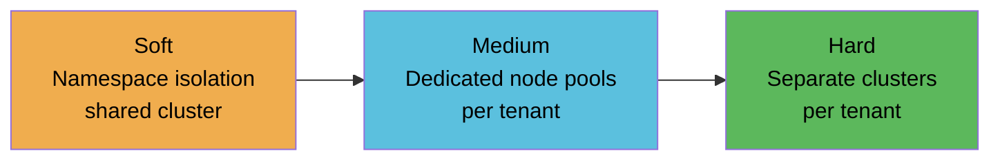
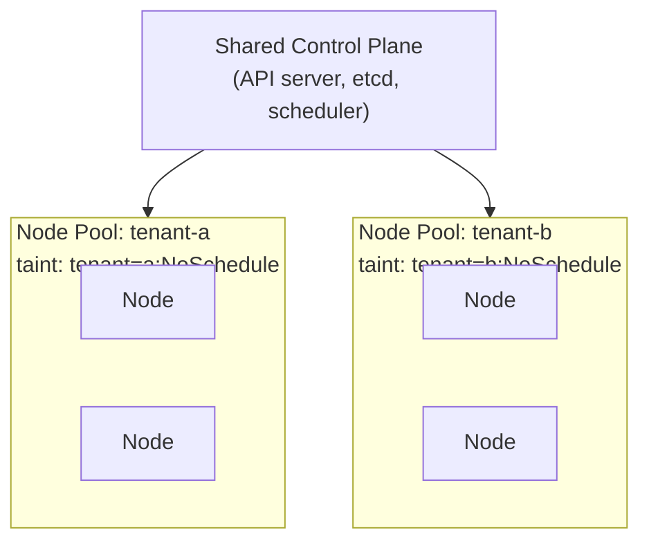

# Namespace Isolation Models

## The isolation spectrum

Kubernetes multi-tenancy sits on a spectrum. The choice of where to land is driven by compliance requirements, org size, and blast radius tolerance — not by technical preference.

## Soft multi-tenancy: namespace isolation

Tenants share the cluster control plane, data plane, and often node compute. Isolation is enforced via RBAC, ResourceQuotas, NetworkPolicy, and Pod Security Admission.

**When it works:**
- Up to ~100 engineers on the platform
- Internal teams with a common trust baseline (employees, not external customers)
- Fast onboarding is a priority

**Where it breaks down:**
- Namespace RBAC doesn't prevent API server-level abuse (e.g., listing secrets in other namespaces via a misconfigured ClusterRole)
- A noisy-neighbor workload can saturate shared node resources despite quotas if LimitRanges aren't tuned
- A shared GitOps controller failure creates **deployment paralysis** — every tenant is blocked simultaneously
- Forensic visibility gap: eBPF/mTLS enforcement can blind traditional network tap tools, making incident reconstruction harder across tenant boundaries

## Hard multi-tenancy: separate clusters

Each tenant (or tenant group) gets a dedicated cluster. The data plane is physically isolated; a compromise in one cluster cannot propagate to another.

**When it's required:**
- Regulated workloads (HIPAA, PCI-DSS, SOC 2 Type II) where auditors require data plane separation
- 200+ engineers where namespace sprawl and policy drift become unmanageable
- External-facing tenants (SaaS product serving end customers) — a shared cluster is generally not acceptable

**Cost**: Higher cluster fee × number of tenant clusters, plus the identity federation overhead covered in [../01-Cluster-Architecture/managed-vs-self-managed.md](../01-Cluster-Architecture/managed-vs-self-managed.md).

## Middle ground: dedicated node pools

A practical compromise for teams between the two extremes: shared control plane, dedicated node compute per tenant via taints and tolerations.

Provides noisy-neighbor prevention and subnet-level network identity (for firewall rules) without the operational cost of separate clusters. Does not satisfy compliance auditors who require full data plane separation.

## Decision matrix

| Requirement | Namespace isolation | Dedicated node pools | Separate clusters |
|---|---|---|---|
| Internal teams, low compliance | Sufficient | Overkill | Overkill |
| Noisy-neighbor prevention | No | Yes | Yes |
| Network identity for firewall rules | No | Yes (subnet CIDRs) | Yes |
| PCI / HIPAA audit requirement | No | No | Required |
| 200+ engineers | Risky | Viable | Recommended |
| Fast tenant onboarding | Best | Moderate | Slowest |
| Cost | Lowest | Low | Highest |

## What namespace isolation doesn't give you

Common misconceptions:

- **Namespaces are not a security boundary** for the Kubernetes API. A pod with a misconfigured ClusterRoleBinding can read secrets across all namespaces. RBAC must be audited at the cluster level, not just the namespace level.
- **ResourceQuotas don't prevent burst consumption** within the quota window. A tenant can exhaust CPU/memory quota in seconds; throttling happens at the cgroup level, not at admission.
- **NetworkPolicy is not enforced by default.** It requires a CNI that supports it (Calico, Cilium, Weave). Without a compliant CNI, `NetworkPolicy` objects are silently ignored.

See [network-policy-isolation.md](network-policy-isolation.md) for default-deny patterns and CNI enforcement.
See [admission-control-policy.md](admission-control-policy.md) for RBAC guardrails via admission webhooks.
