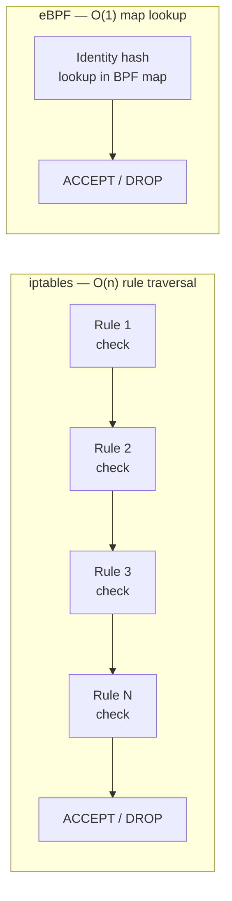
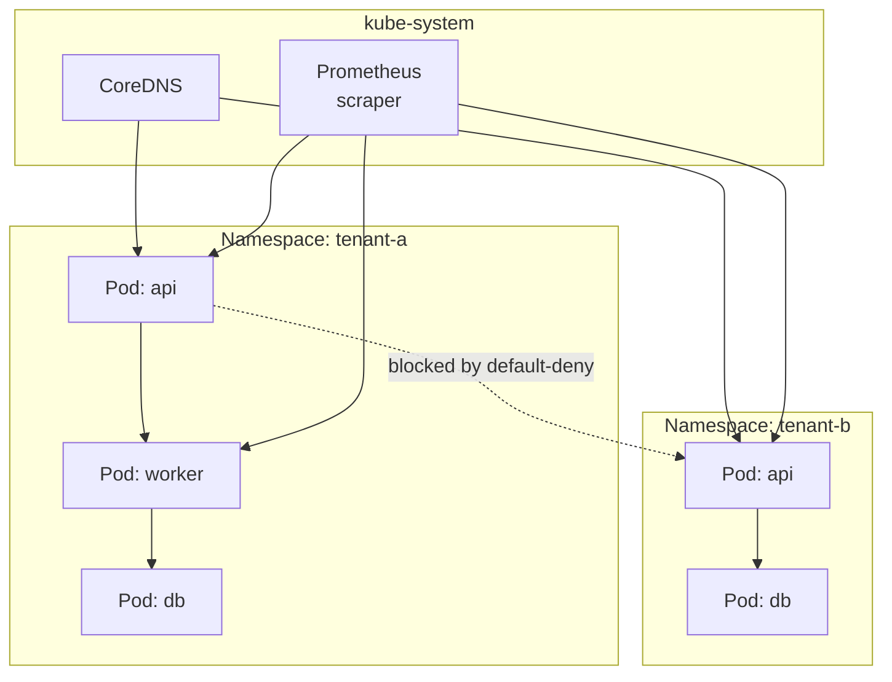

# Network Policy Isolation

## Default state: no isolation

By default, Kubernetes allows all pod-to-pod traffic within and across namespaces. Any pod can reach any other pod on the cluster network. This is intentional for developer convenience — and it's the wrong default for multi-tenant production.

Without NetworkPolicy:

- A compromised pod in tenant A can reach tenant B's database
- Lateral movement across tenant namespaces is unrestricted
- Egress to the internet from any pod is unrestricted

## CNI enforcement requirement

`NetworkPolicy` objects are only enforced if the cluster CNI supports them. Without a compliant CNI, `NetworkPolicy` manifests are silently accepted by the API server and ignored.

| CNI | NetworkPolicy support | eBPF datapath |
|---|---|---|
| Calico | Yes | Optional (eBPF mode) |
| Cilium | Yes | Yes (default) |
| Weave | Yes | No |
| Flannel | No | No |
| AWS VPC CNI (vanilla) | No (requires Calico or Cilium alongside) | No |

**EKS**: The default AWS VPC CNI does not enforce NetworkPolicy. You must install Calico or Cilium as a separate CNI plugin, or use the AWS VPC CNI with the Network Policy controller add-on (GA since EKS 1.25).

## Default-deny as the baseline

The zero-trust starting point: deny all ingress and egress by default, then explicitly allow required flows.

```yaml
# Apply to every tenant namespace at onboarding
apiVersion: networking.k8s.io/v1
kind: NetworkPolicy
metadata:
  name: default-deny-all
  namespace: tenant-a
spec:
  podSelector: {}      # matches all pods in namespace
  policyTypes:
  - Ingress
  - Egress
```

This alone breaks DNS. Add a DNS allow policy:

```yaml
apiVersion: networking.k8s.io/v1
kind: NetworkPolicy
metadata:
  name: allow-dns
  namespace: tenant-a
spec:
  podSelector: {}
  policyTypes:
  - Egress
  egress:
  - ports:
    - protocol: UDP
      port: 53
    - protocol: TCP
      port: 53
```

Every inter-service flow and external egress must then be explicitly allowed. This is operational friction by design — it forces teams to document their traffic.

## The iptables vs eBPF performance tradeoff

Traditional CNIs implement NetworkPolicy via iptables rules in the kernel. Each policy rule adds an entry to the iptables chain. Rule evaluation is sequential: O(n) where n is the number of rules.



**At scale**: A cluster with 100 tenants, each with 20 NetworkPolicy rules, generates thousands of iptables entries per node. On high-traffic nodes, iptables rule traversal adds measurable latency (~1–5ms per hop in extreme cases) and consumes CPU.

**eBPF (Cilium)**: Policy is compiled into BPF maps with O(1) lookup time regardless of rule count. The performance advantage becomes significant at:

- 50+ namespaces with policies
- High-throughput services (>10k RPS per pod)
- Dense east-west traffic patterns

For smaller clusters or moderate traffic, iptables-based NetworkPolicy is fine. Don't adopt eBPF for performance reasons until you've measured the problem.

## Tenant isolation pattern



Cross-namespace traffic is blocked by default-deny. DNS and monitoring scrapers are explicitly allowed via policies in each namespace.

## Admission-enforced NetworkPolicy presence

The platform can require that every namespace has at least a default-deny policy before pods can run. Kyverno policy:

```yaml
apiVersion: kyverno.io/v1
kind: ClusterPolicy
metadata:
  name: require-network-policy
spec:
  validationFailureAction: Enforce
  rules:
  - name: check-network-policy-exists
    match:
      any:
      - resources:
          kinds: ["Pod"]
    preconditions:
      all:
      - key: "{{ request.namespace }}"
        operator: NotIn
        value: ["kube-system", "kube-public", "monitoring"]
    validate:
      message: "Namespace must have a default-deny NetworkPolicy before pods can run"
      deny:
        conditions:
          all:
          - key: "{{ networkpolicies_in_namespace | length(@) }}"
            operator: Equals
            value: 0
```

This blocks pod creation in any namespace without a NetworkPolicy, ensuring "shadow traffic" — pods deployed to namespaces that were never properly configured — cannot exist.

## Egress controls

Default-deny egress plus explicit allows is stricter than most teams start with. Common production egress policy patterns:

**Allow egress to specific external services:**

```yaml
egress:
- to:
  - ipBlock:
      cidr: 10.0.0.0/8    # internal VPC
- ports:
  - protocol: TCP
    port: 443              # HTTPS to approved external services via egress proxy
```

**Funnel external egress through a proxy**: Rather than allowing direct pod egress to the internet, route all external traffic through a dedicated egress proxy (Squid, Envoy). The proxy enforces hostname-based allowlists. NetworkPolicy restricts pods to only reach the proxy, not the internet directly.

See [admission-control-policy.md](admission-control-policy.md) for enforcing NetworkPolicy presence via Kyverno.
See [../03-Networking/](../03-Networking/) for CNI selection, Gateway API, and service mesh patterns that extend beyond NetworkPolicy.
