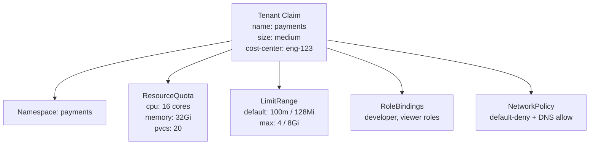

# ResourceQuota and LimitRange Design

## Why quotas exist at the platform level

Without quotas, cloud spend is unbounded and unowned. Any tenant can deploy an unlimited number of pods, request unlimited memory, or create unlimited PersistentVolumeClaims. At scale, this produces budget incidents that no single team is accountable for.

Quotas serve two functions: financial guardrail (cost attribution and spend control) and stability guardrail (preventing one tenant from starving others of cluster resources).

## ResourceQuota vs LimitRange

These are complementary, not alternatives.

| Object | Scope | What it controls |
|---|---|---|
| `ResourceQuota` | Namespace | Total aggregate consumption: sum of all pod CPU/memory requests, total PVC storage, object counts (pods, services, secrets) |
| `LimitRange` | Namespace | Per-pod and per-container defaults and maximums; sets default `requests`/`limits` when containers omit them |

**LimitRange is required for ResourceQuota to work reliably.** A pod without `resources.requests` set doesn't consume quota. Without a LimitRange providing defaults, a tenant can bypass ResourceQuota entirely by omitting resource requests from their pod spec.

```yaml
apiVersion: v1
kind: LimitRange
metadata:
  name: default-limits
  namespace: tenant-a
spec:
  limits:
  - type: Container
    default:          # applied when container omits limits
      cpu: "500m"
      memory: "512Mi"
    defaultRequest:   # applied when container omits requests
      cpu: "100m"
      memory: "128Mi"
    max:              # hard ceiling per container
      cpu: "4"
      memory: "8Gi"
```

## Tiered blueprint pattern

Avoid per-tenant quota negotiation. It creates toil and inconsistency. Instead, define a fixed set of t-shirt sizes that expand into concrete quota objects.



**Size definitions (example)**:

| Size | CPU quota | Memory quota | Max pods | Use case |
|---|---|---|---|---|
| small | 4 cores | 8 Gi | 20 | Side services, tooling |
| medium | 16 cores | 32 Gi | 100 | Standard application teams |
| large | 64 cores | 128 Gi | 400 | Data processing, ML workloads |

Implement this with a `Tenant` CRD (via KRO or Crossplane) or a Helm chart parameterized by size. The key property: adding a new tenant is a single YAML apply, not a manual checklist.

## VPA in recommendation mode

Tenants frequently over-request resources ("just in case") or under-request (causing OOMKills). Vertical Pod Autoscaler in `Off` mode generates recommendations without acting on them — a useful tool for right-sizing before quotas become a blocker.

```yaml
apiVersion: autoscaling.k8s.io/v1
kind: VerticalPodAutoscaler
metadata:
  name: app-vpa
spec:
  targetRef:
    apiVersion: apps/v1
    kind: Deployment
    name: my-app
  updatePolicy:
    updateMode: "Off"   # recommendations only, no automatic pod restarts
```

Surface VPA recommendations in the developer portal or as a platform-generated report. Teams see "your app is using 200m CPU but requesting 2000m" before you enforce quotas, reducing friction.

## What happens when quota is exhausted

Pod scheduling fails with `Forbidden: exceeded quota`. The pod stays in `Pending` with a `FailedCreate` event on the ReplicaSet. This is visible but not always acted on promptly.

**Production pattern**: Alert on namespace quota utilization > 80% to give teams time to request a size upgrade before they hit the ceiling. Don't wait for pods to fail.

```yaml
# Prometheus alerting rule
- alert: NamespaceQuotaUtilizationHigh
  expr: |
    kube_resourcequota{type="used"} / kube_resourcequota{type="hard"} > 0.8
  for: 10m
  labels:
    severity: warning
  annotations:
    summary: "Namespace {{ $labels.namespace }} quota > 80% utilized"
```

## Object count quotas

CPU and memory get most of the attention, but object count quotas matter too. A tenant creating thousands of ConfigMaps, Secrets, or Services stresses etcd and the API server regardless of pod resource consumption.

```yaml
apiVersion: v1
kind: ResourceQuota
metadata:
  name: object-counts
spec:
  hard:
    count/configmaps: "50"
    count/secrets: "50"
    count/services: "20"
    count/persistentvolumeclaims: "20"
    pods: "100"
```

Include object count limits in every tenant quota. They're easy to forget and cause hard-to-diagnose API server degradation at scale.

See [tenant-onboarding.md](tenant-onboarding.md) for automating quota provisioning as part of the onboarding flow.
