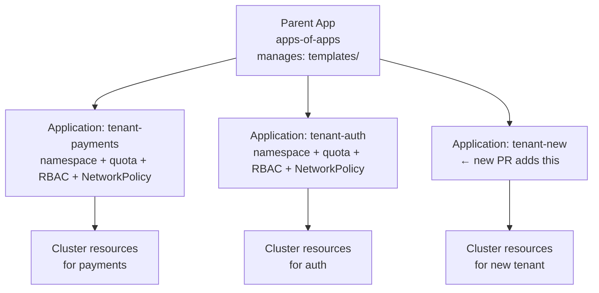
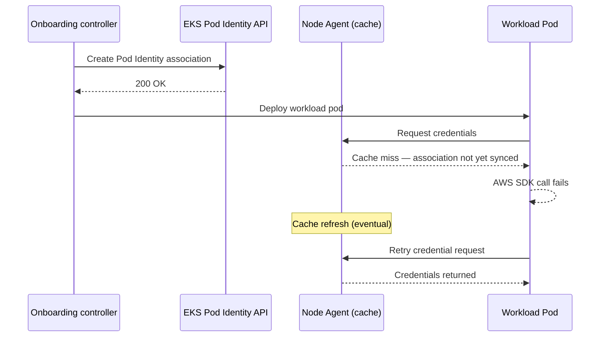

# Tenant Onboarding Automation

## The cost of manual onboarding

Manual onboarding via tickets — "please create namespace X with quota Y and RBAC role Z" — degrades developer velocity and introduces configuration drift. Every manually created namespace is slightly different. Six months later, the platform team can't reason about why namespaces differ.

The goal: adding a tenant is a single declarative apply that is idempotent, auditable, and self-healing.

## GitOps apps-of-apps pattern

The most common production pattern. A parent ArgoCD `Application` or Flux `Kustomization` manages a directory of per-tenant application manifests. Adding a tenant is a Git PR.



**Onboarding a new tenant:**

1. PR adds `templates/tenant-new.yaml` to the parent app's chart
2. ArgoCD detects the new `Application` object and reconciles
3. Namespace, ResourceQuota, LimitRange, RoleBindings, NetworkPolicy all created automatically
4. Platform team reviews and merges the PR — no manual kubectl, no tickets

**Drift prevention**: GitOps continuously reconciles. If someone manually edits a ResourceQuota in-cluster, ArgoCD reverts it to the Git-declared state. Configuration drift is eliminated structurally.

## CRD-based onboarding with KRO / Crossplane

For richer onboarding flows that include cloud resources (IAM roles, S3 buckets, RDS databases), a `Tenant` CRD via KRO or Crossplane handles topological ordering automatically.

```yaml
apiVersion: platform.example.com/v1alpha1
kind: Tenant
metadata:
  name: payments
spec:
  size: medium
  costCenter: eng-123
  awsAccount: "123456789012"
  team:
    slackChannel: "#payments-platform"
    oncallRotation: payments-sre
```

This single object triggers a microcontroller that creates:

1. Kubernetes namespace
2. ResourceQuota + LimitRange (from size template)
3. RoleBindings for the team
4. Default NetworkPolicy (default-deny + DNS allow)
5. IAM role + EKS Pod Identity association
6. Any cloud resources (S3 buckets, parameter store paths, etc.)

**Topological ordering**: KRO/Crossplane ensures the namespace and IAM role exist before creating resources that depend on them. This is not guaranteed if you apply a flat manifest list with `kubectl apply -f`.

## The Pod Identity race condition

EKS Pod Identity uses eventual consistency: the IAM role association is recorded in the EKS API, but the node-local Pod Identity agent may not have refreshed its cache yet. A pod that starts within seconds of the association being created may fail its first AWS API call.



**Mitigation**: Insert a blocking validation job in the onboarding pipeline that verifies credential availability before declaring the tenant ready.

```yaml
# Validation job in onboarding pipeline
apiVersion: batch/v1
kind: Job
metadata:
  name: validate-iam-identity
spec:
  template:
    spec:
      serviceAccountName: tenant-sa
      containers:
      - name: validate
        image: amazon/aws-cli
        command: ["aws", "sts", "get-caller-identity"]
      restartPolicy: OnFailure
  backoffLimit: 10   # retry until IAM is available
```

The onboarding flow does not proceed past this job until it succeeds.

## Self-service vs platform-team-gated

| Model | Tenant experience | Platform risk |
|---|---|---|
| Fully self-service (PR-based) | Developer opens PR, gets namespace after review/merge | PR review is the only gate — requires good PR templates and CI validation |
| Platform-team-gated (ticket) | Developer submits ticket, platform creates manually | Slow; creates configuration drift; doesn't scale |
| Automated with approval gate | Developer submits claim, automation validates, human approves | Balance of speed and oversight; right for most orgs |

PR-based self-service with automated CI validation (quota checks, naming convention enforcement) is the production target. The platform team is a reviewer, not a manual executor.

## Offboarding

Offboarding is as important as onboarding — orphaned namespaces accumulate, consuming quota and cluttering audit logs.

Offboarding automation should:

1. Drain workloads (scale deployments to 0, wait for pods to terminate)
2. Revoke IAM role associations before deleting the namespace
3. Archive the namespace's audit logs before deletion
4. Remove the tenant entry from Git (triggers GitOps reconciliation to delete)

Never delete a namespace with running pods via `kubectl delete namespace`. The finalizer may hang if PVCs or other resources have deletion dependencies. Use the platform's offboarding flow which handles ordering.

See [resource-quotas-limitranges.md](resource-quotas-limitranges.md) for the size-based quota model referenced here.
See [../05-GitOps/](../05-GitOps/) for the apps-of-apps implementation in ArgoCD/Flux.
