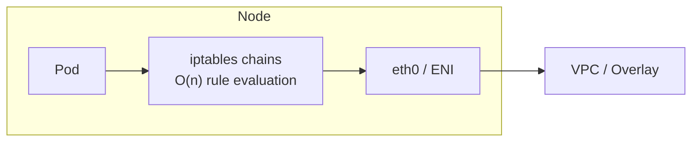
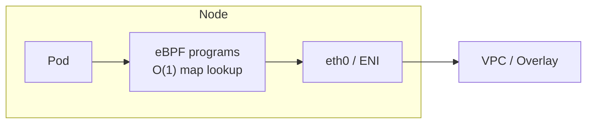

# CNI Selection

## What the CNI decision actually controls

The Container Network Interface plugin owns three things: pod IP assignment, pod-to-pod routing, and NetworkPolicy enforcement. The choice determines your network performance ceiling, your policy enforcement model, and which cloud-native features you can use.

On EKS, you have three practical options: AWS VPC CNI (default), Calico, or Cilium. Each occupies a different position on the simplicity-vs-capability curve.

## AWS VPC CNI

Pods get real VPC IP addresses from the node's ENI secondary IPs. Pod-to-pod traffic routes natively through the VPC without overlay or encapsulation.

**Advantages:**

- Native VPC integration: Security Groups for Pods, VPC flow logs, VPC routing all work at the pod level
- No overlay overhead: traffic takes the VPC fast path
- First-class AWS support and EKS add-on lifecycle management

**Limitations:**

- IP exhaustion: each node consumes a slot of ENI secondary IPs. Dense clusters in small subnets run out of IPs. Mitigate with custom networking (separate subnet for pods) or IPv6
- NetworkPolicy enforcement requires the separately enabled Network Policy controller add-on (GA since EKS 1.25). Without it, `NetworkPolicy` objects are silently ignored
- No eBPF datapath: policy enforcement runs on iptables — O(n) rule traversal

**When to use:** Default for most EKS clusters that need tight AWS integration (Security Groups for Pods, VPC Lattice) and don't have dense NetworkPolicy requirements.

## Calico

Calico runs as an overlay (VXLAN or IPIP) or in native routing mode. It enforces NetworkPolicy via iptables on the host.

**Advantages:**

- Mature, well-understood operational model
- Wide CNI support across cloud and on-prem
- Calico Enterprise adds egress gateway, DNS policy, and Wireguard encryption

**Limitations:**

- iptables rule evaluation degrades with scale: 1000+ NetworkPolicy rules across many namespaces causes measurable latency and CPU overhead on the kernel's conntrack table
- Overlay modes add encapsulation overhead vs native VPC routing

**When to use:** Existing Calico footprint, on-premises clusters, or environments where eBPF is not yet operationally validated by the team.

## Cilium

Cilium replaces iptables entirely with eBPF programs loaded directly into the Linux kernel datapath.

**Performance characteristics:**

- Policy evaluation: O(1) BPF map lookup vs O(n) iptables traversal
- Measured latency: 0.1–0.2ms per hop vs 1–5ms for iptables at high rule counts
- Conntrack table replaced by BPF maps — no kernel conntrack overhead

**Additional capabilities beyond NetworkPolicy:**

- Layer 7 policy (HTTP method, path, headers, gRPC service/method)
- Network-level mTLS without sidecars (via Cilium Mesh + SPIRE)
- Hubble observability: real-time flow visibility and policy decision logging
- Egress gateway with identity-aware SNAT
- WireGuard node-to-node encryption (transparent, no certificates to manage)

**Limitations:**

- Requires Linux kernel ≥ 5.10 for full feature set (EKS Amazon Linux 2023 satisfies this; check custom AMIs)
- More complex to operate than VPC CNI; Hubble and Cilium Operator add components
- Replacing AWS VPC CNI on an existing cluster is disruptive — plan for blue-green migration

**When to use:** New clusters with dense NetworkPolicy requirements, high-throughput east-west traffic, need for L7 policy, or sidecarless mTLS. The right default for greenfield multi-tenant platforms.

## Decision matrix

| Factor | AWS VPC CNI | Calico | Cilium |
|---|---|---|---|
| AWS-native integration (SG for Pods) | Yes | No | Partial |
| NetworkPolicy enforcement | Add-on required | Yes (iptables) | Yes (eBPF) |
| L7 policy | No | No (Enterprise only) | Yes |
| Policy evaluation scale | O(n) iptables | O(n) iptables | O(1) eBPF |
| mTLS / service mesh integration | External mesh | External mesh | Native (Cilium Mesh) |
| Observability | VPC flow logs | Limited | Hubble (rich) |
| Operational complexity | Low | Medium | Medium-High |
| IPv6 support | Yes | Yes | Yes |

## Replacing the CNI on an existing cluster

Swapping CNIs on a live cluster is high-risk — all pod networking is disrupted during the transition. The safe path is blue-green cluster replacement: provision a new cluster with the target CNI, migrate workloads, decommission the old cluster.

In-place CNI replacement is possible with careful node-by-node draining but has caused production outages. Don't attempt it on a cluster running critical workloads without a tested runbook.

See [../02-Multi-Tenancy/network-policy-isolation.md](../02-Multi-Tenancy/network-policy-isolation.md) for NetworkPolicy enforcement patterns.
See [service-mesh-selection.md](service-mesh-selection.md) for where Cilium Mesh fits in the service mesh decision.
