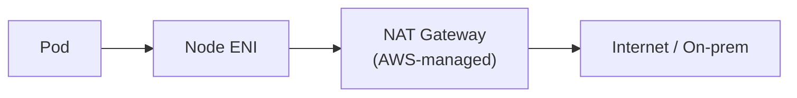
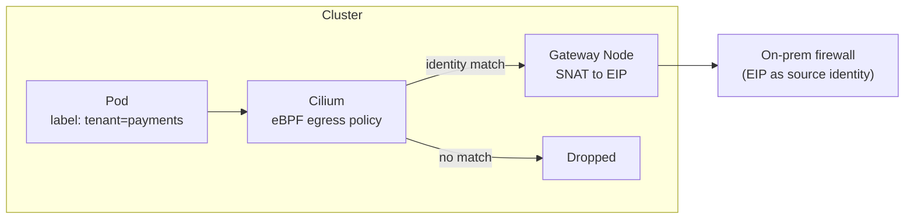
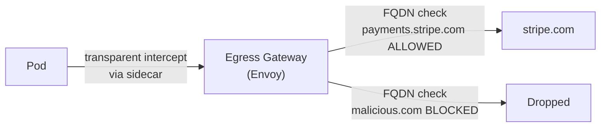
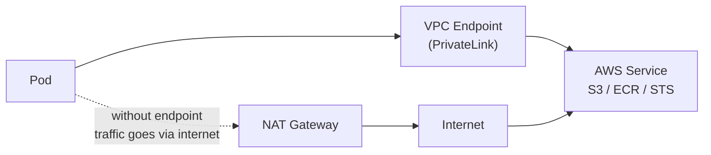

# Egress Traffic Control

## Why egress control matters

By default, pods can reach any IP on the internet. Uncontrolled egress is a data exfiltration path, a C2 communication channel, and a compliance gap. Egress control answers: what can a pod reach outside the cluster, and through what path?

Three patterns exist with different security depth, operational cost, and price-performance tradeoffs.

## Pattern 1: NAT Gateway (managed, L4 only)

All pod outbound traffic routes through an AWS-managed NAT Gateway. The source IP for all pods on a node becomes the NAT Gateway's EIP.



**Security profile:** L4 only. You can restrict destinations by IP/CIDR via Security Groups or NACLs, but not by hostname (FQDN), HTTP path, or workload identity. If 10.0.0.0/8 is allowed, any pod can reach anything in that range.

**Cost:** NAT Gateway charges per GB of data processed. At high egress volumes (TB/month), NAT Gateway cost becomes significant. AWS pricing: ~$0.045/GB in us-east-1.

**When to use:** Acceptable for clusters with low-sensitivity egress, simple IP-based allowlists, or where egress volume is modest. Default starting point for most clusters.

## Pattern 2: Cilium Egress Gateway (identity-aware, eBPF)

Cilium intercepts egress traffic and routes it through designated gateway nodes. Source NAT (SNAT) rewrites the source IP to the gateway node's IP.



**Identity-aware routing:** Egress policy is based on pod labels, not IPs. Pod `tenant=payments` routes through gateway EIP `203.0.113.10`; pod `tenant=auth` routes through a different EIP. On-premises firewalls use the EIP as the identity.

```yaml
apiVersion: cilium.io/v2
kind: CiliumEgressGatewayPolicy
metadata:
  name: payments-egress
spec:
  selectors:
  - podSelector:
      matchLabels:
        tenant: payments
  destinationCIDRs:
  - 10.100.0.0/16   # on-prem network
  egressGateway:
    nodeSelector:
      matchLabels:
        egress-gateway: "true"
    egressIP: 203.0.113.10
```

**Security risk — label manipulation:** Egress policy trusts pod labels. If RBAC allows a developer to set `tenant=payments` on any pod, that pod gains payments' egress privileges. Mitigate with:
- Admission webhooks that validate label ownership (only the payments team can deploy pods with `tenant=payments`)
- OPA/Kyverno policy that enforces label-to-namespace mapping

**When to use:** Multi-tenant clusters where different tenants need distinct source IPs for on-premises firewall rules. Requires Cilium CNI.

## Pattern 3: Istio / Envoy Egress Gateway (L7, FQDN-aware)

All external traffic is routed through a dedicated Envoy proxy deployment. The gateway enforces L7 rules: FQDN allowlists, TLS SNI inspection, HTTP method filtering, rate limiting.



**Capabilities:**
- FQDN-based allowlisting (`payments.stripe.com`, `api.github.com`) — not just IPs
- SNI inspection for TLS connections (hostname visible without decryption)
- HTTP header and method enforcement
- Rate limiting per workload
- Full Envoy access logs for forensic reconstruction

**Operational cost:** The egress gateway is a critical path for all external traffic — it must be highly available (multi-replica + PDB), sized for throughput, and monitored tightly. Envoy configuration complexity (ServiceEntry, DestinationRule, VirtualService) adds operational surface area.

**When to use:** High-security environments requiring FQDN-level egress control, data exfiltration prevention, or compliance requirements for documented external communication paths. Typically paired with Istio service mesh already in place.

## VPC Endpoints: the private path

For AWS service traffic (S3, DynamoDB, STS, ECR), VPC Endpoints route API calls through the VPC backbone — no public internet traversal.



**Why this matters beyond security:** NAT Gateway charges for traffic to AWS services even within the same region. VPC Endpoints for S3 and DynamoDB are gateway endpoints (free); interface endpoints (PrivateLink) have an hourly charge but eliminate data transfer costs.

For clusters pulling container images from ECR, an ECR VPC Endpoint eliminates image pull traffic from NAT Gateway billing and keeps control-plane communication private — relevant for the EKS API server private endpoint setup in [../01-Cluster-Architecture/control-plane-ha.md](../01-Cluster-Architecture/control-plane-ha.md).

## Comparison

| Pattern | Security depth | Egress identity | FQDN control | Operational cost | Cost at scale |
|---|---|---|---|---|---|
| NAT Gateway | L4 (IP/port) | Shared EIP per node | No | Low | High (per-GB) |
| Cilium Egress Gateway | L4 + identity (pod labels) | Per-tenant EIP | No | Medium | Lower (EC2 cost) |
| Istio Egress Gateway | L7 (FQDN, headers) | Per-workload | Yes | High | Lower (EC2 cost) |
| VPC Endpoints | N/A (AWS services only) | N/A | No | Low | Free (gateway) / Low (interface) |

See [cni-selection.md](cni-selection.md) for Cilium CNI as the prerequisite for Cilium Egress Gateway.
See [service-mesh-selection.md](service-mesh-selection.md) for Istio deployment as a prerequisite for Istio Egress Gateway.
