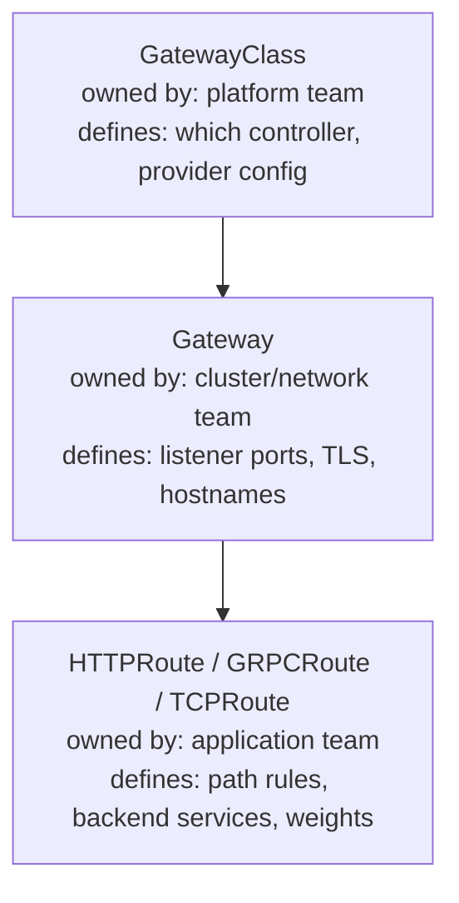
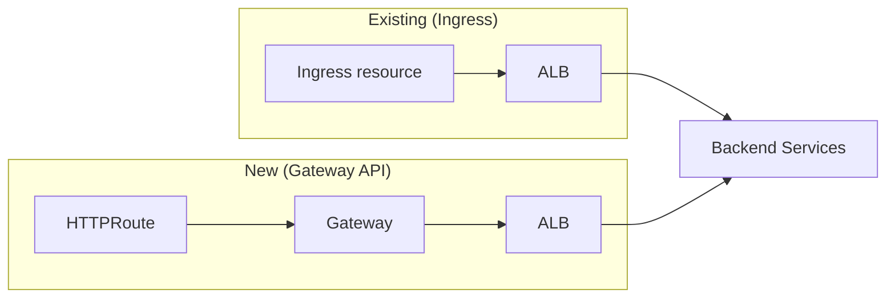
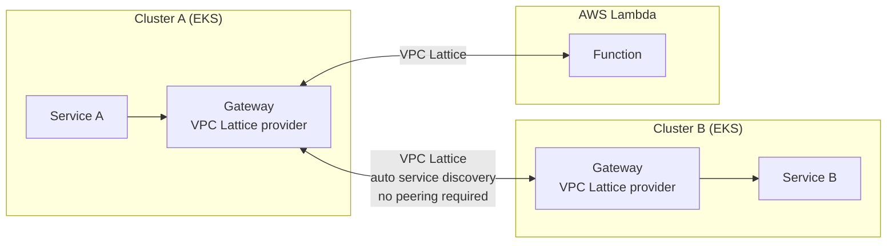

# Ingress vs Gateway API

## The problem with legacy Ingress

The `Ingress` resource was designed for a single use case: HTTP/S routing from an external load balancer to backend services. Everything beyond that became annotations — vendor-specific, non-portable, and increasingly unmaintainable.

```yaml
# Reality of production Ingress resources
annotations:
  kubernetes.io/ingress.class: alb
  alb.ingress.kubernetes.io/scheme: internet-facing
  alb.ingress.kubernetes.io/target-type: ip
  alb.ingress.kubernetes.io/certificate-arn: arn:aws:acm:...
  alb.ingress.kubernetes.io/waf-acl-id: ...
  alb.ingress.kubernetes.io/ssl-policy: ELBSecurityPolicy-TLS13-1-2-2021-06
  # 10+ more annotations for meaningful production config
```

Annotations mix infrastructure concerns (which load balancer, which certificate) with application routing concerns (paths, backends). There's no separation of roles — a developer modifying path rules can accidentally change infrastructure configuration.

## Gateway API: role-oriented design

Gateway API splits configuration across three objects with distinct ownership:



**GatewayClass** — Infrastructure template. The platform team defines which controller handles this class (AWS LBC, Envoy, Cilium). Set once per cluster or per environment type.

**Gateway** — Cluster entrypoint. Binds to a GatewayClass, defines which hostnames and ports it accepts, and configures TLS termination. The network team owns this — not application developers.

**HTTPRoute / GRPCRoute** — Application routing rules. Developers own these. They reference a Gateway by name but can't modify the Gateway itself. Path matching, header-based routing, traffic weighting for canary deploys.

```yaml
# Application team's HTTPRoute — no infrastructure annotations
apiVersion: gateway.networking.k8s.io/v1
kind: HTTPRoute
metadata:
  name: payments-api
  namespace: payments
spec:
  parentRefs:
  - name: prod-gateway
    namespace: platform
  hostnames:
  - payments.example.com
  rules:
  - matches:
    - path:
        type: PathPrefix
        value: /api/v2
    backendRefs:
    - name: payments-service
      port: 8080
      weight: 90
    - name: payments-service-canary
      port: 8080
      weight: 10
```

## AWS Load Balancer Controller: both APIs simultaneously

The AWS LBC supports Ingress and Gateway API in the same cluster. Migration is incremental — no flag day required.



**Migration strategy:**

1. Install Gateway API CRDs and configure a `GatewayClass` using AWS LBC
2. New services: use `Gateway` + `HTTPRoute` from the start
3. Existing services: create parallel `HTTPRoute` resources pointing to the same backends
4. Validate, then remove the old `Ingress` resource
5. No traffic disruption — both can run indefinitely

## When to migrate

Don't migrate everything immediately. Migrate when you need:

- **Canary and weighted routing** natively (HTTPRoute `weight` field) — no Ingress annotation equivalent
- **Cross-namespace routing** — HTTPRoute in namespace A can route to a Service in namespace B with ReferenceGrant
- **Protocol-specific routes** — GRPCRoute, TCPRoute, TLSRoute for non-HTTP traffic
- **VPC Lattice unification** — a single Gateway spec managing both ALB (internet) and VPC Lattice (internal) listeners

**Don't migrate** if: your Ingress setup is stable, your team doesn't need the above features, and you have no immediate driver. Technical debt from "works fine" infrastructure is not worth creating churn.

## VPC Lattice and Gateway API

VPC Lattice is AWS's managed service-to-service networking layer — cross-cluster, cross-VPC, cross-account. The Gateway API spec is the right abstraction for it.



VPC Lattice eliminates the need for VPC peering or Transit Gateway for service-to-service traffic across cluster and compute boundaries. The Gateway API provides a consistent spec for routing regardless of whether the backend is EKS, Lambda, or ECS.

## TLS termination patterns

| Pattern | Where TLS terminates | Use case |
|---|---|---|
| Edge termination | Gateway / ALB | Standard; certificates managed by platform team |
| Passthrough | Backend pod | mTLS to application layer; pod handles cert |
| Re-encrypt | Gateway decrypts, re-encrypts to backend | Legacy backends requiring TLS, compliance scanning at gateway |

With Gateway API, TLS mode is set on the `Gateway` listener — not buried in annotations. Application teams don't need to know the TLS model to write `HTTPRoute` rules.

See [egress-control.md](egress-control.md) for VPC Lattice as an egress pattern for cross-boundary service communication.
See [../04-Security/](../04-Security/) for WAF integration and OIDC authentication at the Gateway layer.
