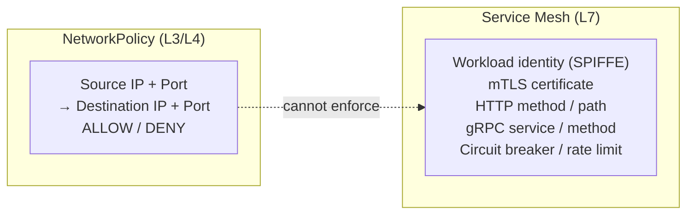
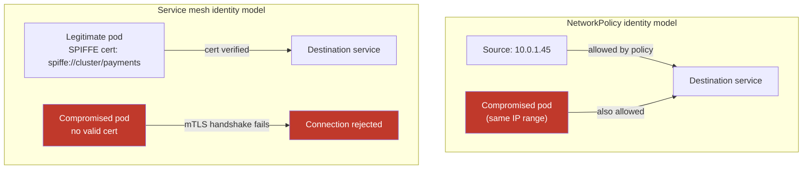
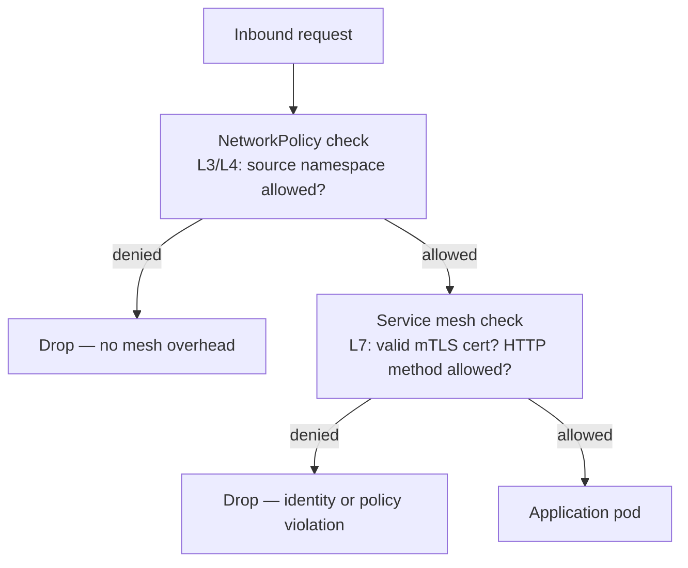

# NetworkPolicy and the Service Mesh Gap

## What NetworkPolicy enforces

NetworkPolicy operates at L3/L4 — IP addresses and ports. It answers: "can pod A reach pod B on port 8080?" It does not answer: "is pod A actually the payments service?", "is this an authorized gRPC method?", or "has this connection been rate-limited?"

## The identity gap

NetworkPolicy verifies *where* traffic comes from — the source IP. It does not verify *who* is sending it.

In a Kubernetes cluster, pod IPs are ephemeral. IP-based identity is weak: if a pod is compromised and restarts on the same IP, the policy still allows it. If a new pod is scheduled to a previously allowed IP range, it inherits those permissions.

Service mesh solves this with SPIFFE (Secure Production Identity Framework For Everyone): each workload gets a cryptographic X.509 certificate tied to its service account identity. mTLS validates the certificate on every connection — not the IP. A compromised pod that can't present the right certificate can't establish connections, regardless of its IP.

## The protocol gap

NetworkPolicy cannot inspect or enforce based on application-layer content:

- HTTP method (allow GET, deny POST to `/admin`)
- URL path matching beyond what port-level policy provides
- gRPC service and method (`payments.PaymentsService/ProcessPayment` vs `payments.PaymentsService/Refund`)
- HTTP headers (tenant ID header routing, JWT claims)
- Circuit breaking when error rates exceed a threshold
- Rate limiting per client identity

These require L7 awareness, which means a proxy — either sidecar-based (Istio, Linkerd) or node-level (Cilium Mesh, Ambient).

## When NetworkPolicy alone is sufficient

NetworkPolicy is the right tool when:
- Your security model needs L3/L4 microsegmentation (isolate namespaces, control which services can communicate)
- You don't need to verify workload identity cryptographically
- Your traffic is not HTTP-based or you don't need L7 enforcement
- The resource overhead of a service mesh isn't justified by the security requirements

NetworkPolicy + RBAC + Pod Security Admission is a solid security posture for most internal platforms without regulated compliance requirements.

## When you need a service mesh

Add a service mesh when:

| Requirement | Why mesh is needed |
|---|---|
| Zero-trust workload identity | IP-based policy is insufficient; cryptographic mTLS required |
| L7 traffic management (canary, retries, circuit breaking) | NetworkPolicy has no L7 primitives |
| Compliance requiring mutual authentication | PCI-DSS, HIPAA may require proof that services authenticate each other |
| Observability of request-level metrics (P99 latency, error rate per route) | Proxy collects these automatically |
| Multi-cluster service-to-service mTLS | NetworkPolicy is cluster-scoped; mesh spans clusters |

## Layering the two

NetworkPolicy and service mesh are not alternatives — they're complementary layers. NetworkPolicy provides coarse L3/L4 segmentation; the mesh adds fine-grained L7 identity and control on top.

NetworkPolicy as the first gate reduces the traffic volume that reaches the mesh proxy — important for performance. Don't route traffic the mesh should never see through it.

## The forensic visibility gap

When transparent mTLS encrypts all east-west traffic, traditional network tap and packet capture tools go blind. `tcpdump` on the node sees encrypted bytes; it can't reconstruct the request.

This is a production readiness requirement that's easy to miss until a security incident requires forensic reconstruction.

**Mitigations:**
- **Hubble (Cilium)**: exports eBPF-level flow decisions (connection allowed/denied, identity) to a central store even for encrypted traffic
- **Envoy access logs (Istio/Linkerd)**: proxy logs include request metadata (method, path, source identity, response code) without decrypting payload
- Export these logs to your SIEM before you need them in an incident

See [service-mesh-selection.md](service-mesh-selection.md) for the Istio vs Cilium vs Linkerd decision.
See [cni-selection.md](cni-selection.md) for Cilium's native L7 policy without a separate mesh.
