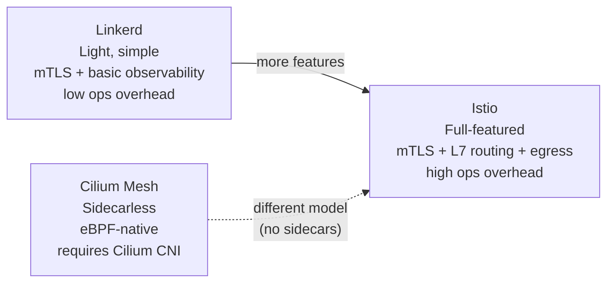
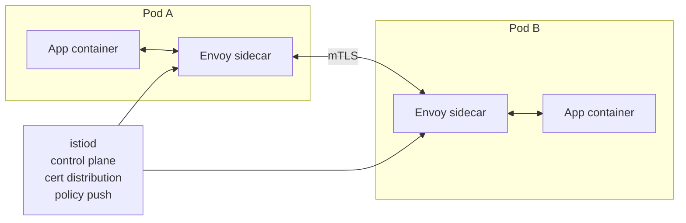
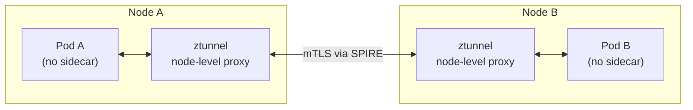

# Service Mesh Selection

## The core tradeoff: features vs resource overhead

Every service mesh adds latency and resource consumption in exchange for mTLS, observability, and traffic management. The question is how much overhead is acceptable and how much of the feature set you'll actually use.

The three production-grade options occupy distinct positions:

## Istio

The most feature-complete mesh. Istio injects an Envoy sidecar proxy into every pod. All traffic in and out of the pod is transparently intercepted by the sidecar.

**Capabilities:**

- mTLS between all services (SPIFFE/SPIRE certificates)
- L7 traffic management: weighted routing, retries, timeouts, circuit breaking, fault injection
- Ingress and egress gateways
- Rich Envoy metrics: P50/P99 latency, request rate, error rate per route
- JWT/OIDC validation at the proxy layer

**Costs:**

- **Sidecar overhead**: each Envoy proxy consumes ~50–100 MiB memory and ~0.1–0.5 vCPU under load, per pod
- **First-packet latency**: mTLS handshake adds latency on new connection establishment
- **Operational complexity**: istiod, CRDs, webhook injector, gateway pods — significant surface area
- **Version upgrades**: Istio minor version upgrades require careful coordination with sidecar versions

**When to use Istio:** You need the full feature set — especially L7 traffic management for complex canary rollouts, fault injection for chaos engineering, or egress gateway with FQDN filtering. Teams with Envoy expertise.

## Cilium Mesh (sidecarless mTLS)

Cilium Mesh implements mTLS at the node level via a lightweight Rust proxy (`ztunnel`) in the eBPF datapath — no sidecar injected into pods.

**Advantages:**

- No per-pod sidecar: eliminates the memory/CPU tax on application pods
- Identity via SPIRE: cryptographic workload identity without sidecar lifecycle management
- eBPF-native: policy evaluation in kernel, not userspace proxy
- Hubble integration: flow-level observability natively
- Single CNI + mesh stack (no two systems to operate)

**Limitations:**

- Requires Cilium as the CNI — not an add-on to an existing CNI
- L7 traffic management is less mature than Istio (Cilium's `Ingress` and `HTTPRoute` via Envoy gateway are improving but not at Istio's depth)
- Smaller production footprint than Istio; fewer reference architectures

**When to use Cilium Mesh:** Greenfield clusters already using Cilium CNI that need mTLS and basic L7 policy without the sidecar tax. Right choice when reducing compute overhead is a priority and Istio's advanced L7 features aren't required.

## Linkerd

Linkerd uses lightweight Rust-based micro-proxies (not Envoy) as sidecars, with a significantly smaller per-pod resource footprint than Istio.

**Advantages:**

- ~10 MiB per sidecar vs ~50–100 MiB for Envoy — meaningful at scale
- Simpler operational model than Istio (fewer CRDs, simpler control plane)
- Automatic mTLS with no configuration required after install
- Strong default observability (golden metrics out of the box)

**Limitations:**

- Less L7 traffic management capability than Istio
- No built-in egress gateway
- Smaller ecosystem and fewer integrations

**When to use Linkerd:** Teams that need mTLS and request-level observability but can't justify Istio's operational overhead or sidecar cost. A common choice for smaller engineering orgs moving to zero-trust.

## Decision matrix

| Factor | Istio | Cilium Mesh | Linkerd |
|---|---|---|---|
| mTLS | Yes | Yes (SPIRE) | Yes |
| L7 traffic management depth | High | Medium (improving) | Low–Medium |
| Sidecar required | Yes (Envoy) | No | Yes (Rust micro-proxy) |
| Per-pod memory overhead | High (~100 MiB) | None | Low (~10 MiB) |
| Egress gateway | Yes | Partial | No |
| Observability | Rich (Envoy metrics) | Hubble (flow-level) | Golden metrics |
| Operational complexity | High | Medium (if using Cilium CNI) | Low–Medium |
| Requires specific CNI | No | Yes (Cilium) | No |

## The forensic visibility gap — across all meshes

Transparent mTLS means packet capture tools see only encrypted bytes. This is true for all three mesh options.

**Required for production:**

- **Istio**: enable Envoy access logging; export to SIEM. Access logs include source identity, method, path, response code — without decrypting payload.
- **Cilium/Hubble**: configure Hubble to export flow events (policy verdicts, connection metadata) to Elasticsearch or S3.
- **Linkerd**: tap and access logs provide request metadata.

Verify your security operations team can reconstruct network-layer decisions post-incident before going live with any mesh. "We have mTLS" is not the same as "we can investigate a breach."

See [networkpolicy-and-service-mesh.md](networkpolicy-and-service-mesh.md) for when a service mesh is necessary.
See [cni-selection.md](cni-selection.md) for Cilium CNI as the prerequisite for Cilium Mesh.
