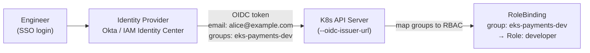
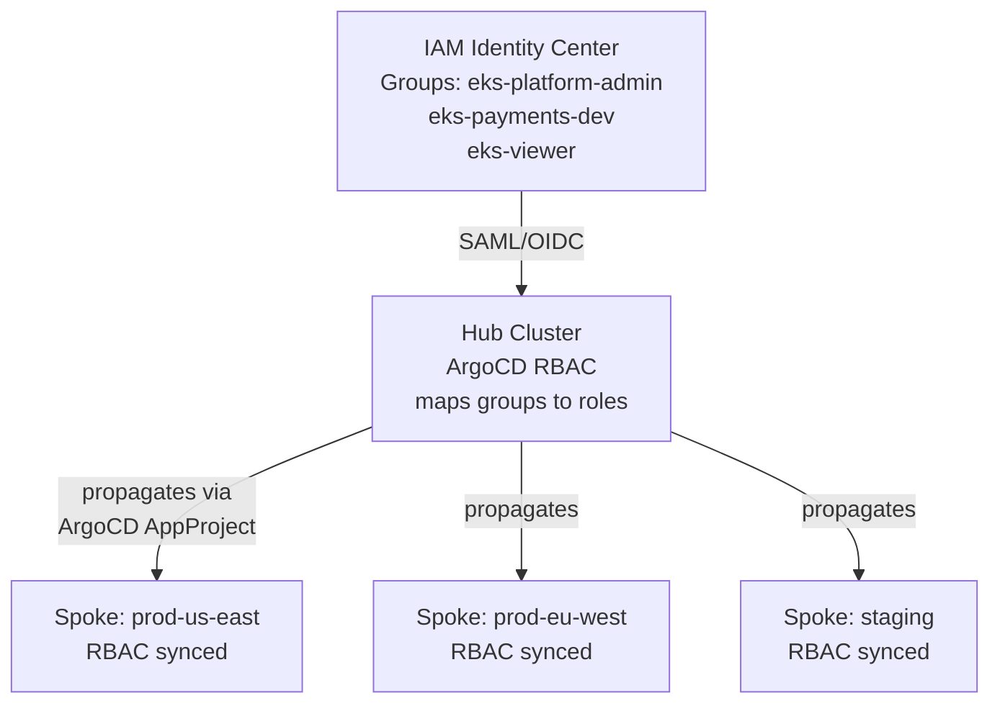

# IAM Federation for Human Access

## The problem with static role mappings

EKS legacy access used the `aws-auth` ConfigMap to map IAM roles and users to Kubernetes groups. Every human with cluster access needed an IAM role mapped to `system:masters` or a specific group.

At scale this breaks down:
- Mappings are manual — leavers stay in `aws-auth` until someone removes them
- UUIDs in the Subject field are not human-readable; you can't audit who has what access without cross-referencing IAM
- One ConfigMap becomes the global access control document for the entire cluster fleet

**EKS Access Entries** (GA since EKS 1.29) replaces `aws-auth` with a proper API-managed resource. But the deeper fix is OIDC federation — map human identities from your IdP, not from IAM.

## OIDC federation to Kubernetes RBAC



The API server validates the OIDC token from the IdP. The token's `groups` or `email` claim maps directly to Kubernetes RBAC subjects — no IAM role translation required.

```yaml
# RoleBinding using OIDC group claim
apiVersion: rbac.authorization.k8s.io/v1
kind: RoleBinding
metadata:
  name: payments-developers
  namespace: payments
roleRef:
  apiGroup: rbac.authorization.k8s.io
  kind: Role
  name: platform:developer
subjects:
- kind: Group
  name: eks-payments-dev   # matches the OIDC groups claim
  apiGroup: rbac.authorization.k8s.io
```

When an engineer leaves and their IdP account is deprovisioned, access is revoked immediately — no `aws-auth` cleanup needed.

## Username prefix: blocking identity spoofing

Without a prefix, a federated user whose username is `system:masters` or `system:admin` could spoof a Kubernetes built-in identity.

Configure the API server to add a prefix to all OIDC usernames and groups:

```yaml
# kube-apiserver flags (or EKS OIDC configuration)
--oidc-username-prefix=okta:
--oidc-groups-prefix=okta:
```

With this configuration, a federated user `alice@example.com` becomes `okta:alice@example.com` in Kubernetes. The group `eks-payments-dev` becomes `okta:eks-payments-dev`. No external user can collide with `system:masters` or any internal system identity.

**Critical**: this is not optional. An OIDC configuration without a prefix is a privilege escalation vulnerability.

## Email claim vs sub claim

By default, Kubernetes uses the `sub` (subject) claim from the OIDC token as the username. The `sub` is an opaque identifier — typically a UUID.

```
# sub claim: hard to audit
system:serviceaccount or e8f3a2c1-4d5b-11ee-be56-0242ac120002

# email claim: human-auditable
alice@example.com
```

Configure the API server to use the email claim:

```yaml
--oidc-username-claim=email
```

RBAC policies using email addresses are self-documenting. Audit logs show which human performed which action — not a UUID you have to look up. The tradeoff: email addresses can change (name changes, domain migrations). The `sub` claim is stable. Decide based on your org's email address stability and audit requirements.

## IAM Identity Center fleet-scale access

For EKS fleets using ArgoCD hub-and-spoke topology, IAM Identity Center (IDC) provides a single access control plane across all clusters.



IDC group → ArgoCD role mapping:

```yaml
# argocd-rbac-cm ConfigMap
policy.csv: |
  g, eks-platform-admin, role:admin
  g, eks-payments-dev, role:developer
  g, eks-viewer, role:readonly

# ArgoCD projects restrict which groups can deploy to which clusters
```

**Single pane of glass**: remove an engineer from the IDC group, and they lose access to ArgoCD and through it, all spoke clusters — simultaneously, without touching each cluster's RBAC.

## Access levels for human roles

| Role | Kubernetes permissions | Typical subjects |
|---|---|---|
| Platform admin | `cluster-admin` on hub; namespace admin on spokes | Platform team leads |
| Developer | `get/list/watch` pods, logs, events in own namespace; `create` jobs | Application engineers |
| Viewer | `get/list/watch` all resources in own namespace | On-call, stakeholders |
| Security auditor | `get/list/watch` all resources cluster-wide (read-only `ClusterRole`) | Security team |
| Break-glass | `cluster-admin` — time-limited, requires approval workflow | Incident response only |

Break-glass access deserves special design: issue time-limited credentials via an approval workflow (PagerDuty incident, Slack approval bot), log every action in the audit trail, and automatically revoke after a set TTL.

## kubectl access via kubeconfig

Human engineers shouldn't have long-lived kubeconfig credentials. Use `aws eks update-kubeconfig` with short-lived tokens (AWS STS tokens expire in 15 minutes by default for EKS) — the token refreshes automatically when kubectl makes an API call.

For private endpoint clusters (no public API server), access requires VPN or a bastion. Configure the VPN to enforce IdP authentication — the VPN session becomes the first factor; the OIDC token the second.

See [rbac-design.md](rbac-design.md) for Kubernetes RBAC design principles that complement this access model.
See [../01-Cluster-Architecture/control-plane-ha.md](../01-Cluster-Architecture/control-plane-ha.md) for private endpoint configuration.
