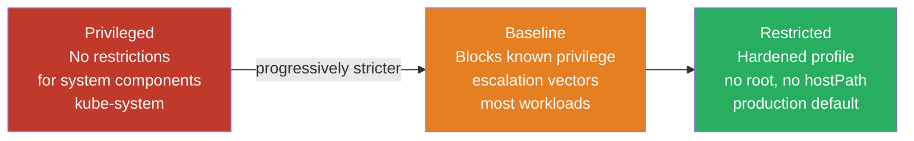
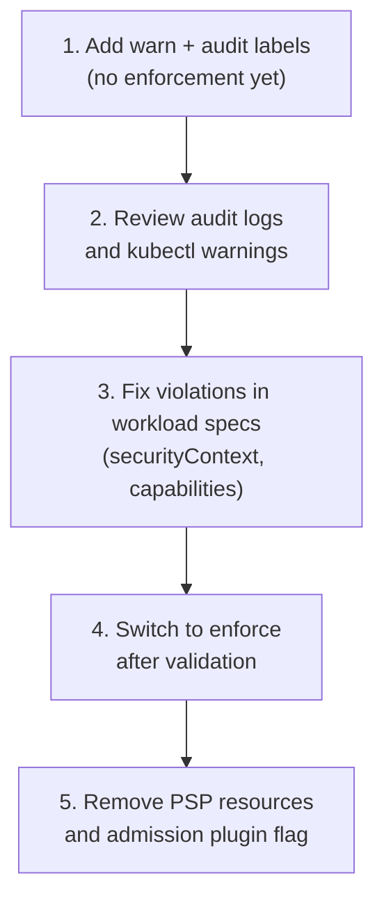

# Pod Security Admission

## PSP is gone — what replaced it

PodSecurityPolicy was removed in Kubernetes 1.25. Pod Security Admission (PSA) is the built-in replacement. It's simpler to operate (no CRDs, no webhook to manage) but less flexible — three fixed enforcement levels, no mutation.

## The three levels



**Privileged**: No restrictions. Required for system-level pods (CNI plugins, node exporters, device plugins). Only use in `kube-system` and equivalent platform namespaces.

**Baseline**: Blocks the most dangerous privilege escalation vectors — privileged containers, hostNetwork, hostPID, hostPath volumes, dangerous capabilities (NET_RAW, SYS_ADMIN). Allows running as root. Right for most application workloads that haven't been hardened.

**Restricted**: The hardened profile. Requires non-root user, drops ALL capabilities, requires seccomp profile, blocks hostPath and most volume types. Some legitimate workloads (JVM apps needing `/tmp`, certain logging agents) need adjustment to run at Restricted.

## Enforcement via namespace labels

PSA is configured per namespace using labels. Three modes per level:

```yaml
apiVersion: v1
kind: Namespace
metadata:
  name: payments
  labels:
    # Enforce: reject pods that violate the policy
    pod-security.kubernetes.io/enforce: restricted
    pod-security.kubernetes.io/enforce-version: v1.29
    # Audit: log violations without blocking
    pod-security.kubernetes.io/audit: restricted
    pod-security.kubernetes.io/audit-version: v1.29
    # Warn: return warning to kubectl without blocking
    pod-security.kubernetes.io/warn: restricted
    pod-security.kubernetes.io/warn-version: v1.29
```

`enforce-version` pins the policy version to the Kubernetes release — prevents automatic behavior changes during upgrades.

## Migration from PSP

PSP had per-namespace admission via RBAC — a complex model that made it hard to reason about which policy applied. PSA is straightforward: label the namespace.

**Migration sequence:**



Start with `warn` and `audit` on existing namespaces. This surfaces violations without breaking anything. Fix workload specs iteratively. Switch to `enforce` only after the warning count reaches zero.

## What PSA cannot do

PSA enforces by admission — it accepts or rejects a pod. It cannot mutate pods. This matters when:

- You want to automatically inject `securityContext` defaults (non-root UID, read-only root filesystem)
- You need per-workload exceptions with audit trails
- You want custom policies beyond the three fixed profiles

For these cases, add Kyverno or OPA/Gatekeeper alongside PSA. PSA handles the fixed-profile enforcement; Kyverno handles mutation and custom rules. The two don't conflict.

## Recommended defaults per namespace type

| Namespace type | enforce | audit | warn |
|---|---|---|---|
| `kube-system`, CNI, platform operators | privileged | baseline | baseline |
| Shared tenant namespaces | baseline | restricted | restricted |
| Hardened production namespaces | restricted | restricted | restricted |
| Developer sandboxes | baseline | restricted | restricted |

Set the audit/warn level one tier stricter than enforce. This surfaces drift toward stricter compliance without breaking the current workload.

## securityContext required for Restricted

Workloads targeting Restricted must set these fields or PSA rejects them:

```yaml
securityContext:
  runAsNonRoot: true
  runAsUser: 1000
  seccompProfile:
    type: RuntimeDefault
containers:
- name: app
  securityContext:
    allowPrivilegeEscalation: false
    capabilities:
      drop: ["ALL"]
    readOnlyRootFilesystem: true  # recommended, not required by Restricted
```

`readOnlyRootFilesystem` is not required by the Restricted profile but is a hardening best practice. Applications that write to `/tmp` need an `emptyDir` volume mount for that path.

## PSA and namespace-level exemptions

PSA supports cluster-level exemptions for specific usernames, runtime classes, or namespaces:

```yaml
# kube-apiserver --admission-plugins=PodSecurity flag config
apiVersion: apiserver.config.k8s.io/v1
kind: AdmissionConfiguration
plugins:
- name: PodSecurity
  configuration:
    exemptions:
      namespaces: ["kube-system", "monitoring"]
      runtimeClasses: ["kata-containers"]
```

Exemptions are cluster-wide. Prefer per-namespace `privileged` labels over broad exemptions — the label is visible in `kubectl describe namespace`, the exemption is not.

See [rbac-design.md](rbac-design.md) for ServiceAccount practices that complement pod security.
See [../02-Multi-Tenancy/admission-control-policy.md](../02-Multi-Tenancy/admission-control-policy.md) for Kyverno policies that extend beyond PSA's fixed profiles.
