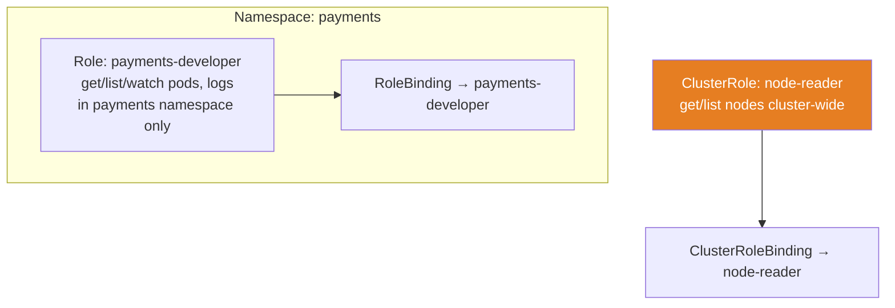
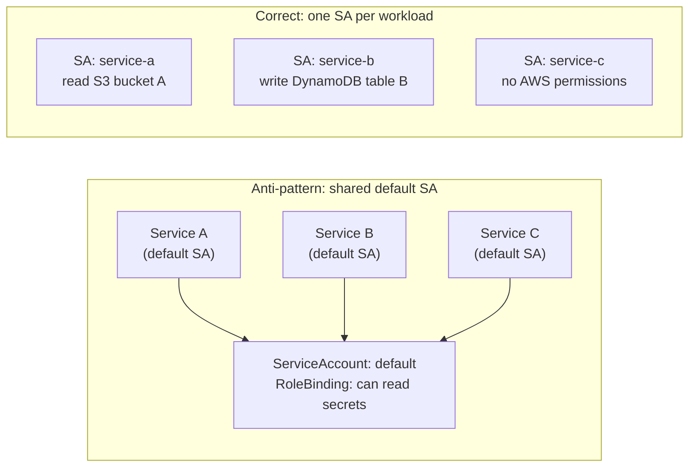

# RBAC Design

## Role vs ClusterRole

The scope choice determines blast radius. A `Role` is namespace-scoped — it can only grant permissions on resources within its namespace. A `ClusterRole` is cluster-scoped and can grant access across all namespaces or to cluster-scoped resources (nodes, PersistentVolumes, Namespaces themselves).



**Default to `Role` + `RoleBinding`.** Grant `ClusterRole` only for:
- Resources that are genuinely cluster-scoped (nodes, PVs, namespaces, CRDs)
- Platform operators that must act across all namespaces (monitoring scrapers, GitOps controllers)

A common mistake: granting a `ClusterRole` with `RoleBinding` (namespace-scoped binding of a cluster-scoped role). This is valid but easily confused — the permission scope is the namespace, but the role definition lives cluster-wide. Prefer `Role` for namespace-scoped grants; use `ClusterRoleBinding` only when cluster-wide access is genuinely required.

## One ServiceAccount per workload

The `default` ServiceAccount is the most abused resource in Kubernetes. Every pod that doesn't specify a `serviceAccountName` uses it. Any pod compromised in the namespace inherits the permissions of `default`.



**Enforce at the platform level:**
- Kyverno policy: require `serviceAccountName` to be explicitly set on all Deployments/StatefulSets
- Kyverno policy: block pods using `default` ServiceAccount in production namespaces
- Disable auto-mount of service account tokens where not needed: `automountServiceAccountToken: false`

```yaml
apiVersion: v1
kind: ServiceAccount
metadata:
  name: payments-api
  namespace: payments
automountServiceAccountToken: false  # explicit opt-in per pod when needed
```

## Avoiding ClusterAdmin sprawl

`cluster-admin` ClusterRole grants unrestricted access to every resource and every verb. Treat it like root on a production server — no human should have it by default, and machine accounts should never have it.

**Patterns that create ClusterAdmin sprawl:**

1. **Shared `aws-auth` ConfigMap entries**: The legacy EKS access method maps IAM roles directly to `system:masters`. These mappings are hard to audit and easy to forget. A developer who left the company two years ago may still have an IAM role in `aws-auth`.

2. **Broad CI/CD service accounts**: CI pipelines granted `cluster-admin` "for convenience" during initial setup that never get scoped down.

3. **Helm operators**: Some Helm chart deployments request `cluster-admin` in their RBAC. Review and scope down to what's actually required.

**Audit for ClusterAdmin exposure:**
```bash
# Find all ClusterRoleBindings to cluster-admin
kubectl get clusterrolebindings -o json | \
  jq '.items[] | select(.roleRef.name=="cluster-admin") | .metadata.name, .subjects'
```

## Least-privilege patterns

**Principle**: each workload should have exactly the permissions it needs to function, nothing more. The operational challenge is discovering what those permissions are.

Practical approach for new workloads:
1. Start with no permissions
2. Run the workload and capture permission errors from audit logs
3. Grant the specific permissions that triggered errors
4. Repeat until functional

For AWS IAM permissions alongside Kubernetes RBAC, use IAM Access Analyzer to generate least-privilege policies from CloudTrail activity rather than guessing.

**Aggregated ClusterRoles for platform-defined permission tiers:**

```yaml
# Platform defines standard developer role
apiVersion: rbac.authorization.k8s.io/v1
kind: ClusterRole
metadata:
  name: platform:developer
  labels:
    rbac.example.com/aggregate-to-developer: "true"
rules:
- apiGroups: ["apps"]
  resources: ["deployments", "replicasets"]
  verbs: ["get", "list", "watch"]
- apiGroups: [""]
  resources: ["pods", "pods/log"]
  verbs: ["get", "list", "watch"]
---
# Teams extend it via aggregation rules — no modification of the base role
apiVersion: rbac.authorization.k8s.io/v1
kind: ClusterRole
metadata:
  name: payments:developer-extension
  labels:
    rbac.example.com/aggregate-to-developer: "true"
rules:
- apiGroups: ["batch"]
  resources: ["jobs"]
  verbs: ["get", "list", "watch", "create"]
```

Aggregation lets platform teams define base roles and application teams extend them without modifying platform-owned resources.

See [iam-federation.md](iam-federation.md) for OIDC federation replacing static IAM role mappings.
See [../02-Multi-Tenancy/admission-control-policy.md](../02-Multi-Tenancy/admission-control-policy.md) for Kyverno policies enforcing ServiceAccount requirements.
