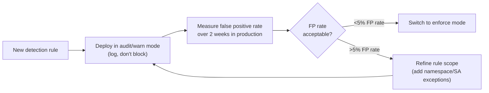
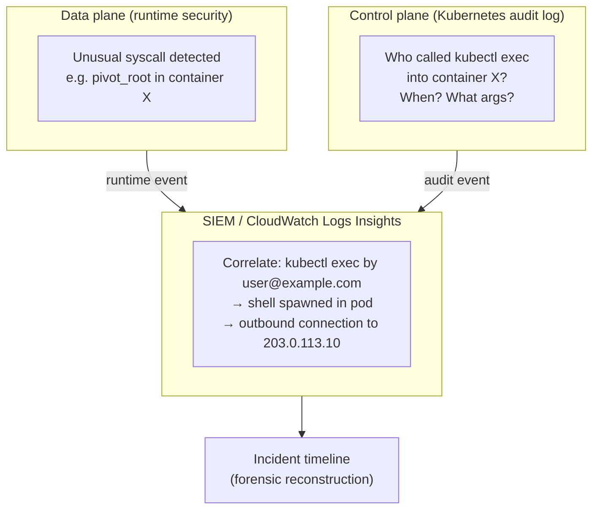

# Runtime Security

## What runtime security covers

Runtime security monitors what is actually executing inside containers — syscalls, process execution, network connections, file access — and raises alerts or blocks behavior that indicates compromise or policy violation. It is the data-plane view of cluster security: RBAC and PSA are admission-time controls; runtime security is what catches threats that got through admission or originated from a compromised workload.

## Falco vs eBPF-based approaches

The fundamental split is in *how* rules are evaluated against kernel events:

| | Falco (rules engine) | eBPF (Tetragon, Cilium, Groundcover) |
|---|---|---|
| Rule evaluation complexity | O(n) per syscall — more rules = higher overhead | O(1) — eBPF hash map lookups regardless of rule count |
| Deployment model | DaemonSet + kernel module or eBPF probe | eBPF programs loaded into kernel |
| Rule language | YAML-based Falco rules | eBPF programs or higher-level policy CRDs |
| Enforcement | Alert only (block via Falco sidekick + admission) | Block at kernel level before syscall completes |
| Observability integration | Falco events → SIEM, alertmanager | Hubble flow logs, Tetragon TracingPolicy CRDs |
| Maturity | High — production since 2018 | Growing — Tetragon production-ready since 2023 |

**When the O(n) vs O(1) difference matters**: with <50 rules, Falco's overhead is negligible. At 200+ rules covering a broad attack surface, eBPF's hash map approach avoids measurable per-pod CPU overhead. For most organizations below 10k pods, Falco's operational simplicity outweighs the performance argument.

## What to monitor

Focus on signals that indicate *cause*, not *symptom*. CPU spikes, OOM kills, and latency increases are symptoms — they have many innocent explanations. These syscalls are cause-level signals with narrow legitimate use:

| Syscall / action | What it indicates | Legitimate exception |
|---|---|---|
| `execve` from an unexpected binary path | Shell spawned inside container | Build containers, debug-mode pods |
| `ptrace` attached to another process | Process injection attempt | JVM profiling agents (allowlist by SA) |
| `pivot_root` / `chroot` | Container escape attempt | Almost none in production |
| Outbound connection to non-allowlisted IP | C2 callback, data exfiltration | Platform-managed egress (allowlist by namespace) |
| `/proc/<pid>/mem` write | Process memory manipulation | Debugging tools (never in prod) |
| `chmod` setting SUID on file | Privilege escalation attempt | Installer containers (only during init) |

**Avoid over-alerting on symptoms**: writing rules that fire on "high CPU" or "many open file descriptors" creates alert fatigue without actionable signal. Security teams tuned out of alert fatigue stop investigating alerts — including real ones.

## Alert fatigue prevention

The single biggest failure mode in runtime security programs is deploying rules directly to enforce mode, generating thousands of alerts per day, and having the security team disable or ignore the rules within two weeks.

**The audit-before-enforce lifecycle** (same model as PSA enforcement mode):



**Symptom-based vs cause-based rule design**:

```yaml
# BAD: symptom-based — fires on anything that spikes CPU (too many FPs)
- rule: High CPU Usage
  condition: container.cpu_usage > 80

# GOOD: cause-based — fires specifically on unexpected shell execution
- rule: Shell Spawned in Non-Debug Container
  condition: >
    spawned_process and
    proc.name in (bash, sh, zsh) and
    not (k8s.ns.name in (debug-pods) or
         container.label.debug = "true")
```

## Kubernetes audit logs + runtime security

Runtime security (data plane) and Kubernetes API audit logs (control plane) provide complementary views. Together they reconstruct privilege escalation paths:



**EKS setup**: enable Kubernetes API audit logs via the EKS control plane logging configuration. Logs stream to CloudWatch. Use Logs Insights queries to correlate `ObjectRef.resource=pods` with `verb=create` in subresource `exec` to find all interactive exec sessions.

```bash
# EKS: enable audit logging
aws eks update-cluster-config \
  --name my-cluster \
  --logging '{"clusterLogging":[{"types":["audit","authenticator"],"enabled":true}]}'
```

## Network visibility under eBPF-based networking

Dataplane V2 (GKE), Cilium, and ACNS (AKS) use eBPF for packet processing. This provides rich network observability via Hubble flow logs — but it also means traditional packet capture tools (`tcpdump`) are blind to eBPF-processed traffic.

**Export Hubble flow logs to your SIEM** as the network layer audit trail. Without this, the network dimension of an incident (which pod called which IP) is invisible. Cilium Hubble's `hubble observe` output can be forwarded to Kafka/S3 for retention.

Under mTLS (Istio/Cilium encryption), application-layer packet captures are encrypted ciphertext. The TLS session information (certificate SANs, handshake metadata) is still visible — use SPIFFE SVID identities (the certificate SANs) as the network identity layer in SIEM correlation, not IPs.

## Practical deployment pattern

1. Start with Falco in warn mode covering the 10 highest-signal rules (unexpected shells, `ptrace`, `pivot_root`)
2. Tune per-namespace exceptions over 4 weeks to reduce FP rate to <5%
3. Switch to enforce for the tuned ruleset
4. Add rules incrementally — never batch-enable 100 rules at once
5. Instrument Falco → alertmanager → PagerDuty only for rule categories at <2% FP rate; route everything else to Slack/logs

See [pod-security-admission.md](pod-security-admission.md) for admission-time controls that reduce the attack surface runtime security needs to monitor.
See [secrets-management.md](secrets-management.md) for secret access patterns that runtime security should alert on (unexpected reads of `/var/run/secrets`).
See [../03-Networking/network-policy.md](../03-Networking/network-policy.md) for network-level controls that complement runtime egress monitoring.
