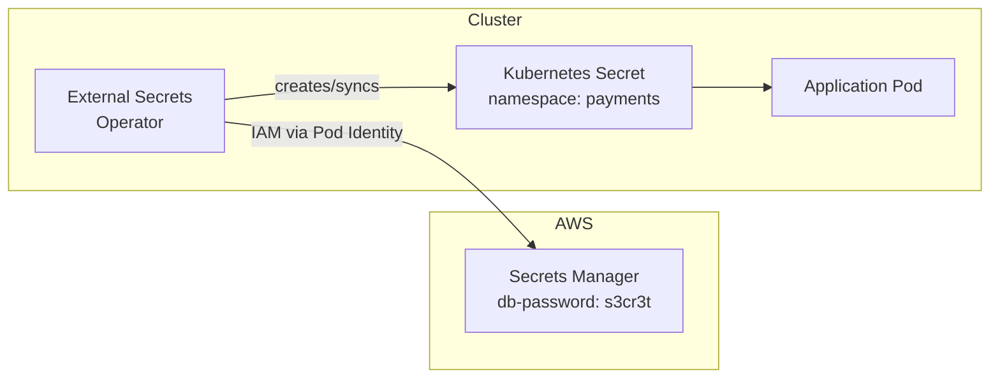
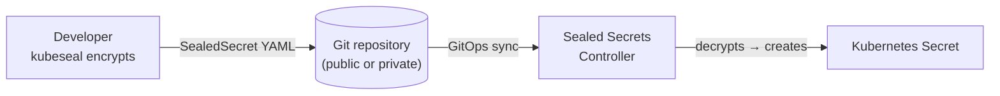
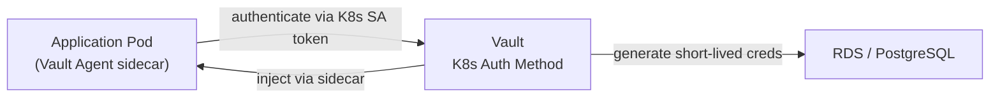
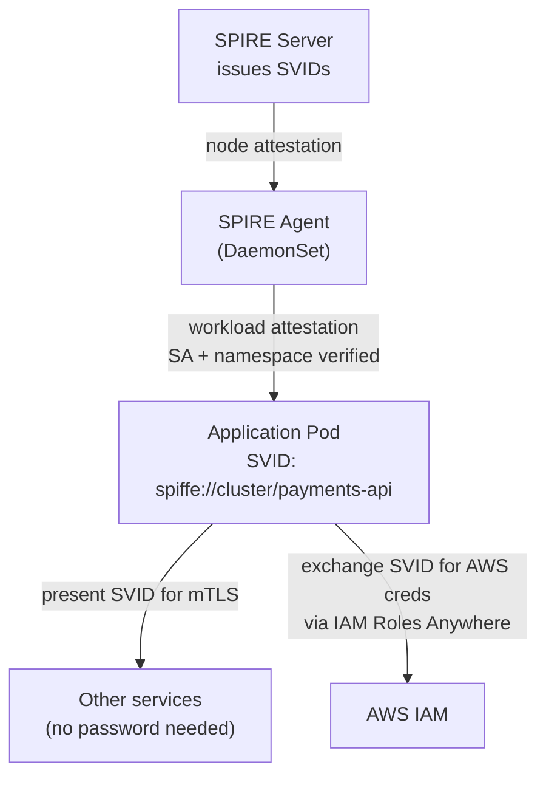
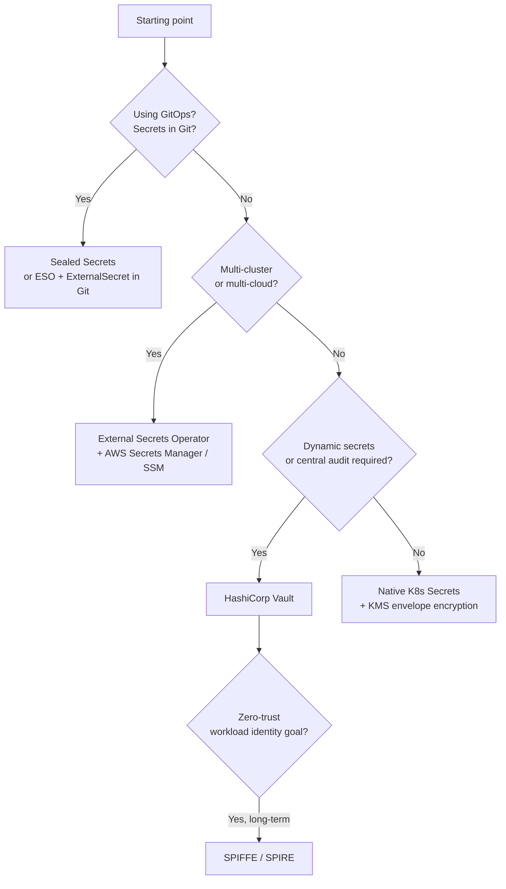

# Secrets Management

## The bottom turtle problem

Any secrets management system has a bootstrap secret: the credential that authenticates to the secrets store. Kubernetes-native Secrets store that credential in etcd. The question is how many layers of protection sit between an attacker and your plaintext secrets.

## Native Kubernetes Secrets

Kubernetes Secrets are base64-encoded (not encrypted) by default. Encryption at rest requires explicit configuration of an `EncryptionConfiguration` on the API server — on managed K8s (EKS, AKS, GKE), this is handled by the provider via envelope encryption with a KMS key.

**What native Secrets get right:**

- First-class Kubernetes objects: RBAC, audit logs, namespacing all work natively
- Zero operational overhead — no additional components
- Mounted as env vars or volumes transparently to applications

**What they get wrong:**

- Default RBAC `view` ClusterRole grants `get/list/watch` on most resources but not Secrets — however, many operators and service accounts are granted broader permissions that include Secrets
- Secret values appear in etcd; if etcd backup snapshots are stored without encryption, Secrets are exposed
- Secrets appear in `kubectl describe` and API server audit logs — watch for `list` + `get` on Secrets in audit logs as a signal of credential harvesting

**ConfigMap confusion**: Developers sometimes put sensitive values in ConfigMaps instead of Secrets because ConfigMaps are "easier." Enforce with Kyverno: scan ConfigMap values for patterns matching passwords, tokens, or private keys and reject.

## External Secrets Operator (ESO)

ESO syncs secrets from external stores (AWS Secrets Manager, SSM Parameter Store, GCP Secret Manager, Azure Key Vault, Vault) into Kubernetes Secrets. The workload consumes a normal Kubernetes Secret — ESO handles the sync.



```yaml
apiVersion: external-secrets.io/v1beta1
kind: ExternalSecret
metadata:
  name: db-credentials
  namespace: payments
spec:
  refreshInterval: 1h
  secretStoreRef:
    name: aws-secretsmanager
    kind: ClusterSecretStore
  target:
    name: db-credentials       # name of the K8s Secret to create
  data:
  - secretKey: password
    remoteRef:
      key: payments/db-password
      version: AWSCURRENT
```

**Advantages:** Multi-cluster, multi-cloud. One SecretStore definition per cluster; ExternalSecret objects are application-owned and live in the application namespace. Rotation is automatic — ESO re-syncs on `refreshInterval`.

**Limitation:** The synced Kubernetes Secret still exists in etcd. ESO reduces the number of places a secret needs to be managed, but doesn't eliminate the etcd exposure.

### ESO security hardening

**SecretStore vs ClusterSecretStore**: `SecretStore` is namespace-scoped and the correct default — ExternalSecrets in `payments` can only reference a SecretStore in `payments`. `ClusterSecretStore` is accessible from every namespace and should be disabled unless required. If you must use `ClusterSecretStore`, add a `namespaceSelector` to restrict which namespaces can consume it:

```yaml
apiVersion: external-secrets.io/v1beta1
kind: ClusterSecretStore
spec:
  conditions:
  - namespaceSelector:
      matchLabels:
        secrets.company.com/allowed: "true"   # only labeled namespaces can use this store
```

**ESO controller token creation privilege**: by default ESO can create tokens for any ServiceAccount in the cluster — a compromised ESO controller can impersonate any workload. Harden this in the Helm chart:

```yaml
# values.yaml
rbac:
  serviceAccountTokenCreate: false    # disable blanket token creation
```

Then grant token creation explicitly, scoped to the specific ServiceAccounts ESO needs:

```yaml
apiVersion: rbac.authorization.k8s.io/v1
kind: RoleBinding
metadata:
  namespace: payments
subjects:
- kind: ServiceAccount
  name: external-secrets
  namespace: external-secrets
roleRef:
  kind: Role
  name: token-creator
---
kind: Role
rules:
- apiGroups: [""]
  resources: ["serviceaccounts/token"]
  verbs: ["create"]
  resourceNames: ["payments-api"]    # only this specific SA
```

**NetworkPolicy for ESO egress**: ESO is a potential exfiltration vector — it has credentials to your secrets store and runs in your cluster. Restrict its egress:

```yaml
apiVersion: networking.k8s.io/v1
kind: NetworkPolicy
metadata:
  name: eso-egress
  namespace: external-secrets
spec:
  podSelector:
    matchLabels:
      app.kubernetes.io/name: external-secrets
  policyTypes: [Egress]
  egress:
  - ports: [{ port: 443 }]    # K8s API server + secrets manager endpoints only
```

**Secret key naming enforcement**: use Kyverno to require ExternalSecrets to reference only secrets with a predefined prefix, preventing teams from accidentally syncing unrelated secrets:

```yaml
# Kyverno ClusterPolicy: enforce key naming
spec:
  rules:
  - name: require-secret-prefix
    match:
      resources: { kinds: [ExternalSecret] }
    validate:
      message: "remoteRef.key must start with the namespace name"
      pattern:
        spec:
          data:
          - remoteRef:
              key: "{{ request.object.metadata.namespace }}-*"
```

## Sealed Secrets

Sealed Secrets enables storing encrypted secrets in Git. The `kubeseal` CLI encrypts a Secret using the cluster's public key; only the in-cluster controller can decrypt it.



**When to use:** GitOps workflows where secrets need to live alongside application manifests in version control. The encrypted SealedSecret is safe to commit even to public repos — it can only be decrypted by the specific cluster's controller.

**Risk:** The cluster's sealing key is the root of trust. If it's lost, all sealed secrets must be re-encrypted. Back up the sealing key to an external store (AWS Secrets Manager). If the key leaks, all sealed secrets are compromised — rotate immediately.

## HashiCorp Vault

Vault provides a central secrets store with dynamic secret generation, fine-grained access policies, secret leasing, and audit trails.

**Dynamic secrets** are Vault's differentiator: instead of storing a long-lived database password, Vault generates a short-lived credential on demand and automatically revokes it after a TTL. No long-lived credentials exist anywhere.



**Operational cost**: Vault is a stateful, HA service you operate. Vault HA (Raft or Consul backend), unsealing procedures, Vault operator upgrades, and backup/restore — significant platform engineering investment. For teams without existing Vault expertise, ESO bridging to a managed secrets store (AWS Secrets Manager) is usually the right call.

## SPIFFE/SPIRE: eliminating static secrets

The zero-trust target state: workloads never hold static API keys, passwords, or long-lived tokens. Instead, each workload holds a short-lived X.509 certificate (SVID) issued by SPIRE, which is automatically rotated.



### EKS node attestation

On EKS, the SPIRE agent proves its identity to the server using `k8s_psat` (Kubernetes Projected Service Account Token) attestation:

1. The SPIRE agent presents a signed projected service account token to the SPIRE server
2. The SPIRE server validates the token via the Kubernetes Token Review API
3. The server queries node metadata (UID, namespace) to verify the node's legitimacy
4. The server issues the agent's SVID, anchoring it to the verified node identity

The alternative is AWS IID (Instance Identity Document) attestation — the agent presents a signed document from the EC2 instance metadata service. `k8s_psat` is preferred for managed EKS nodes because it doesn't require access to IMDS and works on Fargate.

The SPIRE server itself needs AWS API access (for certificate storage, Aurora backing store). Use IRSA or Pod Identity — the same workload identity mechanism used by every other platform component.

**Why it's complex:** SPIRE requires operating a server, agents, and a federation trust bundle. Workload attestation must be tuned carefully — if the attestation policy is too broad, compromised workloads can obtain SVIDs they shouldn't have. Nested SPIRE (SPIRE Servers federating across clusters) adds further complexity.

**Right for:** Organizations with a mature security posture and dedicated security engineering. Don't reach for SPIRE as a first step — ESO or Vault gets you most of the security benefit at much lower operational cost.

## Decision guide



See [iam-federation.md](iam-federation.md) for Pod Identity as the authentication mechanism for ESO's AWS integration.
See [supply-chain-security.md](supply-chain-security.md) for signing secrets and registry credentials.
