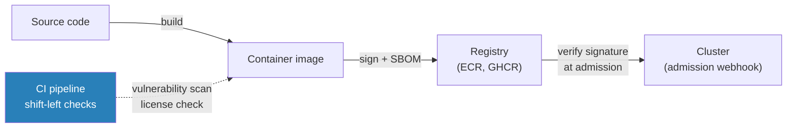
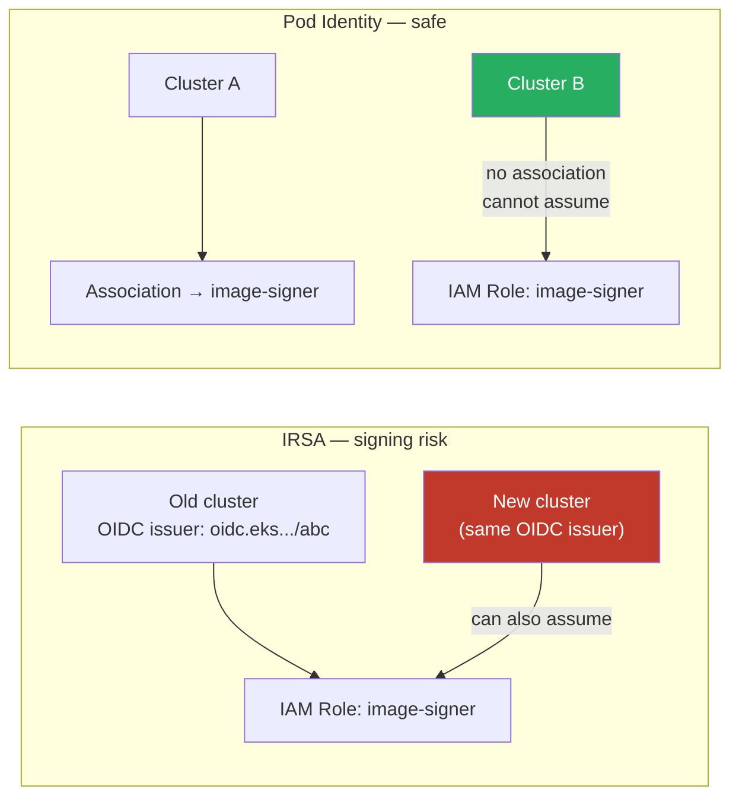
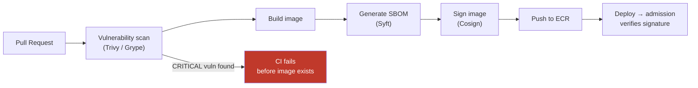

# Supply Chain Security

## The threat model

Supply chain attacks enter through artifacts: container images built from compromised base images, Helm charts with malicious dependencies, or images from unverified registries pushed to production. The goal of supply chain security is to ensure that only artifacts you built, from sources you trust, run in your cluster.

Three controls address this at different points:



## Image signing with Cosign

Cosign (part of the Sigstore project) attaches a cryptographic signature to an OCI image by writing it to the registry as a separate artifact alongside the image.

```bash
# Sign after build and push
cosign sign --key awskms:///arn:aws:kms:us-east-1:123456789:key/abc123 \
  123456789.dkr.ecr.us-east-1.amazonaws.com/payments-api:v1.2.3@sha256:abc...

# Verify before deploy (or in admission webhook)
cosign verify --key awskms:///arn:aws:kms:us-east-1:123456789:key/abc123 \
  123456789.dkr.ecr.us-east-1.amazonaws.com/payments-api:v1.2.3
```

**Keyless signing** (via OIDC): Cosign supports keyless signatures using ephemeral keys from a transparency log (Fulcio/Rekor). The signature is bound to the CI pipeline's OIDC identity (GitHub Actions job, etc.) rather than a long-lived key. No KMS key to manage; the tradeoff is dependency on the Sigstore public infrastructure.

## The IRSA signing permission risk

When running Cosign or a signing tool in a CI/CD pipeline on Kubernetes, workload identity determines who can sign images. This is where IRSA creates a non-obvious vulnerability.

IRSA binds trust to an OIDC issuer URL. If a new cluster is created with the same OIDC issuer URL (possible with custom domain aliases), any service account in the new cluster that presents a valid JWT can assume the signing role — including service accounts that should never touch signing.

**Safe practice**: Use EKS Pod Identity for signing workloads. Pod Identity binds trust to the specific cluster resource ARN, not to a reusable OIDC issuer URL. A new cluster cannot inherit signing permissions from the old one.



## SBOM generation

A Software Bill of Materials documents every dependency in an image — base OS packages, language runtime, third-party libraries. Without an SBOM, you can't answer "are any of our running containers affected by CVE-2024-XXXX?"

```bash
# Generate SBOM with Syft and attach to image
syft 123456789.dkr.ecr.us-east-1.amazonaws.com/payments-api:v1.2.3 \
  -o spdx-json > payments-api-sbom.json

cosign attach sbom --sbom payments-api-sbom.json \
  123456789.dkr.ecr.us-east-1.amazonaws.com/payments-api:v1.2.3
```

Store SBOMs alongside image signatures in the registry. This enables downstream tooling (Grype, Trivy, Dependency Track) to query them for vulnerability matching without re-scanning images.

## Admission-enforced verification

Signing images is meaningless without enforcing verification at admission. Otherwise, unsigned images (from shadow deployments or manual pushes) run freely.

**Kyverno policy to require signed images:**

```yaml
apiVersion: kyverno.io/v1
kind: ClusterPolicy
metadata:
  name: require-signed-images
spec:
  validationFailureAction: Enforce
  rules:
  - name: verify-image-signature
    match:
      any:
      - resources:
          kinds: ["Pod"]
    verifyImages:
    - imageReferences:
      - "123456789.dkr.ecr.us-east-1.amazonaws.com/*"
      attestors:
      - count: 1
        entries:
        - keys:
            kms: awskms:///arn:aws:kms:us-east-1:123456789:key/abc123
```

This blocks any pod using an image from your ECR that doesn't have a valid Cosign signature. Images from third-party registries need separate rules or exemptions for trusted base images.

## Shift-left: CI/CD as the first gate

Admission control is the safety net, not the primary control. Catching violations in CI is cheaper — it fails fast before the image is even pushed.



**What to scan in CI:**
- CVEs in base image and application dependencies (Trivy, Grype)
- Secrets accidentally embedded in images (Gitleaks, Trufflehog)
- Dockerfile best practices (Hadolint)
- Image size and layer count (operational, not security)

**What CI can't catch:** Images pushed directly to ECR bypassing the CI pipeline. Admission control is the mandatory backstop for this case.

## Registry allowlisting

Combine signature verification with a registry allowlist. Block images from unknown registries entirely, regardless of signature status.

```yaml
# Kyverno: only allow images from approved registries
- name: restrict-image-registries
  validate:
    message: "Image must come from an approved registry"
    pattern:
      spec:
        containers:
        - image: "123456789.dkr.ecr.us-east-1.amazonaws.com/* | 456789012.dkr.ecr.us-east-1.amazonaws.com/*"
```

This prevents developers from pulling `docker.io/randomuser/myapp:latest` into production regardless of whether it's signed.

See [rbac-design.md](rbac-design.md) for RBAC on ECR push permissions to enforce who can publish images.
See [secrets-management.md](secrets-management.md) for managing the KMS signing key used by Cosign.
