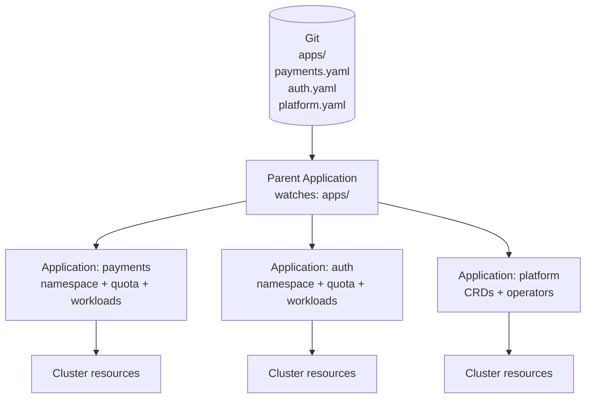
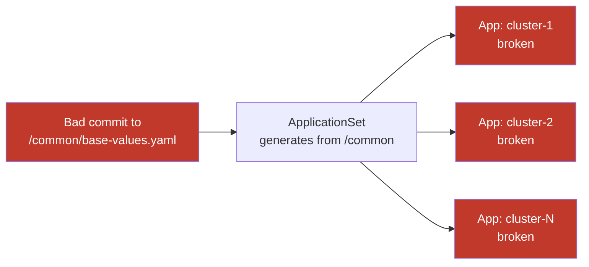

# App-of-Apps and ApplicationSets

## The problem: managing many applications

A GitOps platform with 10 teams and 3 environments means 30+ ArgoCD Applications. Managing each one manually doesn't scale. Two patterns address this: app-of-apps for hierarchical control, ApplicationSets for automated generation.

## App-of-apps pattern

A parent ArgoCD Application points to a Git directory containing child Application manifests. ArgoCD reconciles the parent, which creates the children, which each reconcile their own workloads.



**Adding a new tenant:**

1. PR adds `apps/new-tenant.yaml` to the parent directory
2. ArgoCD detects the new Application and reconciles
3. Namespace, RBAC, quotas, NetworkPolicy created automatically

**Audit trail:** Every application addition, modification, or removal is a Git commit — full history of who added what and when.

**Limitation:** Adding a new application requires a PR to the parent chart's directory. The platform team is always in the critical path. This is acceptable for small fleets but becomes a bottleneck at scale.

### Helm-based app-of-apps

The parent can be a Helm chart where each tenant is a `values.yaml` entry that renders into an Application object:

```yaml
# values.yaml
tenants:
  - name: payments
    namespace: payments
    repoURL: https://github.com/example/payments
    targetRevision: main
    size: medium
  - name: auth
    namespace: auth
    repoURL: https://github.com/example/auth
    targetRevision: main
    size: small
```

```yaml
# templates/application.yaml
{{- range .Values.tenants }}
apiVersion: argoproj.io/v1alpha1
kind: Application
metadata:
  name: {{ .name }}
spec:
  source:
    repoURL: {{ .repoURL }}
    targetRevision: {{ .targetRevision }}
  destination:
    namespace: {{ .namespace }}
{{- end }}
```

This is the most auditable model — all tenant configuration is in one file, diffs are obvious.

## ApplicationSets

ApplicationSets generate multiple Applications from a single template using generators. No PR needed per application — the generator discovers them automatically.

### Git directory generator

```yaml
apiVersion: argoproj.io/v1alpha1
kind: ApplicationSet
metadata:
  name: tenant-apps
spec:
  generators:
  - git:
      repoURL: https://github.com/example/fleet-config
      revision: main
      directories:
      - path: tenants/*          # every directory under tenants/ becomes an Application
  template:
    metadata:
      name: "{{path.basename}}"
    spec:
      source:
        repoURL: https://github.com/example/fleet-config
        path: "{{path}}"
      destination:
        namespace: "{{path.basename}}"
        server: https://kubernetes.default.svc
```

Creating a new directory `tenants/new-team/` in Git automatically provisions a new Application — no changes to the ApplicationSet itself.

### Cluster generator

```yaml
generators:
- clusters:
    selector:
      matchLabels:
        environment: production    # target all clusters labeled production
```

Add a new cluster with the `environment: production` label and it's automatically enrolled in the fleet. Remove the label and it's removed from management scope.

## The fleet-wide blast radius risk

ApplicationSets trade PR oversight for automation. A bug in the ApplicationSet template or a bad commit to a shared template directory propagates to every generated Application simultaneously.



**Required safety gates before using ApplicationSets in production:**

- CI validation on every commit to shared templates (render + dry-run with `argocd app diff`)
- Integration tests using `kuttl` or Kyverno Chainsaw that validate rendered manifests against policy
- Branch protection on the repository with required review before merge to main
- Progressive rollout: stage changes to a subset of clusters first using cluster labels as a selector

## Choosing between them

| Factor | App-of-apps | ApplicationSets |
|---|---|---|
| New application onboarding | PR to parent directory | Automatic on Git directory creation |
| Audit trail | Explicit PR per addition | Implicit — directory existence drives state |
| Fleet-wide change risk | Scoped to what the PR changes | Template bug affects all generated apps |
| Suitable scale | Tens of applications | Hundreds of applications / many clusters |
| Platform team involvement | Required for each addition | Not required after initial setup |

**Practical pattern**: use app-of-apps for platform-level components (CRDs, operators, shared infrastructure) where the platform team should review every addition. Use ApplicationSets for tenant workloads where self-service onboarding is the goal.

See [promotion-pipelines.md](promotion-pipelines.md) for how ApplicationSets handle environment promotion across clusters.
See [drift-detection-reconciliation.md](drift-detection-reconciliation.md) for managing the reconciliation behavior of generated Applications.
