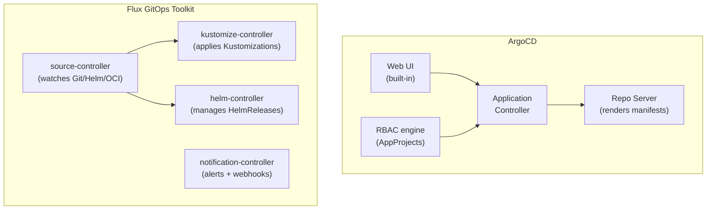

# ArgoCD vs Flux

## Architectural model

The fundamental difference is philosophy: ArgoCD is a monolithic application with batteries included; Flux is a composable toolkit where each capability is a separate controller.



ArgoCD ships one binary that handles Git polling, manifest rendering, syncing, UI, and RBAC. Flux installs independent controllers — each can be upgraded, scaled, or replaced independently. A Flux outage in helm-controller doesn't affect kustomize-controller.

## Multi-tenancy model

**ArgoCD — AppProject isolation:**

AppProjects are the tenancy boundary. They restrict which source repositories a project can deploy from, which destination clusters and namespaces it can target, and which Kubernetes resources it can manage.

```yaml
apiVersion: argoproj.io/v1alpha1
kind: AppProject
metadata:
  name: payments
spec:
  sourceRepos:
  - https://github.com/example/payments-*
  destinations:
  - namespace: payments
    server: https://kubernetes.default.svc
  clusterResourceWhitelist: []          # no cluster-scoped resources
  namespaceResourceBlacklist:
  - group: ""
    kind: ResourceQuota                 # tenants cannot modify quotas
```

AppProject RBAC maps to ArgoCD's internal user model — separate from Kubernetes RBAC. Platform team manages AppProjects; tenants can only deploy within their project bounds.

**Flux — Kubernetes RBAC as the boundary:**

Flux enforces tenancy through native Kubernetes RBAC. A `Kustomization` runs with a specific `serviceAccountName`; that ServiceAccount's RBAC determines what the reconciliation can create. No separate RBAC model to learn.

```yaml
apiVersion: kustomize.toolkit.fluxcd.io/v1
kind: Kustomization
metadata:
  name: payments-app
  namespace: payments
spec:
  serviceAccountName: payments-reconciler  # scoped SA — can only write to payments ns
  sourceRef:
    kind: GitRepository
    name: payments-repo
  path: ./manifests
```

**Decision**: ArgoCD's AppProject model is more intuitive for teams with a "projects" mental model. Flux's native RBAC is better for teams that want one consistent access control model across the cluster.

## Fleet management

**ArgoCD** is designed for hub-and-spoke: one ArgoCD instance on a hub cluster manages multiple remote spoke clusters. Spoke clusters are registered as destinations; ArgoCD pushes to them.

**Flux** is designed for decentralized operation: each cluster runs its own Flux controllers and pulls from Git independently. No central controller. The fleet is coordinated via Git structure, not a hub.

| Factor | ArgoCD hub-and-spoke | Flux decentralized |
|---|---|---|
| Single pane of glass | Yes — all clusters in one UI | No — per-cluster view only |
| Hub failure impact | All deployment activity blocked | Only hub management stops |
| Identity federation | Map IdP groups once at hub | Per-cluster RBAC configuration |
| Cluster registration | Explicit — add cluster to ArgoCD | Implicit — install Flux + point to Git |
| Resource footprint | Higher (hub + controller per spoke) | Lower (controllers only per cluster) |

## Resource footprint

Flux is lighter. ArgoCD's application controller memory scales with the number of managed resources — a hub managing hundreds of applications across dozens of clusters requires significant memory allocation and tuning.

For edge computing or environments with strict resource budgets, Flux is the practical choice. For a central platform team managing a fleet with a UI requirement, ArgoCD fits.

## When to choose each

**Choose ArgoCD when:**

- Your team is transitioning from traditional CI/CD and needs a visual deployment dashboard
- You want a central hub with unified access control across the fleet
- You need AppProject-level logical isolation for multi-tenancy
- Your fleet is hub-and-spoke and hub availability is acceptable

**Choose Flux when:**

- Each cluster must be fully autonomous (decentralized, edge, or air-gap)
- Resource footprint is constrained
- You want to stay entirely within Kubernetes-native primitives (no separate RBAC model)
- OCI artifact sources (Flux supports OCI registries as sources natively)

See [multi-cluster-sync.md](multi-cluster-sync.md) for hub-and-spoke vs decentralized fleet topology.
See [app-of-apps-and-applicationsets.md](app-of-apps-and-applicationsets.md) for managing many applications within either tool.
