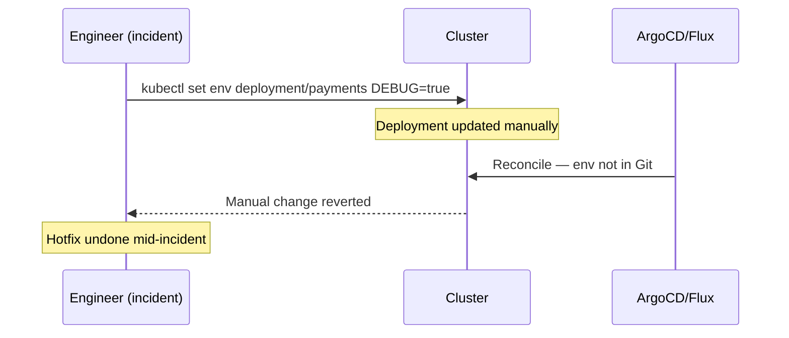

# Drift Detection and Reconciliation

## What drift is and why it happens

Drift is when the live cluster state diverges from the desired state declared in Git. It happens through:

- Manual `kubectl apply` or `kubectl edit` during incidents
- Operators that mutate resources after creation (admission webhooks, controllers)
- Helm chart upgrades that change defaults without a Git commit
- Resource deletion that GitOps doesn't re-create immediately

GitOps controllers detect and reconcile drift continuously. The operational question is how aggressively — and what to do when reconciliation conflicts with incident response.

## Reconciliation models: event-driven vs interval-based

**ArgoCD — event-driven with polling fallback:**

ArgoCD compares live cluster state against the rendered Git manifests on a configurable interval (default: 3 minutes). For near-instant reconciliation on push, configure a Git webhook:

```yaml
# ArgoCD detects push within seconds via webhook
# Server webhook endpoint: https://argocd-server/api/webhook
```

Webhook-driven reconciliation avoids the API server polling overhead of short intervals. The polling interval becomes a fallback for when the webhook fails.

**Flux — interval-based:**

Flux reconciles on a fixed interval set per `GitRepository` and `Kustomization`:

```yaml
apiVersion: source.toolkit.fluxcd.io/v1
kind: GitRepository
metadata:
  name: fleet-config
spec:
  interval: 1m        # poll Git every minute
  url: https://github.com/example/fleet-config
---
apiVersion: kustomize.toolkit.fluxcd.io/v1
kind: Kustomization
metadata:
  name: payments
spec:
  interval: 5m        # reconcile cluster state every 5 minutes
  sourceRef:
    kind: GitRepository
    name: fleet-config
```

**API rate limit risk**: very short intervals (under 30s) on large fleets hit GitHub API rate limits and Kubernetes API server request quotas. Production recommendation: 1–5 minute Git poll interval; 5–10 minute reconciliation interval. Use webhooks in ArgoCD for change responsiveness; accept eventual consistency in Flux.

## Self-healing and the incident conflict

Self-healing is GitOps's most valuable property and its most operationally disruptive one. When enabled, the controller reverts manual changes automatically.



This is a real production incident pattern. The engineer applies a fix; the GitOps controller reverts it within seconds; the engineer applies it again; loop.

## Suspend for incident response

Both ArgoCD and Flux support suspending reconciliation temporarily — the break-glass mechanism.

**ArgoCD — disable auto-sync:**

```bash
argocd app set payments --sync-policy none    # disable auto-sync
# ... perform manual changes for incident response ...
argocd app set payments --sync-policy automated  # re-enable
```

**Flux — suspend annotation:**

```bash
flux suspend kustomization payments
# ... perform manual changes ...
flux resume kustomization payments
```

**Critical discipline**: always resume reconciliation after the incident. Forgotten suspensions are how Day 2 config rot starts. Add a runbook step that verifies reconciliation is resumed as part of incident closure, and alert on Flux Kustomizations or ArgoCD Applications that have been suspended for more than N hours.

## Day 2 configuration rot

Every manual override that isn't committed back to Git is technical debt that compounds. Over 12–18 months of incident-driven manual changes:

- Cluster state diverges from Git in ways that aren't tracked
- The next cluster upgrade or blue-green migration fails because the drift isn't captured
- "It works in cluster A but not cluster B" — because A has 18 months of manual patches

**Prevention**: after every incident involving manual cluster changes, open a PR that captures the change in Git before closing the incident. Make this a mandatory step in your incident process. GitOps only works if Git is always the source of truth.

## The Helm random value problem

Helm's `randAlphaNum` and similar random value functions generate new values on every `helm template` invocation. ArgoCD/Flux render and diff manifests on every reconciliation cycle — triggering perpetual OutOfSync when random values appear in specs.

```yaml
# This causes perpetual OutOfSync in GitOps
env:
- name: SESSION_SECRET
  value: {{ randAlphaNum 32 | quote }}   # different on every render
```

**Fix**: use stable values. Generate the random value once, store it in a Secret (via Sealed Secrets or ESO), and reference it:

```yaml
env:
- name: SESSION_SECRET
  valueFrom:
    secretKeyRef:
      name: app-secrets
      key: session-secret
```

Other sources of reconciliation noise:

- `helm.sh/chart` annotation with timestamps
- Resource version fields that controllers update
- `kubectl.kubernetes.io/last-applied-configuration` annotation differences

Configure ArgoCD resource ignore rules for annotations that legitimately change outside GitOps:

```yaml
# argocd-cm ConfigMap
resource.customizations.ignoreDifferences.apps_Deployment: |
  jsonPointers:
  - /spec/replicas    # HPA manages this — don't fight it
```

## Monitoring reconciliation health

Treat reconciliation failures as platform alerts, not background noise.

```yaml
# Prometheus alert: Flux Kustomization not reconciled
- alert: FluxKustomizationNotReady
  expr: gotk_reconcile_condition{type="Ready",status="False"} == 1
  for: 15m
  labels:
    severity: warning

# ArgoCD equivalent
- alert: ArgoCDAppOutOfSync
  expr: argocd_app_info{sync_status="OutOfSync"} == 1
  for: 30m
  labels:
    severity: warning
```

A permanently OutOfSync Application means the cluster is running something different from Git. That's either an unresolved incident drift or a misconfigured ignore rule — both warrant investigation.

See [promotion-pipelines.md](promotion-pipelines.md) for how sync policies interact with environment promotion.
See [../04-Security/secrets-management.md](../04-Security/secrets-management.md) for Sealed Secrets and ESO as alternatives to random Helm values.
