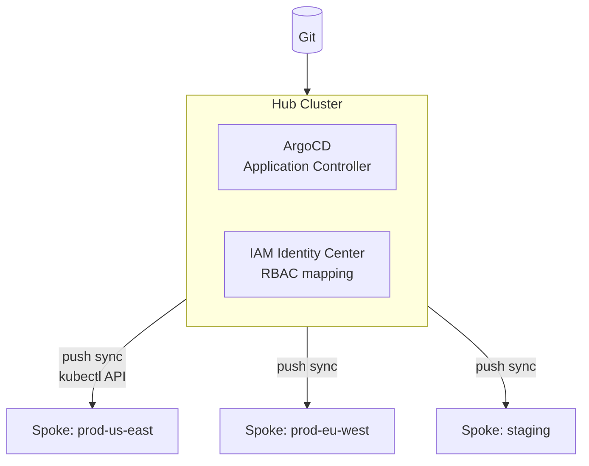
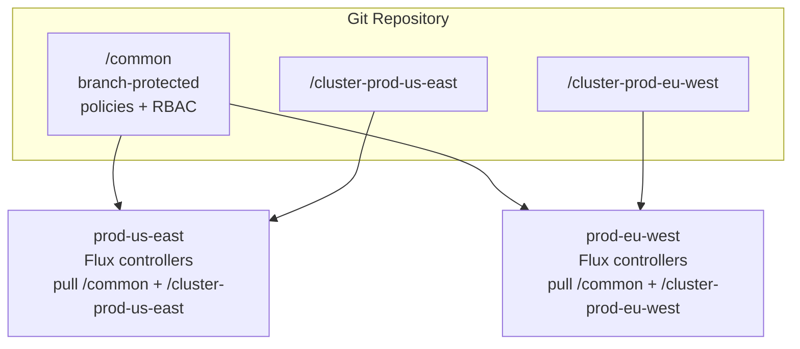

# Multi-Cluster GitOps Sync

## The core topology choice

Multi-cluster GitOps has two delivery models: a central controller pushes to spokes (hub-and-spoke), or each cluster pulls from Git independently (decentralized). The choice determines availability characteristics, operational complexity, and blast radius.

## Hub-and-spoke with ArgoCD

A single ArgoCD instance on the hub cluster manages the entire fleet. Spoke clusters are registered as remote destinations; ArgoCD connects to their API servers and applies manifests.



**Identity federation advantage**: ArgoCD's RBAC is configured once on the hub. IAM Identity Center groups map to ArgoCD roles (`admin`, `developer`, `viewer`). Access to any spoke cluster flows through this single mapping — no per-cluster RBAC management.

**The deployment paralysis risk**: If the hub cluster is unavailable, no new deployments can reach any spoke. Pods continue running — the data plane is unaffected — but you cannot deploy, rollback, or run automated remediation across the fleet until the hub recovers.

Mitigate hub unavailability:
- Hub cluster must be multi-AZ, multi-replica ArgoCD application controller
- PodDisruptionBudget on ArgoCD pods (`minAvailable: 1` for each component)
- Hub itself reconciled by a GitOps controller (ArgoCD manages itself via app-of-apps)
- Documented break-glass procedure for direct `kubectl apply` to spokes when hub is down

## Decentralized fleet with Flux

Each cluster runs its own Flux controllers and pulls its configuration from Git. No hub cluster. Policy consistency is enforced through shared Git directories, not a central controller.



**Resilience advantage**: A failure in prod-us-east's Flux controllers doesn't affect prod-eu-west. Each cluster is independently operational. This is the correct model for fleets where deployment continuity during management plane failures is a hard requirement.

**Consistency challenge**: Ensuring `/common` policies are actually applied on all 20 clusters requires discipline. Flux doesn't have a "check all clusters are compliant" view out of the box — you need Prometheus metrics from each cluster's Flux controllers and a centralized alerting rule for reconciliation failures.

## Spoke cluster registration

**ArgoCD**: explicit cluster registration using a service account on the spoke:

```bash
argocd cluster add prod-us-east \
  --name prod-us-east \
  --system-namespace argocd
```

ArgoCD creates a ServiceAccount on the spoke with cluster-admin (by default — scope down in production). The hub stores the kubeconfig credential as a Secret.

**Flux**: no explicit registration — install Flux on the cluster and point it at Git. The cluster is autonomous from the moment Flux starts reconciling.

## Cross-cluster application delivery

For workloads that must run across multiple clusters (active-active, blue-green fleet rollout), ApplicationSets with the cluster generator is the right model:

```yaml
apiVersion: argoproj.io/v1alpha1
kind: ApplicationSet
metadata:
  name: payments-api
spec:
  generators:
  - clusters:
      selector:
        matchLabels:
          tier: production
  template:
    metadata:
      name: "payments-api-{{name}}"
    spec:
      destination:
        server: "{{server}}"
        namespace: payments
      source:
        repoURL: https://github.com/example/payments
        targetRevision: main
        path: manifests/
```

Adding a new production cluster automatically deploys the payments API to it. Removing the `tier: production` label from a cluster removes it from the delivery scope.

## Network connectivity requirements

Hub-and-spoke requires the hub to reach each spoke's Kubernetes API server. In private endpoint clusters (no public API), this means:

- VPC peering or Transit Gateway between hub VPC and spoke VPCs
- Or hub cluster runs in the same VPC (less isolation)
- Or spoke clusters expose a private endpoint accessible from the hub's VPC

Decentralized Flux only needs outbound access from each cluster to Git (HTTPS). No cluster-to-cluster connectivity required. Simpler for air-gapped or strict network segmentation environments.

See [argocd-vs-flux.md](argocd-vs-flux.md) for the tool-level decision driving topology choice.
See [../01-Cluster-Architecture/cluster-topology.md](../01-Cluster-Architecture/cluster-topology.md) for the cluster topology decision this GitOps topology builds on.
