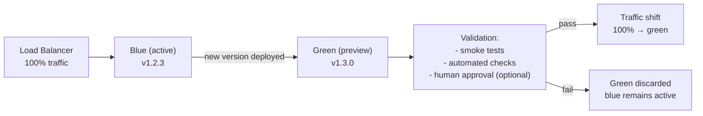
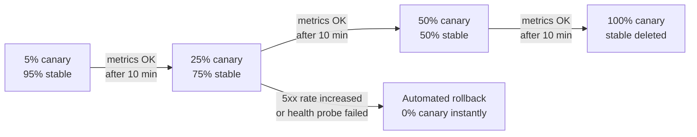
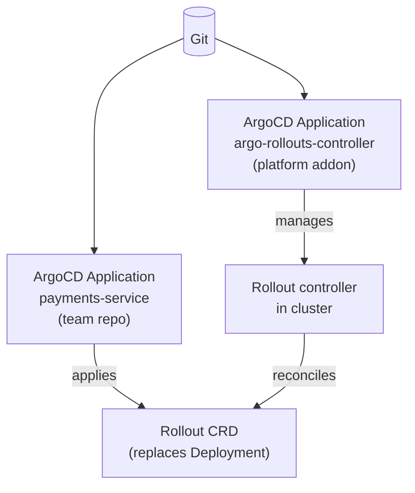

# Progressive Delivery

## What progressive delivery adds to GitOps

GitOps handles the *what* of deployment — the desired state in Git becomes the running state in the cluster. Progressive delivery handles the *how* — traffic is shifted gradually with automated rollback if error rates or health checks degrade. Together they produce deployments that are both auditable (GitOps) and low-risk (progressive delivery).

Without progressive delivery, a GitOps deployment is either fully applied or reverted. Progressive delivery enables intermediate states: 5% of traffic to the new version while the platform observes metrics.

## Argo Rollouts vs Flagger

The tool choice follows the GitOps tool choice:

| | Argo Rollouts | Flagger |
|---|---|---|
| GitOps integration | ArgoCD-native — deep UI integration, rollout visualization in ArgoCD UI | Flux-native — reconciled as a Flux resource |
| Controller model | CRD-based Rollout resource replaces Deployment | Canary CRD wraps an existing Deployment |
| Strategy support | Blue-green, canary, blue-green with canary analysis | Canary, A/B testing, Blue-green |
| Traffic shifting | Service mesh, Gateway API, NGINX, ALB, VPC Lattice | Service mesh, Gateway API, NGINX, Gloo |
| Analysis | AnalysisTemplate CRDs querying Prometheus/Datadog/CloudWatch | MetricTemplate CRDs, Webhook tests |
| UI | Rollout visualization in ArgoCD UI — real-time traffic weight display | No native UI; Grafana dashboards |
| Blast radius | One Rollout controller per cluster | One Flagger controller per cluster |

**Primary decision factor**: if the cluster runs ArgoCD, use Argo Rollouts — the UI integration provides visibility that significantly reduces the human-time cost of running canary deployments. If the cluster runs Flux, Flagger is the natural choice.

## Blue-green deployments

A blue-green deployment runs two complete environments (blue = active, green = preview). Traffic shifts from blue to green only after validation:



**Rollback time**: instant — revert the traffic switch. The old version is still running.

**Cost**: blue-green doubles compute during the transition window. For large deployments, this is significant. Consider scheduling blue-green windows during off-peak hours, or use canary for cost-sensitive services.

```yaml
apiVersion: argoproj.io/v1alpha1
kind: Rollout
spec:
  strategy:
    blueGreen:
      activeService: payments-active      # currently receiving 100% traffic
      previewService: payments-preview    # new version — receives 0% until promotion
      autoPromotionEnabled: false         # require human approval or AnalysisRun pass
      prePromotionAnalysis:
        templates:
        - templateName: smoke-tests
```

## Canary deployments

Traffic is shifted incrementally. Each step is contingent on metrics staying within bounds:



```yaml
apiVersion: argoproj.io/v1alpha1
kind: Rollout
spec:
  strategy:
    canary:
      canaryService: payments-canary
      stableService: payments-stable
      steps:
      - setWeight: 5
      - analysis:
          templates:
          - templateName: error-rate-check
      - pause: {duration: 10m}
      - setWeight: 25
      - pause: {duration: 10m}
      - setWeight: 50
      - pause: {duration: 10m}
---
apiVersion: argoproj.io/v1alpha1
kind: AnalysisTemplate
metadata:
  name: error-rate-check
spec:
  metrics:
  - name: error-rate
    interval: 1m
    successCondition: result[0] < 0.05    # <5% error rate
    failureLimit: 3
    provider:
      prometheus:
        address: http://prometheus:9090
        query: |
          sum(rate(http_requests_total{status=~"5..",service="payments-canary"}[5m]))
          /
          sum(rate(http_requests_total{service="payments-canary"}[5m]))
```

**Automated rollback trigger**: if the AnalysisRun fails (metric threshold breached `failureLimit` times), Rollouts sets canary weight to 0 instantly. The stable version continues handling 100% of traffic. No human intervention required.

## Gateway API for traffic shifting

Use Kubernetes Gateway API (`HTTPRoute` weight split) rather than service mesh-specific traffic APIs. This keeps the Rollout spec portable across traffic shifting implementations:

```yaml
apiVersion: gateway.networking.k8s.io/v1
kind: HTTPRoute
metadata:
  name: payments-route
spec:
  rules:
  - backendRefs:
    - name: payments-stable
      port: 8080
      weight: 95
    - name: payments-canary
      port: 8080
      weight: 5    # Argo Rollouts updates this weight as canary progresses
```

This HTTPRoute works with AWS ALB (via AWS LBC), VPC Lattice, Istio, and Envoy Gateway without changing the Rollout spec. Coupling to Istio's VirtualService or NGINX-specific annotations makes the progressive delivery config non-portable.

See [../03-Networking/service-mesh-selection.md](../03-Networking/service-mesh-selection.md) for service mesh options that provide the traffic shifting backend.

## GitOps integration

Deploy Argo Rollouts or Flagger as a cluster addon via the app-of-apps pattern. The Rollout or Canary CRD then replaces the Deployment in each service's GitOps repo:



The Rollout spec is committed to Git by engineers. ArgoCD syncs it. The Rollout controller manages the actual traffic shift lifecycle — ArgoCD sees the Rollout object as in-sync once it's applied; it does not track the intermediate canary steps. This is expected behavior: the traffic shifting lifecycle is Rollout's responsibility, not GitOps's.

**Important**: set ArgoCD's resource health check for Rollout objects to treat `Progressing` as healthy (not `Degraded`). Otherwise ArgoCD will flag a canary-in-progress as out-of-sync and operators may inadvertently sync it back to the previous state.

```yaml
# argocd-cm ConfigMap — add Rollout health check
resource.customizations.health.argoproj.io_Rollout: |
  hs = {}
  if obj.status ~= nil then
    if obj.status.phase == "Progressing" then
      hs.status = "Progressing"
      hs.message = obj.status.message
      return hs
    end
    if obj.status.phase == "Healthy" then
      hs.status = "Healthy"
      return hs
    end
  end
  hs.status = "Progressing"
  return hs
```

See [app-of-apps-and-applicationsets.md](app-of-apps-and-applicationsets.md) for the ApplicationSet pattern that deploys Argo Rollouts as a cluster addon.
See [argocd-vs-flux.md](argocd-vs-flux.md) for the GitOps tool selection that determines Rollouts vs Flagger.
See [../10-Platform-API/golden-path-templates.md](../10-Platform-API/golden-path-templates.md) for embedding Rollout specs in golden path templates so canary is the default deployment strategy for new services.
