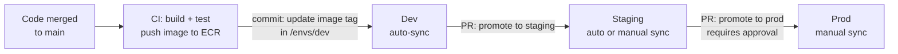
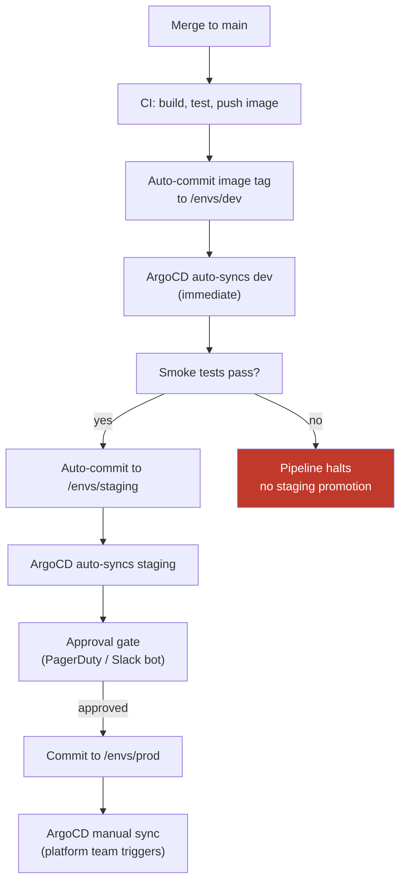

# Environment Promotion Pipelines

## What promotion means in GitOps

In GitOps, promoting a change means updating Git state — not running a deployment command. Promotion is a commit or PR that updates the image tag, Helm chart version, or configuration value for a specific environment's directory.



## PR-based promotion

Changes move between environments via pull requests. A CI pipeline opens a PR to update the image tag in the target environment's directory; a human approves and merges.

**Structure:**

```text
fleet-config/
├── envs/
│   ├── dev/
│   │   └── payments/values.yaml     # image: payments:sha-abc123
│   ├── staging/
│   │   └── payments/values.yaml     # image: payments:sha-abc123 (after PR merge)
│   └── prod/
│       └── payments/values.yaml     # image: payments:v1.2.3 (semver-tagged only)
```

**Advantages:**

- Full audit trail: every promotion is a named commit with a reviewer
- Easy rollback: revert the commit that bumped the image tag
- Governance gate: required reviewers enforce approval workflow

**Limitation at scale**: as fleet size grows, the platform team or senior engineers become the bottleneck reviewing promotion PRs. A team with 20 services promoting multiple times per day generates significant PR review volume.

## Automated promotion

CI pipelines automatically commit image tag updates to lower environments without a PR. Higher environments (staging, prod) still require explicit approval.

**Image updater automation (ArgoCD Image Updater):**

```yaml
apiVersion: argoproj.io/v1alpha1
kind: Application
metadata:
  annotations:
    argocd-image-updater.argoproj.io/image-list: payments=123456789.dkr.ecr.us-east-1.amazonaws.com/payments
    argocd-image-updater.argoproj.io/payments.update-strategy: semver
    argocd-image-updater.argoproj.io/payments.allow-tags: regexp:^v[0-9]+\.[0-9]+\.[0-9]+$
    argocd-image-updater.argoproj.io/write-back-method: git
```

ArgoCD Image Updater polls ECR, detects new semver-tagged images, and commits the updated tag to Git automatically. Dev gets instant updates; prod uses a separate Application pointing to the prod environment's directory with manual sync.

## Hybrid: auto in dev, manual trigger in prod

The production pattern for most platforms:

| Environment | Sync mode | Promotion trigger |
|---|---|---|
| dev | Automatic | Every commit to main |
| staging | Automatic or scheduled | CI pipeline commits after dev passes |
| prod | Manual | Pipeline-driven with approval gate |



**Manual sync in prod**: ArgoCD can be configured with `syncPolicy: {}` (no automated sync) on the production Application. The sync is triggered explicitly — by the platform team via UI, CLI, or a pipeline step that calls the ArgoCD API after all checks pass.

## Testing gates before promotion

Automated promotion without testing gates is dangerous — it just moves failures faster.

**Required gates for staging promotion:**

- Unit and integration tests passing in CI
- Smoke tests against the dev deployment (real K8s, not mocks)
- Policy compliance: `argocd app diff` to verify rendered manifests match expected state
- Vulnerability scan on the new image

**For prod promotion additionally:**

- Load test or synthetic traffic validation in staging
- Approval from service owner (automated request via Slack/PagerDuty)
- Change window enforcement (no prod deploys during peak hours or freeze periods)

## Rollback strategy

In GitOps, rollback is a promotion in reverse — a commit that restores the previous image tag or configuration.

```bash
# Rollback via git revert (clean history)
git revert HEAD --no-edit
git push origin main

# Or pin to specific previous commit
git checkout <prev-sha> -- envs/prod/payments/values.yaml
git commit -m "rollback payments to v1.2.2"
git push origin main
```

ArgoCD or Flux detects the new commit and reconciles back to the previous state. This is faster and safer than imperative rollback commands — the Git history shows exactly what happened.

**Avoid**: `argocd app rollback` which uses ArgoCD's internal history rather than Git. This creates a divergence between Git state and cluster state — the definition of drift.

See [drift-detection-reconciliation.md](drift-detection-reconciliation.md) for managing sync behavior during and after promotions.
See [app-of-apps-and-applicationsets.md](app-of-apps-and-applicationsets.md) for using ApplicationSets to automate multi-cluster promotions.
