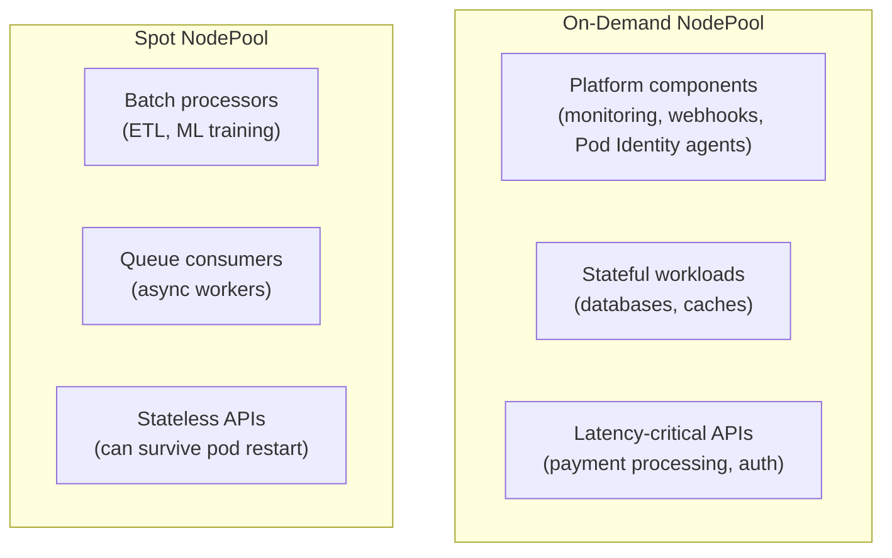
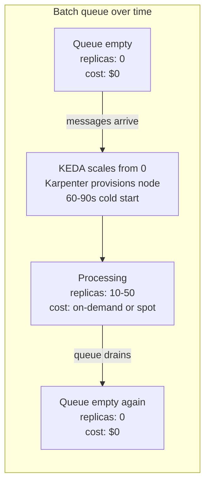

# Cost-Aware Scaling

## The cost model of autoscaling

Autoscaling doesn't reduce costs automatically — it shifts when you pay. A cluster that scales up for traffic spikes and down during off-hours costs less than a statically over-provisioned cluster. But a misconfigured scaler that never scales down, or one that over-provisions nodes, can cost more than a static fleet.

Cost-aware scaling requires deliberate design: the right capacity type for each workload, scale-to-zero for idle workloads, and node consolidation to eliminate wasted compute.

## Spot vs on-demand: workload segregation

Spot instances are 60–80% cheaper than on-demand but can be interrupted with 2 minutes notice. The platform decision is which workloads can tolerate interruption.



**Segregation via taints and NodePool capacity type:**

```yaml
# Spot NodePool — batch workloads
- key: karpenter.sh/capacity-type
  operator: In
  values: ["spot"]

# Workload toleration for spot
tolerations:
- key: karpenter.sh/capacity-type
  operator: Equal
  value: spot
  effect: NoSchedule
```

Stateless APIs can run on spot safely if they handle pod restarts gracefully (readiness probes, retry logic, no in-memory session state). The risk is a spot interruption during a traffic spike — ensure HPA has enough headroom that a sudden 20% node loss doesn't cause a capacity cliff.

## Scale-to-zero with KEDA: eliminating idle cost

Standard HPA minimum is 1 replica — a pod always running even when there's no load. KEDA's `minReplicaCount: 0` allows full scale-to-zero.



**Cold-start decision**: scale-to-zero eliminates idle cost but introduces cold-start latency. Trade-off by workload type:

| Workload | Cold-start tolerance | Recommendation |
|---|---|---|
| Nightly ETL batch | Minutes acceptable | `minReplicaCount: 0` — full scale-to-zero |
| Async email sending | 60–90s acceptable | `minReplicaCount: 0` |
| Near-real-time data pipeline | <10s required | `minReplicaCount: 1` — keep one warm |
| Interactive API with queue backing | Unacceptable | Use HPA, not KEDA scale-to-zero |

For workloads with acceptable cold-start, pre-warm nodes using Karpenter's `nodepool.karpenter.sh/capacity-reservation` or by keeping a small on-demand buffer. The cold-start cost is node provision time (~45–90s) plus container image pull time — cache images on nodes via a DaemonSet or use ECR pull-through cache to reduce pull time.

## Savings Plans interaction

AWS Compute Savings Plans commit to a $/hour spend in exchange for a discount on on-demand compute (up to 66%). The savings plan covers any EC2 instance family, size, region, and OS.

**Sizing on-demand NodePools to consume the commitment:**

If you have a $500/hour Savings Plan, your on-demand NodePool limits should be sized to consume ~$500/hour at steady state before overflowing to spot. Under-consuming the commitment means paying for unused savings plan capacity.

```text
On-demand baseline → Savings Plan coverage
Spot burst → no savings plan coverage, but 60-80% cheaper than on-demand
```

Operational pattern: use CloudWatch or AWS Cost Explorer to monitor Savings Plan utilization rate. If utilization drops below 85%, the on-demand NodePool minimum is too low — increase it or reduce the savings plan commitment at renewal.

## Node consolidation and cost recapture

Karpenter's consolidation continuously right-sizes the node fleet as pod scheduling changes. Without consolidation, nodes that have had pods evicted or scaled down remain running — you pay for compute that's running nothing.

**Consolidation settings for cost optimization:**

```yaml
disruption:
  consolidationPolicy: WhenEmptyOrUnderutilized
  consolidateAfter: 5m       # wait 5 min before consolidating — avoid churn
  budgets:
  - nodes: "20%"             # consolidate at most 20% of nodes at once
    schedule: "@daily"       # limit aggressive consolidation to off-hours
  - nodes: "5%"              # conservative during business hours
    schedule: "* 8-18 * * MON-FRI"
```

**Cost visibility**: tag Karpenter-provisioned nodes with workload labels so EC2 cost allocation reports show which applications are driving compute cost:

```yaml
# EC2NodeClass — propagate labels as EC2 tags
spec:
  tags:
    karpenter.sh/nodepool: "{{ .NodePool.Name }}"
    team: "{{ .Labels.team }}"
    environment: "{{ .Labels.environment }}"
```

## AWS API rate limits at scale

During large-scale events (fleet-wide spot interruption, mass HPA scale-out), Karpenter and the Kubernetes scheduler both make high volumes of API calls. AWS EC2 and EKS APIs have per-region rate limits.

**Mitigation:**

- Karpenter batches pod evaluation — it doesn't provision one node per pending pod but evaluates all pending pods together and provisions the minimum set
- Set `--batch-max-duration` and `--batch-idle-duration` in Karpenter to tune batching aggressiveness
- Spread workloads across AZs — concentrated AZ deployments amplify spot interruption storms

See [hpa-vpa-keda.md](hpa-vpa-keda.md) for the pod-level scalers that drive node-level demand.
See [karpenter-nodepool-design.md](karpenter-nodepool-design.md) for NodePool configuration that implements the spot/on-demand mix.
See [../01-Cluster-Architecture/node-pool-design.md](../01-Cluster-Architecture/node-pool-design.md) for node pool taint/toleration strategy that separates spot and on-demand workloads at the node group level.
