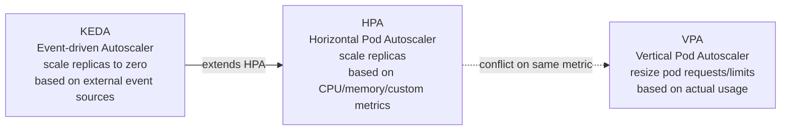
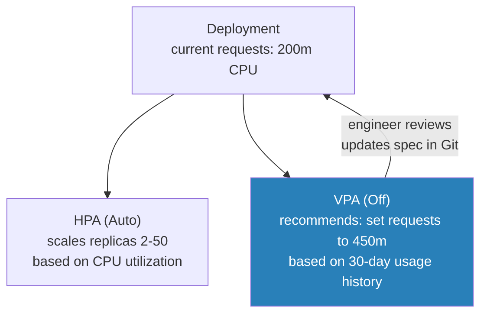

# HPA vs VPA vs KEDA

## The three layers of pod scaling

Pod-level autoscaling has three distinct tools that solve different problems. Reaching for the wrong one — or combining them incorrectly — causes instability.



## HPA: horizontal scaling for stateless workloads

HPA adjusts the replica count of a Deployment, StatefulSet, or ReplicaSet based on observed metrics. It is the right default for stateless services.

```yaml
apiVersion: autoscaling/v2
kind: HorizontalPodAutoscaler
metadata:
  name: payments-api
spec:
  scaleTargetRef:
    apiVersion: apps/v1
    kind: Deployment
    name: payments-api
  minReplicas: 2
  maxReplicas: 50
  metrics:
  - type: Resource
    resource:
      name: cpu
      target:
        type: Utilization
        averageUtilization: 60    # scale out when average CPU > 60%
  behavior:
    scaleDown:
      stabilizationWindowSeconds: 300   # wait 5 min before scaling down
      policies:
      - type: Pods
        value: 2
        periodSeconds: 60              # remove at most 2 pods per minute
```

**Scale-down stabilization window**: critical for workloads with bursty traffic. Without it, HPA scales down aggressively after a traffic spike ends, then scales back up when the next spike hits — causing oscillation. Set `stabilizationWindowSeconds` to at least the duration of your typical traffic burst.

**Resource requests are required**: HPA calculates utilization as `actual usage / requested`. A pod with no resource requests reports 0% utilization regardless of actual load — HPA will never scale it out. Enforce resource requests via LimitRange (see [../02-Multi-Tenancy/resource-quotas-limitranges.md](../02-Multi-Tenancy/resource-quotas-limitranges.md)).

## VPA: right-sizing for vertically-bound workloads

VPA adjusts resource requests and limits on running pods based on historical usage. It is the right tool for workloads that can't scale horizontally (singletons, stateful sets with tight coupling) or where initial resource estimates are wrong.

```yaml
apiVersion: autoscaling.k8s.io/v1
kind: VerticalPodAutoscaler
metadata:
  name: payments-worker
spec:
  targetRef:
    apiVersion: apps/v1
    kind: Deployment
    name: payments-worker
  updatePolicy:
    updateMode: "Off"     # Off = recommendations only, no automatic pod restarts
```

**Modes:**

- `Off`: generates recommendations in `.status.recommendation` — read-only, no mutations
- `Initial`: applies recommendations only at pod creation, not to running pods
- `Auto`: evicts and restarts pods to apply new resource settings — disrupts running workloads

**The HPA + VPA conflict**: if both are managing the same deployment on the same metric (CPU), they fight. HPA sees high CPU and adds replicas; VPA sees the replicas are undersized and evicts them to resize; repeat. This causes scheduling churn and instability.

**Safe combination**: VPA in `Off` mode alongside HPA in `Auto` mode. VPA surfaces recommendations; engineers review and manually update requests in the deployment spec. HPA handles active scaling within those requests.



## KEDA: event-driven and scale-to-zero

KEDA extends HPA to support external event sources as scaling triggers. It creates and manages an HPA under the hood — KEDA is not a replacement for HPA, it's a superset.

Scale triggers KEDA supports natively:

- SQS queue depth
- Kafka consumer group lag
- Prometheus query result
- Azure Service Bus message count
- Cron schedule (scale up at 8am, scale down at 6pm)
- Custom external metrics via HTTP

```yaml
apiVersion: keda.sh/v1alpha1
kind: ScaledObject
metadata:
  name: batch-processor
spec:
  scaleTargetRef:
    name: batch-processor
  minReplicaCount: 0        # scale to zero when queue is empty
  maxReplicaCount: 100
  triggers:
  - type: aws-sqs-queue
    metadata:
      queueURL: https://sqs.us-east-1.amazonaws.com/123456789/batch-jobs
      queueLength: "10"     # one replica per 10 messages
      awsRegion: us-east-1
    authenticationRef:
      name: keda-sqs-auth   # Pod Identity or IRSA for SQS access
```

**Scale-to-zero**: KEDA's key differentiator over plain HPA. When the SQS queue is empty, replicas drop to zero — no idle compute cost. When messages arrive, KEDA scales from 0 to 1 before handing control to HPA for further scale-out.

**Cold-start tradeoff**: scaling from zero means a pod must be scheduled on an existing node (fast, ~10s) or trigger node provisioning via Karpenter (slow, 45–90s). For time-sensitive batch workloads, set `minReplicaCount: 1` to keep one warm pod at the cost of idle compute.

## Decision guide

| Workload type | Scaler | Mode |
|---|---|---|
| Stateless API, variable traffic | HPA | CPU or custom metric |
| Stateless API + right-sizing needed | HPA + VPA | HPA Auto, VPA Off |
| Queue consumer, cost-sensitive | KEDA | SQS/Kafka trigger, scale-to-zero |
| Singleton controller, over-provisioned | VPA | Initial or Auto (with PDB) |
| JVM app with memory churn | VPA | Off (recommendations only) |
| Scheduled batch (on/off hours) | KEDA | Cron trigger |

See [karpenter-vs-cluster-autoscaler.md](karpenter-vs-cluster-autoscaler.md) for node-level scaling that pairs with these pod scalers.
