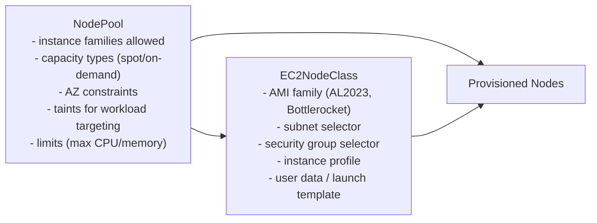
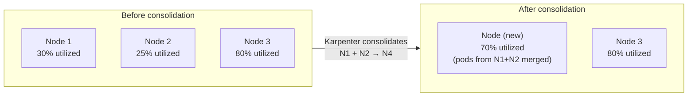
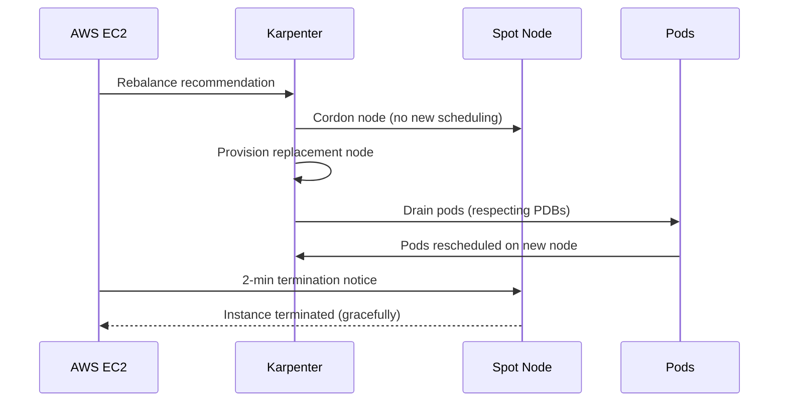

# Karpenter NodePool and NodeClass Design

## The two configuration objects

`NodePool` defines what workloads this pool can serve and what constraints apply. `EC2NodeClass` defines the AWS-specific infrastructure configuration. They are separate concerns — the NodePool is portable; the NodeClass is AWS-specific.



## NodePool design patterns

### General-purpose pool

```yaml
apiVersion: karpenter.sh/v1
kind: NodePool
metadata:
  name: general
spec:
  template:
    spec:
      nodeClassRef:
        name: default
      requirements:
      - key: karpenter.sh/capacity-type
        operator: In
        values: ["spot", "on-demand"]
      - key: kubernetes.io/arch
        operator: In
        values: ["amd64", "arm64"]
      - key: karpenter.k8s.aws/instance-family
        operator: In
        values: ["m5", "m6i", "m6a", "c5", "c6i", "c6a", "r5", "r6i"]
  limits:
    cpu: "1000"
    memory: 4000Gi
  disruption:
    consolidationPolicy: WhenEmptyOrUnderutilized
    consolidateAfter: 1m
```

**Multiple instance families**: always specify multiple families. Spot availability varies by instance type and AZ — a single instance type will frequently be unavailable. Specify 5–10 families to give Karpenter pricing flexibility and spot availability breadth.

### Platform-critical pool (on-demand only)

```yaml
apiVersion: karpenter.sh/v1
kind: NodePool
metadata:
  name: platform-critical
spec:
  template:
    metadata:
      labels:
        node-role: platform
    spec:
      nodeClassRef:
        name: default
      taints:
      - key: node-role
        value: platform
        effect: NoSchedule
      requirements:
      - key: karpenter.sh/capacity-type
        operator: In
        values: ["on-demand"]     # no spot for platform components
      - key: karpenter.k8s.aws/instance-family
        operator: In
        values: ["m6i", "m6a"]
```

Platform components (monitoring agents, admission webhooks, Pod Identity agents) should never run on spot. A spot interruption taking down a monitoring stack during a separate incident compounds the blast radius.

## Consolidation policy

Consolidation is Karpenter's active bin-packing: it identifies underutilized nodes and evicts their pods to denser nodes, then terminates the emptied node.



**PDB requirement**: consolidation respects `PodDisruptionBudgets`. Without a PDB, Karpenter will evict all replicas of a deployment simultaneously to consolidate — causing downtime. Every production workload must have a PDB before enabling `WhenEmptyOrUnderutilized` consolidation.

```yaml
consolidationPolicy: WhenEmptyOrUnderutilized  # consolidate underutilized nodes
# vs
consolidationPolicy: WhenEmpty                  # only consolidate fully empty nodes (safer)
```

Start with `WhenEmpty` and move to `WhenEmptyOrUnderutilized` after verifying all workloads have PDBs.

## Spot interruption handling

AWS sends a rebalance recommendation and a 2-minute termination notice before interrupting a spot instance. Karpenter watches for both signals and responds proactively.



**The Pod Identity agent failure mode**: if the Karpenter-provisioned replacement node takes longer than expected to register and start the Pod Identity DaemonSet, pods rescheduled to it may fail their first AWS API call. Implement retry logic in application code for AWS SDK calls; don't assume credentials are immediately available after pod startup.

## Node drift detection

Karpenter detects when nodes have drifted from their NodePool specification — for example, when the AMI family is updated in the EC2NodeClass. It will replace drifted nodes rolling via `drift` disruption reason.

```yaml
spec:
  disruption:
    budgets:
    - nodes: "10%"     # replace at most 10% of nodes at a time during drift remediation
```

This is how Kubernetes node OS updates work with Karpenter: update the AMI selector in the EC2NodeClass, commit to Git, and Karpenter rolls the fleet node by node.

## NodePool limits

Always set limits. An unbounded NodePool is a cost runaway risk — a misconfigured HPA or KEDA scaler can trigger Karpenter to provision hundreds of nodes before anyone notices.

```yaml
limits:
  cpu: "500"        # max 500 vCPU across all nodes in this pool
  memory: 2000Gi    # max 2 TiB memory
```

Alert when NodePool utilization exceeds 80% of its limit — this is the signal to raise the limit intentionally, not reactively when workloads start failing to schedule.

See [cost-aware-scaling.md](cost-aware-scaling.md) for spot/on-demand mix strategies within NodePool design.
See [karpenter-vs-cluster-autoscaler.md](karpenter-vs-cluster-autoscaler.md) for the architectural context behind these design choices.
