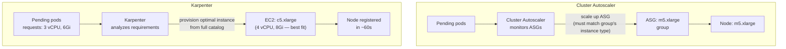

# Karpenter vs Cluster Autoscaler

## The fundamental architectural difference

Cluster Autoscaler works with pre-defined node groups (ASGs). It watches for unschedulable pods and asks the cloud provider to increase the size of an existing group. Karpenter watches for unschedulable pods and provisions nodes directly — choosing instance type, capacity type, and AZ from scratch based on what the pods need.

## Cluster Autoscaler: node groups as the scaling unit

CA requires node groups (ASGs) to exist before it can scale. The instance types available for scale-out are limited to what's in each group. When a pod can't be scheduled, CA evaluates which group could fit it and increases that group's desired count.

**Fragmentation problem**: a cluster with 10 node groups — one per team or workload type — means each group must maintain its own spare capacity buffer. A group at minimum size with 0 spare nodes takes 2–3 minutes to scale up (ASG launch + node join + pod schedule). Meanwhile pods sit pending.

**Over-provisioning tax**: to reduce latency, teams over-provision node groups — always keeping warm nodes. This is expensive. The alternative (scaling from zero) means unacceptable scheduling latency for traffic-sensitive workloads.

**Priority expander**: CA's expander strategy determines which node group to scale when multiple could fit the pod. `least-waste` picks the group that wastes the least CPU/memory. `priority` lets you define a preference order. Neither is as effective as Karpenter's direct instance selection.

## Karpenter: groups-less provisioning

Karpenter replaces the node group layer entirely. When pods are pending, Karpenter:

1. Aggregates the resource requirements of all pending pods
2. Selects the most cost-effective instance type from the full AWS catalog that fits them
3. Launches the instance directly via EC2 API
4. Registers it with the cluster

No ASGs. No pre-defined instance type lists. No group-specific capacity buffers.

**Speed**: Karpenter achieves node registration in ~45–90 seconds — significantly faster than CA + ASG because it bypasses the ASG launch configuration layer and uses EC2 launch templates directly.

**Bin-packing quality**: Karpenter evaluates hundreds of instance types simultaneously and picks the smallest that fits all pending pods. CA is constrained to whatever instance types are in the matching node group.

## Side-by-side comparison

| Factor | Cluster Autoscaler | Karpenter |
|---|---|---|
| Node provisioning model | Scale existing ASG | Direct EC2 launch |
| Instance type selection | Fixed per node group | Full AWS catalog |
| Scale-up speed | 3–5 min (ASG + node join) | 45–90s |
| Bin-packing | Per-group; fragmented | Optimal across all instance types |
| Spot instance handling | Per-group spot/on-demand mix | Per-node capacity type selection |
| Consolidation (scale-down) | Underutilized node removal | Active consolidation + node replacement |
| Multi-arch (ARM/x86) | Separate node groups required | Single NodePool with arch constraints |
| Operational overhead | Low (ASG managed by AWS) | Medium (NodePool/NodeClass config) |
| EKS Auto Mode compatibility | No | Yes (Auto Mode uses Karpenter internally) |

## When Cluster Autoscaler is still appropriate

- Existing clusters with deeply embedded ASG workflows and tooling
- Compliance requirements mandating pre-approved instance type lists
- Windows node groups (Karpenter Windows support is more limited)
- Teams that aren't ready to manage Karpenter NodePool/NodeClass configuration

CA is not wrong — it's mature and well-understood. Karpenter is better for greenfield clusters where cost efficiency and scale-up speed are priorities.

## Migration from CA to Karpenter

Running both simultaneously is supported but operationally noisy — both may try to provision for the same pending pods.

Migration approach:

1. Install Karpenter alongside CA
2. Apply `karpenter.sh/do-not-disrupt: "true"` annotation to CA-managed nodes
3. Configure Karpenter NodePools with taints; gradually move workloads to tolerate them
4. Remove CA node groups one at a time as workloads migrate
5. Remove CA when all workloads are on Karpenter-provisioned nodes

Do not attempt a same-day cutover on a production cluster.

See [karpenter-nodepool-design.md](karpenter-nodepool-design.md) for NodePool and NodeClass configuration patterns.
See [../01-Cluster-Architecture/node-pool-design.md](../01-Cluster-Architecture/node-pool-design.md) for the workload isolation patterns that inform NodePool design.
