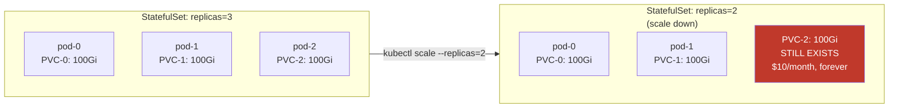

# Scaling Stateful Workloads

## Why stateful workloads are different

HPA and Karpenter were designed with stateless workloads in mind. A stateless pod can be created and destroyed freely — it holds no unique data and has no persistent identity. StatefulSets break both assumptions: each pod has a stable hostname, an ordinal index, and a bound PersistentVolume that follows it.

Scale operations on StatefulSets carry risks that Deployment scale operations don't.

## StatefulSet scaling risks

**Scale-down is irreversible without explicit cleanup**: when you scale a StatefulSet down, the pod is deleted but its PVC is retained. The PVC continues to incur storage cost, and its data persists. This is intentional safety behavior — but orphaned PVCs accumulate silently.



**Ordered scaling**: StatefulSets scale sequentially by default. Scale-up provisions pods in order (0, 1, 2...) and each must be Running and Ready before the next is created. Scale-down deletes in reverse order. This protects quorum in distributed systems (etcd, Kafka, Cassandra) but means scaling is slower than Deployments.

**Never autoscale StatefulSets with HPA without understanding the application**: HPA on a StatefulSet that expects stable quorum membership (like a Kafka broker) will cause split-brain or lost leadership if pods are added/removed faster than the application can rebalance.

## When HPA on StatefulSets is safe

Some stateful applications support dynamic member addition and graceful removal:

- Read replicas of databases (Postgres replicas, Redis replicas)
- Worker pools with no cross-pod coordination
- Stateless-ish applications using StatefulSet only for stable DNS hostnames

For these, HPA can work. Set conservative scale-down policies and verify the application correctly handles member departure.

## External database scaling via ACK/Crossplane

For production databases (RDS, Aurora, ElastiCache), scaling through Kubernetes means managing the cloud resource as a Kubernetes object via ACK or Crossplane — not scaling pods.

```yaml
# ACK RDS DBInstance — scale by modifying the spec
apiVersion: rds.services.k8s.aws/v1alpha1
kind: DBInstance
metadata:
  name: payments-db
  namespace: payments
spec:
  dbInstanceClass: db.r6g.2xlarge    # change this to scale up
  allocatedStorage: 500
  engine: postgres
```

A GitOps PR updating `dbInstanceClass` triggers ACK to call the RDS ModifyDBInstance API. The change is auditable in Git history — who approved the scale-up, when, and why.

## Transition rules: one-way scaling for safety

Crossplane XRDs (CompositeResourceDefinitions) support validation rules that prevent dangerous transitions. For databases, a one-way constraint prevents accidental scale-downs that could cause data loss or performance degradation.

```yaml
# Crossplane XRD validation — database class can only increase
x-kubernetes-validations:
- rule: "self.dbInstanceClass >= oldSelf.dbInstanceClass"
  message: "Database instance class can only be increased, not decreased"
```

This blocks a misconfigured automation or a mistaken PR from scaling a production database down. Scale-down requires explicitly removing the validation rule — a deliberate, audited action.

## PVC lifecycle management

To prevent orphaned PVC accumulation from StatefulSet scale-down operations:

**Automatic PVC cleanup on StatefulSet deletion** (K8s 1.27+):

```yaml
spec:
  persistentVolumeClaimRetentionPolicy:
    whenDeleted: Delete    # delete PVCs when StatefulSet is deleted
    whenScaled: Retain     # keep PVCs on scale-down (safe default)
```

For development or batch StatefulSets where data doesn't need to survive scale-down:

```yaml
persistentVolumeClaimRetentionPolicy:
  whenScaled: Delete    # delete PVC when pod is removed on scale-down
```

Never use `whenScaled: Delete` for production stateful services — data loss is permanent.

**Audit for orphaned PVCs** in your monitoring:

```yaml
# Prometheus alert: PVC not bound to any pod for 24h
- alert: OrphanedPVC
  expr: |
    kube_persistentvolumeclaim_info{phase="Bound"}
    unless on(persistentvolumeclaim, namespace)
    kube_pod_spec_volumes_persistentvolumeclaims_info
  for: 24h
  labels:
    severity: warning
```

## Kafka and distributed system scaling

Kafka brokers are StatefulSets with partitions assigned per broker. Adding a broker doesn't rebalance partitions automatically — you must trigger a partition reassignment. Removing a broker without rebalancing first causes under-replicated partitions or data loss.

**Safe Kafka scale-up pattern:**

1. Scale StatefulSet replicas up (new broker joins cluster)
2. Run partition reassignment tool to distribute partitions to new broker
3. Verify replica sync completes before considering the scale-up done

**Never autoscale Kafka with HPA**. Kafka broker scaling is a manual, coordinated operation. KEDA can scale consumers (separate Deployments) based on Kafka consumer group lag — that's the right use of autoscaling for Kafka workloads.

See [hpa-vpa-keda.md](hpa-vpa-keda.md) for KEDA Kafka consumer lag scaling.
See [../09-Storage/](../09-Storage/) for PV/PVC design patterns that affect StatefulSet scaling behavior.
