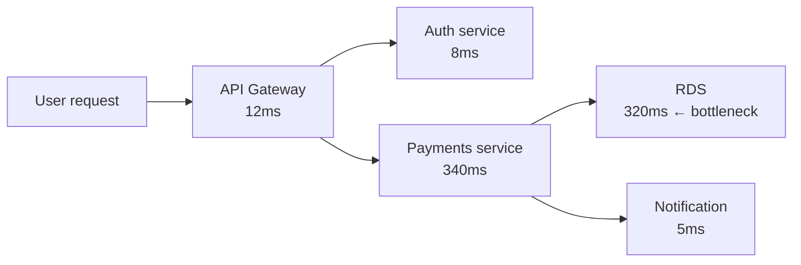
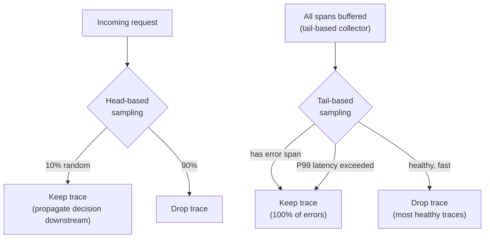

# Distributed Tracing

## What tracing adds that metrics and logs don't

Metrics tell you something is wrong (error rate spike). Logs tell you what happened on one service. Traces tell you the full request path — which services were called, in what order, how long each took, and where the latency or error originated.



Without tracing, a 340ms payments service call looks like a payments problem. With tracing, you see the 320ms is a database call — the database is the bottleneck. This is the diagnostic value tracing provides.

## Instrumentation: auto vs manual

**Auto-instrumentation (ADOT Application Signals)**: AWS injects instrumentation into Java, Python, and Node.js applications automatically via an init container and environment variables. No code changes required.

```yaml
# Add annotation to enable ADOT auto-instrumentation
metadata:
  annotations:
    instrumentation.opentelemetry.io/inject-java: "true"
```

This instruments HTTP clients, gRPC, database drivers, and AWS SDK calls — the most common span sources — without developer involvement. The tradeoff: auto-instrumentation can't capture business-level context (user ID, order ID, tenant ID). Manual span attributes are required for that.

**Manual instrumentation**: developers add spans, attributes, and events using the OTel SDK. Required for:

- Business-level trace context (`order_id`, `tenant_id`, `feature_flag`)
- Internal logic tracing (what decision was made, not just which service was called)
- Async operations (queue processing, background jobs)

The platform provides auto-instrumentation as the baseline. Teams add manual instrumentation for their specific business context.

## Sampling strategies

100% trace collection is expensive. At 1000 RPS, that's 86.4 million traces per day. The question is which traces to keep.



**Head-based sampling**: the decision to sample is made at the first span (ingress). If sampled, all downstream spans in the trace carry the decision. Simple to implement; configured per service or globally.

- Pro: low overhead, no buffering required
- Con: blind to errors — a request sampled as "discard" at the start won't be captured even if it later fails

**Tail-based sampling**: collect all spans in a buffer, make the keep/drop decision when the root span closes (after seeing the full trace).

- Pro: can capture 100% of error traces and high-latency traces while dropping healthy ones
- Con: requires buffering — the OTel Collector gateway holds spans in memory until the trace completes, adding latency and memory overhead
- Requires all spans for a trace to arrive at the same collector instance (sticky routing or trace-aware load balancing)

**Recommended production sampling strategy:**

```yaml
# Tail-based sampling in OTel Collector gateway
processors:
  tail_sampling:
    decision_wait: 10s          # wait up to 10s for all spans
    policies:
    - name: errors-always
      type: status_code
      status_code: {status_codes: [ERROR]}    # keep all error traces
    - name: slow-requests
      type: latency
      latency: {threshold_ms: 500}            # keep traces over 500ms
    - name: probabilistic-baseline
      type: probabilistic
      probabilistic: {sampling_percentage: 5} # 5% random baseline
```

This captures 100% of errors, 100% of slow requests, and a 5% baseline of healthy traffic for coverage.

## Cost of tracing at scale

Trace cost has two components: storage and network transfer.

**Network transfer**: spans travel from application pods to collector to backend. In EKS, inter-AZ traffic and NAT Gateway egress both cost money. At 1000 RPS with 10 spans per trace and 1 KB per span:

- 10 MB/s of trace data
- ~864 GB/day
- ~$38/day in NAT Gateway costs alone (at $0.045/GB)

Sampling aggressively reduces this. Going from 100% to 5% head-based sampling reduces NAT Gateway cost by 95% for trace data.

**Backend storage**: AMP stores traces at a per-GB rate. With tail sampling keeping errors + slow + 5% baseline, typical retention of 15 days at moderate traffic is manageable. Avoid storing traces in CloudWatch — CloudWatch Logs charges per GB ingested, which makes high-volume tracing very expensive.

## Context propagation requirements

Distributed tracing only works if trace context propagates across service boundaries. Without W3C TraceContext headers, each service creates a new root span and traces are disconnected.

Platform requirements:

- Standardize on W3C TraceContext (`traceparent` header) — not proprietary formats
- Ensure all HTTP clients and gRPC stubs propagate headers automatically (auto-instrumentation handles this for common frameworks)
- Include `traceId` in structured log output — links logs to traces for correlated debugging

```java
// Log with trace context (auto-added by ADOT Application Signals)
logger.info("Processing order",
    "traceId", Span.current().getSpanContext().getTraceId(),
    "orderId", order.getId());
```

This makes the link between a log line and the trace that produced it queryable.

See [log-aggregation.md](log-aggregation.md) for correlating trace IDs in log pipelines.
See [opentelemetry-collector-patterns.md](opentelemetry-collector-patterns.md) for the gateway collector that implements tail sampling.
