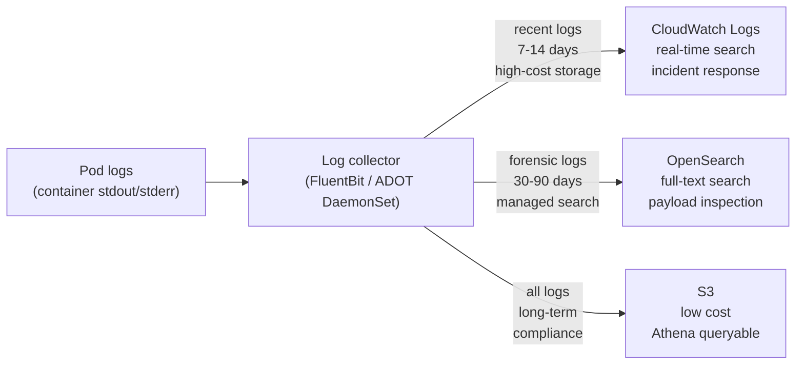
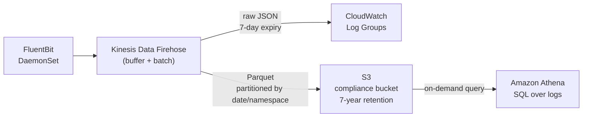

# Log Aggregation

## Structured logging as a platform requirement

Unstructured logs ("ERROR: connection failed") are unsearchable at scale. Structured JSON logs are queryable, filterable, and enrichable:

```json
{
  "timestamp": "2024-01-15T10:23:45.123Z",
  "level": "ERROR",
  "message": "connection failed",
  "service": "payments-api",
  "namespace": "payments",
  "pod": "payments-api-7f9d4b-xk2p9",
  "trace_id": "4bf92f3577b34da6a3ce929d0e0e4736",
  "tenant_id": "acme-corp",
  "spiffe_id": "spiffe://cluster/payments-api",
  "error": "dial tcp 10.0.1.45:5432: connection refused"
}
```

The `spiffe_id` field is essential in mTLS environments — it's the cryptographic identity of the workload. Traditional IP-based network forensics is blind when east-west traffic is encrypted; the SPIFFE ID in logs is what allows you to reconstruct "which service called which" after an incident.

**Platform enforcement**: require structured logging as a platform standard. Provide logging libraries (or auto-instrumentation) that emit structured JSON by default. Don't rely on developers to format logs correctly — make the right format the easy path.

## Collector selection: FluentBit vs ADOT

Both run as DaemonSets. The decision is operational preference and ecosystem.

| Factor | FluentBit | ADOT Collector |
|---|---|---|
| Language | C — very low memory footprint | Go |
| Memory per node | ~30–50 MiB | ~100–200 MiB |
| Configuration model | INI/YAML config with Lua scripting | OTel pipeline (receivers/processors/exporters) |
| Metrics collection | No | Yes (unified logs + metrics + traces) |
| AWS integration | Kinesis Data Firehose, CloudWatch | Native AMP, CloudWatch, X-Ray |
| EKS add-on | No | Yes (AWS-managed lifecycle) |
| Tail sampling support | No | Yes (via OTel gateway) |

**FluentBit** is right when: you want the lowest possible per-node resource footprint, your team knows Fluent configuration, and log collection is the only concern.

**ADOT** is right when: you want a unified pipeline for logs, metrics, and traces; you're on EKS and want AWS-managed add-on lifecycle; or you need OTel-native enrichment and routing.

## Three-tier log routing



**CloudWatch (hot tier)**: real-time ingestion, Container Insights integration, Insights query language. Expensive at scale — CloudWatch charges per GB ingested. Keep to 7–14 days for incident response.

**OpenSearch (warm tier)**: full-text search with Kibana/Dashboards. Better for forensic investigation where you need to search log content, not just filter by metadata. Use Amazon OpenSearch Service to avoid managing the cluster. 30–90 day retention.

**S3 (cold tier)**: cheapest long-term storage. Use Kinesis Data Firehose to buffer and batch-write to S3 in Parquet format. Query with Amazon Athena for compliance audits or post-incident investigations beyond the OpenSearch retention window.

## Kubernetes metadata enrichment

The log collector must enrich every log line with Kubernetes metadata before shipping. Without enrichment, a log line from pod `payments-api-7f9d4b-xk2p9` has no namespace, no deployment name, no team label.

**FluentBit kubernetes filter:**
```ini
[FILTER]
    Name             kubernetes
    Match            kube.*
    Kube_URL         https://kubernetes.default.svc:443
    Merge_Log        On          # parse JSON logs and merge fields
    K8S-Logging.Parser  On
    Labels           On          # include pod labels (team, environment)
    Annotations      Off         # usually too noisy
```

This adds `kubernetes.namespace_name`, `kubernetes.pod_name`, `kubernetes.container_name`, and any pod labels to every log record.

## Log volume control

Log volume can spike unexpectedly — a debug logging mode left on in production, a crash loop generating thousands of stack traces per second, a verbose library. Without controls, this creates cost spikes and can overwhelm the collector.

**Rate limiting in FluentBit:**
```ini
[FILTER]
    Name    throttle
    Match   *
    Rate    1000          # max 1000 records per interval per stream
    Window  5
    Interval 1s
```

**Sampling verbose services**: for known high-volume, low-value log sources (health check endpoints, static asset requests), drop them at the collector:

```ini
[FILTER]
    Name    grep
    Match   kube.payments.*
    Exclude log /healthz          # drop health check logs
```

**Alert on log ingestion cost**: monitor CloudWatch ingestion bytes per namespace. A namespace generating >10× its normal volume is either a bug (crash loop) or a misconfiguration (debug logging in prod).

## Log retention tiering implementation



Partition S3 log objects by `year/month/day/namespace` — this makes Athena queries significantly cheaper by limiting the data scanned:

```
s3://logs-bucket/year=2024/month=01/day=15/namespace=payments/logs.parquet
```

A compliance query "show all payments service logs for January 2024" scans only the relevant partitions, not the entire bucket.

See [opentelemetry-collector-patterns.md](opentelemetry-collector-patterns.md) for ADOT collector pipeline configuration.
See [distributed-tracing.md](distributed-tracing.md) for correlating trace IDs in log records.
