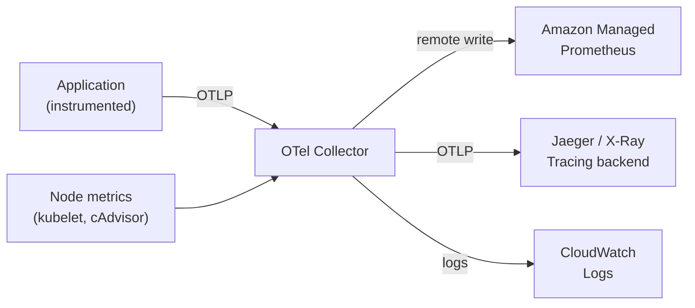
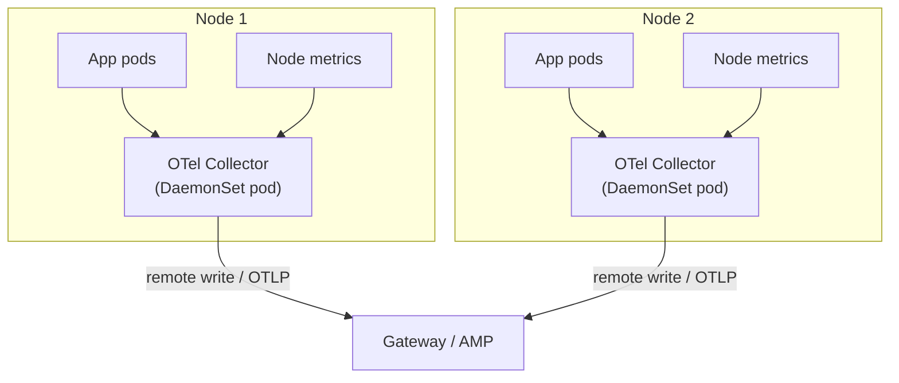
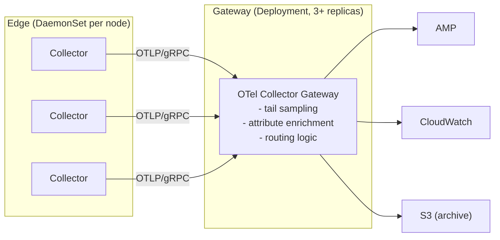

# OpenTelemetry Collector Deployment Patterns

## The collector's role in the observability pipeline

The OpenTelemetry Collector is the data plane of the observability stack. It receives telemetry (metrics, logs, traces), processes and enriches it, and exports it to backends. The deployment pattern determines reliability, resource cost, and failure domain.



## DaemonSet pattern: the production default

One collector pod per node. Scrapes node-level metrics (kubelet, cAdvisor, node-exporter) and tails container logs from the node's filesystem. Applications send telemetry to the local collector via `localhost` or the node IP — no network hop to a remote collector.



**Failure domain**: if the collector pod on a node crashes, all observability for that node is lost until recovery. The DaemonSet controller will restart it, but there's a gap. Mitigate with:
- Liveness and readiness probes on the collector
- Persistent buffer on local disk (`file_storage` extension) to replay telemetry after restart
- Alert on DaemonSet pod restarts as a platform health signal

**Resource sizing**: size the collector DaemonSet requests/limits based on log volume per node. Nodes with high-churn pods or verbose applications generate significantly more log volume. Start with 200m CPU / 256Mi memory and tune based on observed usage via VPA recommendations.

## Gateway pattern: centralized aggregation

A Deployment (not DaemonSet) running as a central collector gateway. DaemonSet collectors forward to the gateway; the gateway batches, transforms, and exports to backends. Separates the edge collection concern from the backend export concern.



**When to use the gateway layer:**
- Tail-based trace sampling (requires seeing all spans for a trace before deciding to sample)
- Routing different telemetry to different backends by namespace, team, or environment label
- Centralized attribute enrichment (adding environment, cluster name, region to all telemetry)
- Buffering against backend unavailability

**Gateway HA**: the gateway is in the critical path for all telemetry. Run at least 3 replicas with a PDB (`minAvailable: 2`). Size for peak throughput — use HPA on CPU/memory to handle burst.

## Sidecar pattern: mesh telemetry only

Injecting an OTel collector as a sidecar into every application pod is expensive — ~50–100 MiB memory and 0.1 vCPU per pod. Reserve the sidecar pattern for cases where per-pod configuration is required, primarily service mesh proxies (Envoy access logs).

In practice, most teams use the DaemonSet collector to receive application telemetry via OTLP push. Sidecars are only justified when:
- Per-pod collector configuration differs significantly across pods
- The application cannot be configured to push to a DaemonSet endpoint

## ADOT on EKS

AWS Distro for OpenTelemetry (ADOT) is AWS's supported distribution of the OTel Collector. It includes EKS-specific integrations:
- Automatic `cluster_name` enrichment from EC2 instance metadata
- Native integration with Amazon Managed Service for Prometheus (remote write)
- Application Signals receiver for auto-instrumentation of Java/Python/Node.js (no code changes required)
- Container Insights metrics compatible with CloudWatch dashboards

ADOT is available as an EKS add-on — version lifecycle managed by AWS, tested against EKS versions. For EKS-native observability pipelines, ADOT simplifies the bootstrap cost significantly.

## Collector pipeline configuration

A minimal production OTel Collector config:

```yaml
receivers:
  otlp:
    protocols:
      grpc:
        endpoint: 0.0.0.0:4317
  prometheus:
    config:
      scrape_configs:
      - job_name: kubelet
        kubernetes_sd_configs:
        - role: node

processors:
  batch:
    timeout: 10s
    send_batch_size: 1000
  resource:
    attributes:
    - key: cluster_name
      value: ${CLUSTER_NAME}      # injected via env var from Downward API
      action: insert
  memory_limiter:
    limit_mib: 512                # prevent OOM killing the collector

exporters:
  prometheusremotewrite:
    endpoint: https://aps-workspaces.us-east-1.amazonaws.com/workspaces/ws-xxx/api/v1/remote_write
    auth:
      authenticator: sigv4auth

service:
  pipelines:
    metrics:
      receivers: [otlp, prometheus]
      processors: [memory_limiter, resource, batch]
      exporters: [prometheusremotewrite]
```

`memory_limiter` is critical — without it, a cardinality spike or log burst can OOM-kill the collector pod, causing a gap in observability at exactly the moment you need it most.

See [prometheus-at-scale.md](prometheus-at-scale.md) for remote write configuration and cardinality management.
See [log-aggregation.md](log-aggregation.md) for log pipeline configuration within the collector.
