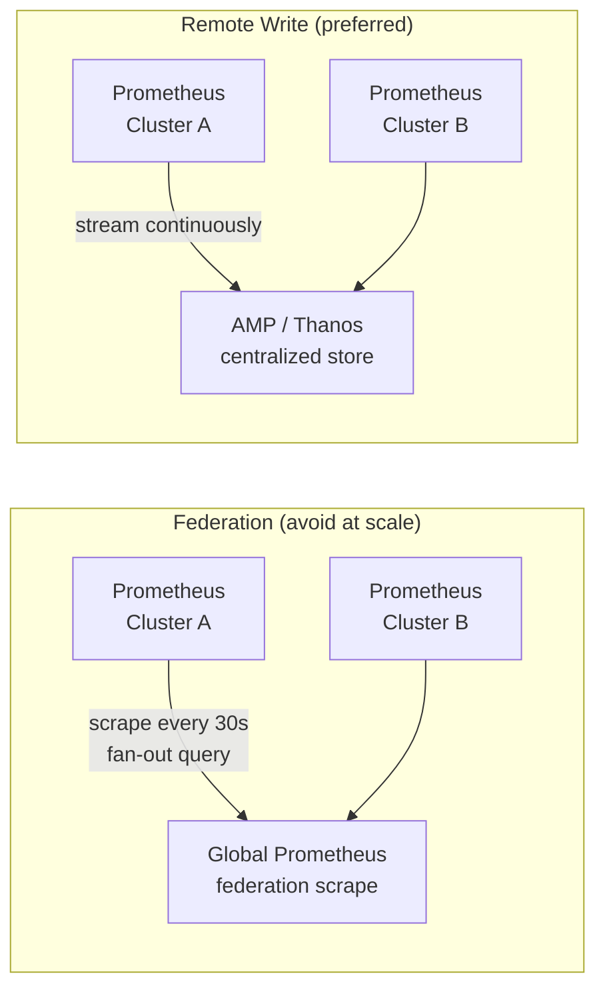

# Prometheus at Scale

## The single-cluster Prometheus limit

A single Prometheus instance handles ~10M active time series comfortably before query latency degrades and memory becomes a bottleneck. A production multi-tenant cluster with comprehensive instrumentation — application metrics, Kubernetes control plane metrics, Istio/Cilium flow metrics — can exceed this ceiling.

The answer is not "make Prometheus bigger." It's choosing the right architecture for the query patterns you need.

## Remote write vs federation

**Federation**: a "global" Prometheus scrapes aggregated metrics from per-cluster Prometheus instances. The global instance runs recording rules over aggregated data.

**Remote write**: each per-cluster Prometheus streams all (or filtered) metrics to a centralized backend (AMP, Thanos, Cortex, Mimir) in real time.



**Why remote write wins at fleet scale:**

- Federation requires the global Prometheus to query every per-cluster instance on its scrape interval — at 20 clusters with 30s intervals, this is constant fan-out load
- Federation only ships aggregated/recorded metrics to the global view; raw metrics stay local — cross-cluster debugging requires knowing which cluster to query
- Remote write streams raw metrics continuously; the central store has full fidelity
- AMP scales storage and query compute independently of your cluster

## Amazon Managed Service for Prometheus (AMP)

AMP is a Prometheus-compatible managed service that accepts remote write and serves PromQL queries. No Prometheus infrastructure to operate — no etcd-backed TSDB, no retention management, no compaction.

```yaml
# Prometheus remote write to AMP
remoteWrite:
- url: https://aps-workspaces.us-east-1.amazonaws.com/workspaces/ws-abc123/api/v1/remote_write
  sigv4:
    region: us-east-1
  queue_config:
    max_samples_per_send: 1000
    max_shards: 200
    capacity: 2500
  write_relabel_configs:
  # drop high-cardinality metrics before sending to AMP
  - source_labels: [__name__]
    regex: "container_tasks_state|container_memory_failures_total"
    action: drop
```

**Cost model**: AMP charges per metric sample ingested and per metric sample queried. High scrape frequency × high cardinality = high cost. The most impactful cost control is reducing cardinality, not reducing query frequency.

## Cardinality: the primary cost and performance driver

Cardinality is the number of unique time series. A metric with labels `{namespace, pod, container, http_method, http_status_code}` has cardinality = `namespaces × pods × containers × methods × status_codes`. Adding a label with high-variance values (request ID, user ID, trace ID) explodes cardinality.

**Cardinality explosion sources in Kubernetes:**

- Per-pod metrics without aggregation (100 pods = 100 time series per metric)
- Kubernetes labels propagated as metric labels (uncontrolled label cardinality)
- Istio/Envoy per-route metrics with URL path in the label (unique paths = unique series)
- GitOps controllers emitting metrics per reconciled resource (many resources = many series)

**Detection:**

```promql
# Top metrics by cardinality
topk(20, count by (__name__)({__name__=~".+"}))

# Alert on rapid cardinality growth
- alert: PrometheusCardinalitySpike
  expr: |
    rate(prometheus_tsdb_symbol_table_size_bytes[10m]) > 100000
  for: 5m
```

**Mitigation:**

```yaml
# Drop high-cardinality labels at scrape time
metric_relabel_configs:
- action: labeldrop
  regex: "pod_template_hash|controller_revision_hash"

# Aggregate before shipping to AMP
- source_labels: [__name__]
  regex: "istio_requests_total"
  target_label: __name__
  replacement: "istio_requests_total"
  # use recording rules to pre-aggregate by namespace, not pod
```

## Cross-cluster labeling: the cluster_name requirement

Without a `cluster_name` label on every metric, cross-cluster PromQL queries are impossible. You can't filter `sum(container_cpu_usage_seconds_total) by (cluster_name)` if the label doesn't exist.

Enforce at the collector level — not the application level:

```yaml
# OTel Collector resource processor
processors:
  resource:
    attributes:
    - key: cluster_name
      value: prod-us-east-1     # injected from env var at deploy time
      action: insert
```

Or in Prometheus `external_labels`:

```yaml
global:
  external_labels:
    cluster_name: prod-us-east-1
    environment: production
    region: us-east-1
```

External labels are appended to all remote write samples. They're the mechanism for fleet-wide aggregation queries.

## Recording rules for query performance

Raw metric queries at fleet scale are slow. Pre-aggregate with recording rules:

```yaml
groups:
- name: fleet.aggregations
  interval: 1m
  rules:
  - record: cluster:container_cpu_usage:rate5m
    expr: |
      sum by (cluster_name, namespace) (
        rate(container_cpu_usage_seconds_total{container!=""}[5m])
      )
```

Store recording rule results in AMP. Dashboard queries hit the pre-aggregated series — microseconds instead of seconds at fleet scale.

## Scrape interval tuning

Default Prometheus scrape interval is 15s — appropriate for alerting on fast-moving metrics. For cost-sensitive production environments:

| Metric type | Recommended interval | Reason |
|---|---|---|
| SLO error rate (fast burn) | 15s | Needs rapid alerting response |
| Container CPU/memory | 60s | Changes slowly; 4× cost reduction vs 15s |
| Node metrics | 60s | Infrastructure changes slowly |
| Control plane components | 30s | Balance between visibility and cost |
| Business metrics | 60–300s | High cardinality; slow-changing |

See [opentelemetry-collector-patterns.md](opentelemetry-collector-patterns.md) for the collector pipeline that feeds remote write.
See [slo-design.md](slo-design.md) for how recording rules serve SLO burn rate calculations.
