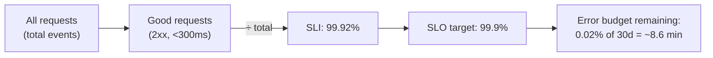
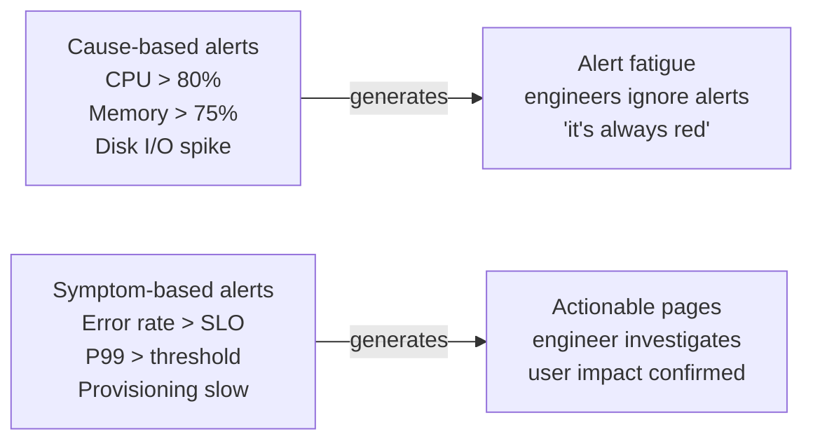

# SLO Design and Error Budget Tracking

## SLI, SLO, error budget: the relationships

**SLI (Service Level Indicator)**: the measured value. A ratio of good events to total events.
**SLO (Service Level Objective)**: the target. "99.9% of requests return 2xx within 300ms over a 30-day window."
**Error budget**: the allowed failure headroom. An SLO of 99.9% allows 0.1% failures — about 43 minutes of downtime per 30 days.



## Product-centric SLOs for platform teams

Platform teams make the mistake of measuring infrastructure health instead of developer outcomes. A platform where all nodes are healthy but developers can't deploy is failing its customers.

**Vanity metrics (avoid as SLOs):**

- Node uptime %
- Control plane availability %
- "No incidents this week"

These measure the platform's internal health, not whether it's delivering value to developers.

**Product-centric SLOs for an internal developer platform:**

| SLO | SLI | Target |
|---|---|---|
| Deployment velocity | % of deployments completing within 5 minutes of merge | 95% |
| Onboarding speed | % of new namespace provisions completing within 2 minutes | 99% |
| Infrastructure provisioning | % of RDS instance creations completing within 15 minutes | 95% |
| Self-service success rate | % of self-service operations completing without platform team intervention | 98% |
| Platform API availability | % of successful kubectl/API calls | 99.9% |

These SLOs break when the platform is failing developers — slow GitOps reconciliation, broken admission webhooks, or failed Crossplane provisioning all show up in these numbers.

## Error budgets as a policy tool

Error budgets do more than trigger conversations about reliability. They quantify the cost of policy exceptions.

**Example**: the platform requires all workloads to have resource limits set. Admission policy enforces this. But teams request exemptions — "just this once, our app needs to burst" — and the platform team grants them to avoid conflict.

Each exemption is a security and stability risk. Track exemptions as SLO violations:

```promql
# Error budget consumption from policy exemptions
sum(kyverno_policy_results_total{policy="require-resource-limits", result="fail"})
/
sum(kyverno_policy_results_total{policy="require-resource-limits"})
```

A rising exemption rate against an SLO target makes the cost visible: "we've consumed 60% of our error budget this month on resource limit exemptions." This changes the conversation from "can you just let this one through?" to "we have 40% budget left — is this the highest-value use of it?"

## Multi-window burn rate alerting

Standard threshold alerting on error rate misses two critical patterns:

- **Fast burn**: error rate spikes to 50% for 10 minutes — burns through hours of error budget quickly
- **Slow burn**: error rate is 0.5% above the SLO threshold for days — never triggers a threshold alert but silently exhausts the budget

Multi-window burn rate detects both:

```yaml
# Fast burn: 2% error rate sustained for 5 minutes
# (14.4x burn rate = budget exhausted in ~2 hours)
- alert: SLOFastBurn
  expr: |
    (
      sum(rate(http_requests_total{status=~"5.."}[5m])) /
      sum(rate(http_requests_total[5m]))
    ) > 0.02
    and
    (
      sum(rate(http_requests_total{status=~"5.."}[1h])) /
      sum(rate(http_requests_total[1h]))
    ) > 0.02
  for: 2m
  labels:
    severity: critical

# Slow burn: 0.2% error rate sustained for 6 hours
# (2x burn rate = budget exhausted in ~15 days)
- alert: SLOSlowBurn
  expr: |
    (
      sum(rate(http_requests_total{status=~"5.."}[6h])) /
      sum(rate(http_requests_total[6h]))
    ) > 0.002
    and
    (
      sum(rate(http_requests_total{status=~"5.."}[3d])) /
      sum(rate(http_requests_total[3d]))
    ) > 0.002
  for: 1h
  labels:
    severity: warning
```

The two-window requirement (short AND long) prevents false positives from brief spikes that don't represent sustained budget consumption.

## Symptom-based vs cause-based alerting

**Cause-based (noisy, low signal):**

- CPU > 80% on a node
- Memory usage > 75% on a pod
- etcd leader election detected

**Symptom-based (actionable, high signal):**

- Error rate on payments API exceeds SLO threshold
- P99 latency for checkout flow exceeds 500ms
- New namespace provisioning taking > 5 minutes

Alert on symptoms — things users experience. Investigate causes when responding to symptom alerts. A node at 80% CPU is not an incident; users experiencing errors is.



## SLO alerting vs platform SLO monitoring

Two distinct monitoring concerns:

**Service SLOs** (what the platform monitors for tenants): error rates, latency percentiles, availability for application services running on the platform.

**Platform SLOs** (what the platform team monitors for itself): admission webhook latency, GitOps reconciliation lag, control plane API server error rate, Karpenter node provisioning time.

Both need SLOs. The platform team is accountable for the platform SLOs; application teams are accountable for their service SLOs. Treat the platform team as a service provider and define SLAs accordingly.

See [prometheus-at-scale.md](prometheus-at-scale.md) for the recording rules that power multi-window burn rate calculations.
