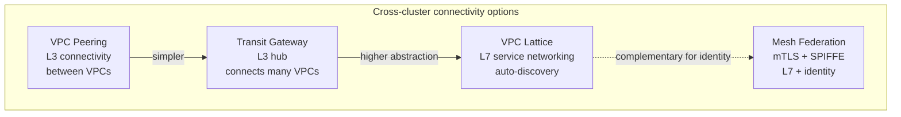
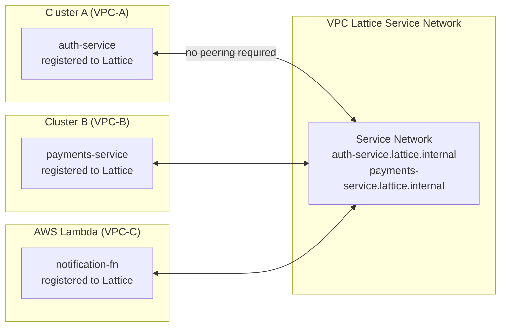
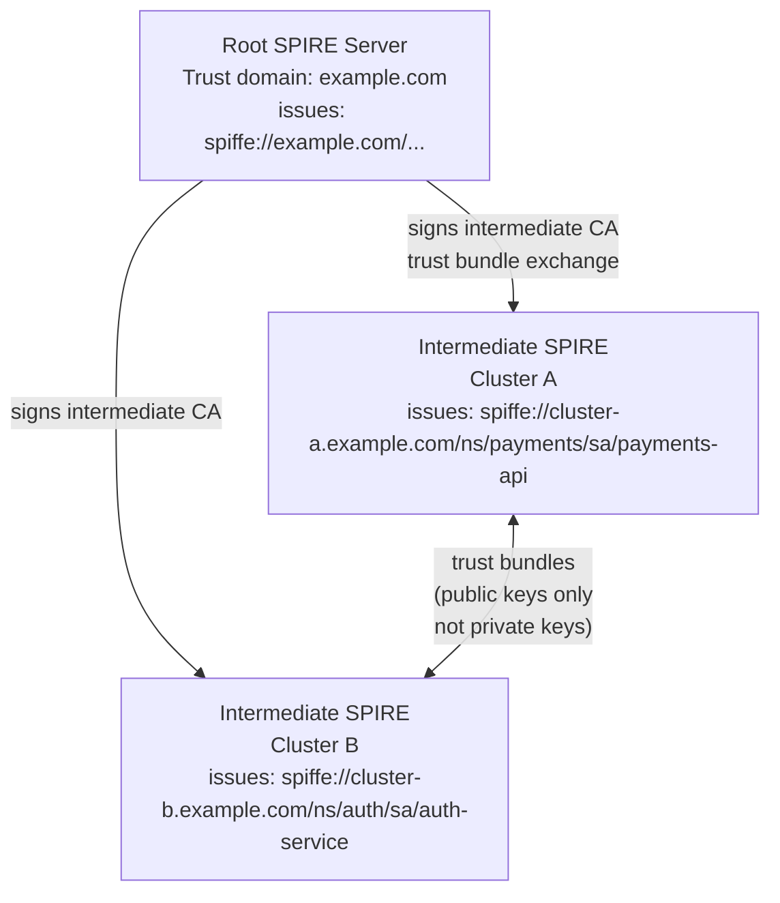

# Cross-Cluster Networking

## The connectivity options

Services in different clusters cannot reach each other by default. The cluster networks are isolated VPCs or subnets. Cross-cluster connectivity requires one of three approaches: network-level peering (VPC peering / Transit Gateway), service-level abstraction (VPC Lattice), or mesh federation (SPIFFE + service mesh).



## VPC peering and Transit Gateway

**VPC peering**: direct network-level connectivity between two VPCs. CIDR ranges must not overlap. Simple for two clusters; management complexity scales quadratically with cluster count — 10 clusters = up to 45 peering connections.

**Transit Gateway**: hub-and-spoke network topology. All VPCs connect to a central Transit Gateway. Adding a new cluster is one attachment, not N peering connections. Required at any meaningful fleet scale.

**Limitations of both**: they are L3 — they provide IP connectivity but no service discovery, no load balancing, no L7 routing. Once network connectivity exists, services still need to know each other's IPs or DNS names. Managing per-cluster DNS and service endpoint configuration across a fleet doesn't scale.

## VPC Lattice: service-level cross-cluster networking

VPC Lattice operates at L7 and provides automatic service discovery across VPCs, accounts, and compute types (EKS, Lambda, ECS). No VPC peering required — Lattice routes through AWS's backbone.



**Service registration** via Gateway API and AWS LBC:

```yaml
apiVersion: gateway.networking.k8s.io/v1
kind: HTTPRoute
metadata:
  name: payments-export
  annotations:
    gateway.networking.k8s.io/lattice-service-export: "true"
spec:
  parentRefs:
  - kind: Gateway
    name: lattice-gateway
  rules:
  - backendRefs:
    - name: payments-service
      port: 8080
```

Consuming services call `payments-service.lattice.internal` — Lattice handles routing, retries, and health checking. No consumer-side service discovery configuration.

**VPC Lattice limitations**: no L7 policy (HTTP method filtering, header-based access control). For identity-verified mTLS between services, add SPIFFE federation.

## SPIFFE federation for cross-cluster identity

NetworkPolicy and VPC Lattice verify *where* traffic comes from (IP, VPC). For zero-trust, you need to verify *who* is calling — cryptographic workload identity that works across cluster boundaries.

SPIFFE Nested SPIRE establishes a federated trust domain:



**Trust bundle exchange**: each intermediate SPIRE server shares its public key (trust bundle) with all others. Private keys never leave the cluster. Services in cluster A can verify a certificate issued by cluster B's SPIRE using the trust bundle — without trusting cluster B's private key.

**Workload verification flow**:

1. Service A (cluster A) presents its SPIFFE SVID to service B (cluster B)
2. Service B validates the SVID signature against cluster A's trust bundle
3. Mutual TLS established — both parties verified

This works across regions, accounts, and any network boundary, as long as the TLS handshake can complete.

## DNS length constraint for SPIFFE

SPIFFE trust domain names are DNS names. IANA DNS specification limits labels (components between dots) to 63 characters, but the operational constraint for nested SPIRE is more specific: cluster identifiers embedded in trust domain names should be **7 characters or fewer** to avoid exceeding limits when combined with namespace and service account components.

```text
# Safe: cluster identifier is short
spiffe://cluster-a.example.com/ns/payments/sa/payments-api

# Risk: long cluster identifier pushes total length toward DNS limit
spiffe://prod-us-east-1-primary.example.com/ns/payments-processing/sa/payments-api
```

Use short, stable cluster identifiers in your naming convention: `use1p` (us-east-1, production), `euw1p` (eu-west-1, production). Define the convention before provisioning clusters — renaming SPIFFE trust domains is disruptive.

## Choosing a connectivity model

| Requirement | Recommended approach |
|---|---|
| Simple two-cluster connectivity, same region | VPC peering |
| Multi-cluster hub, same account | Transit Gateway |
| Cross-cluster service discovery, no peering overhead | VPC Lattice |
| Cross-cluster service calls to Lambda / ECS | VPC Lattice (native multi-compute) |
| Zero-trust mTLS identity across clusters | SPIFFE Nested SPIRE |
| L7 traffic policy across clusters | Service mesh federation (Istio / Cilium) |

VPC Lattice + SPIFFE is the recommended combination for production multi-cluster platforms: Lattice handles the networking layer, SPIFFE handles the identity layer. They are complementary, not alternatives.

See [dr-topology.md](dr-topology.md) for how SPIFFE federation enables active-active DR topology.
See [../03-Networking/service-mesh-selection.md](../03-Networking/service-mesh-selection.md) for single-cluster mesh decisions that extend to multi-cluster.
