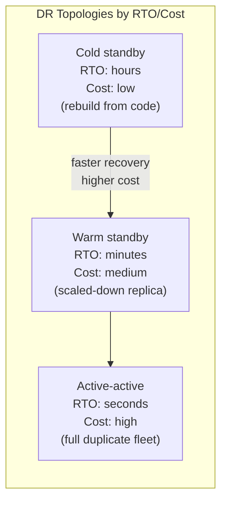
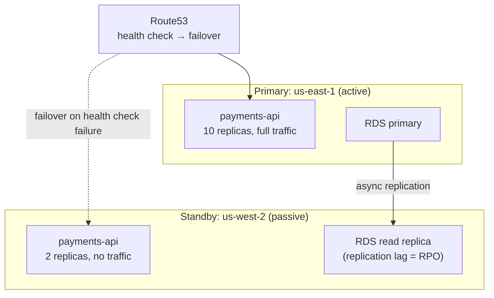
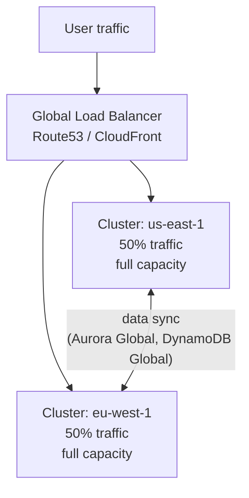
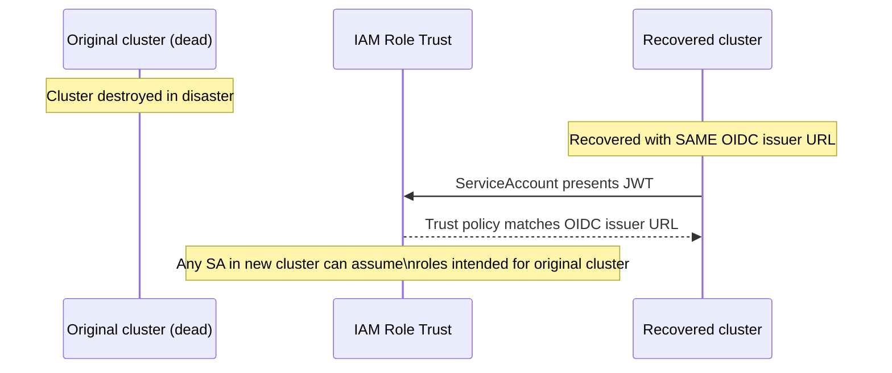
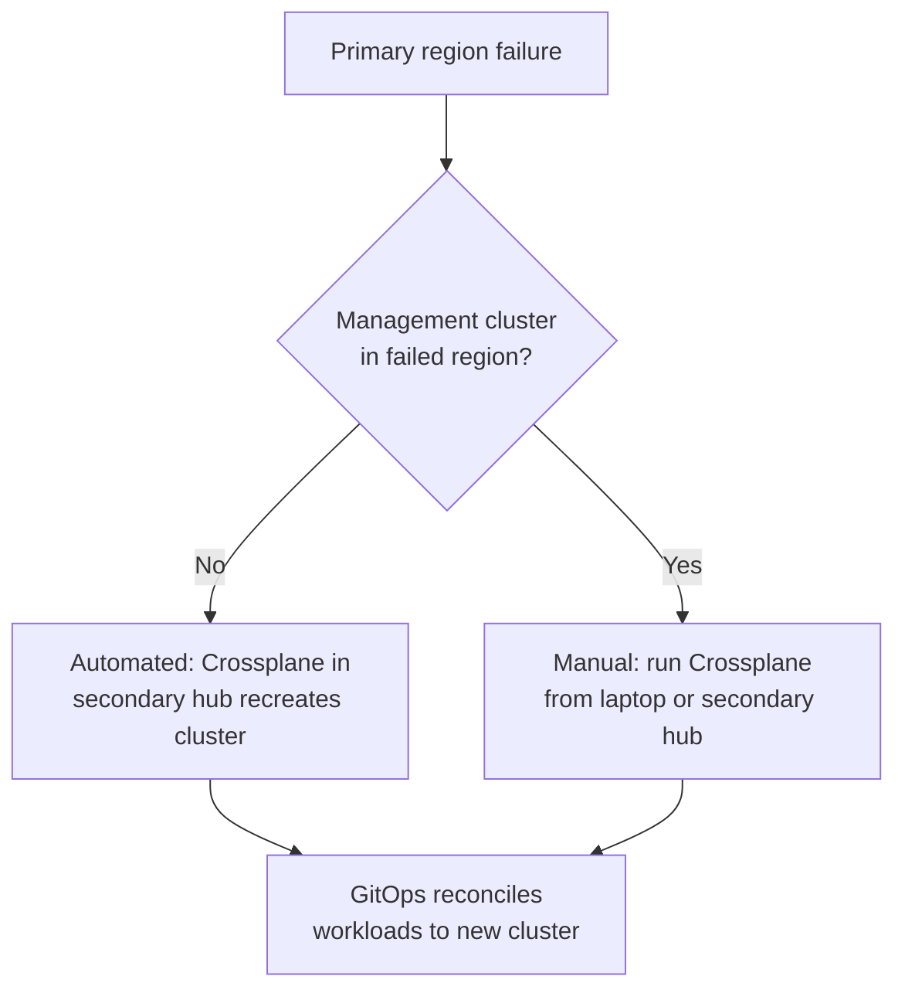

# Disaster Recovery Topology

## RTO, RPO, and cost: the tradeoff triangle

Every DR topology is a tradeoff between three variables:

- **RTO (Recovery Time Objective)**: how long can the system be unavailable?
- **RPO (Recovery Point Objective)**: how much data can be lost?
- **Cost**: what's the standing infrastructure cost of maintaining DR readiness?

## Active-passive: warm standby

A standby cluster exists in a secondary region at reduced capacity. Traffic runs entirely in the primary cluster. On failure, traffic is shifted to the standby.

**RPO**: determined by RDS replication lag — typically seconds for async, near-zero for synchronous multi-AZ (same region). Cross-region replication lag is higher: 1–5 minutes under normal load.

**RTO**: time to promote the standby. Automated Route53 failover triggers in 30–60 seconds after health check failure. Application startup time on the standby adds to this. Total: 2–5 minutes with automation.

**Warm standby cost**: ~20–30% of primary cost (running at reduced capacity, not zero). Database read replica adds replication cost.

## Active-active: simultaneous multi-cluster

Workloads run at full capacity in multiple clusters simultaneously. Traffic is load-balanced across them. Any cluster can absorb the full load if others fail.

**Requirements for active-active:**
- Stateless services: trivially active-active — no data to synchronize
- Stateful services: require multi-region data replication (Aurora Global Tables, DynamoDB Global Tables, Redis Global Datastore)
- Identity: services in cluster A must be able to verify the identity of services in cluster B — requires SPIFFE federation (see [cross-cluster-networking.md](cross-cluster-networking.md))

**Data consistency tradeoff**: global database replication is typically eventual consistency with replication lag. Write-write conflicts in multi-region require application-level conflict resolution. For most applications, the right answer is: write to one region (primary), read from all regions, accept eventual consistency.

## The OIDC trust boundary risk in DR

When recovering from a disaster by recreating a cluster, IRSA creates a security risk.

IRSA binds IAM role trust to an OIDC issuer URL. If the recovered cluster is provisioned with the same OIDC issuer URL as the original (possible when the URL is a static custom domain alias):

A service account in the recovered cluster that was never supposed to have production IAM permissions can assume them — because the IAM trust policy only checks the OIDC issuer URL, not the specific cluster.

**Mitigation with Pod Identity**: Pod Identity binds trust to the cluster's ARN, not an OIDC URL. A new cluster has a new ARN. The IAM association must be explicitly recreated for the new cluster — unauthorized service accounts cannot inherit permissions.

**Safe IRSA recovery pattern**: if IRSA must be used, ensure the recovered cluster gets a new, distinct OIDC issuer URL. Update IAM trust policies explicitly before deploying any workloads. Document this as a mandatory DR runbook step — it's easy to skip under incident pressure.

## Runbook-driven vs automated recovery

**Automated failover**: Route53 health checks trigger DNS failover automatically. No human action required for traffic shift.

**Cluster recreation**: automated only if cluster definitions are in Git and the Crossplane/ACK controller is running on an independent management cluster. If the management cluster is in the same region as the failed cluster, it's also unavailable — management cluster placement matters for DR.

For production DR, the management cluster (hub) should be in a separate AWS region from the workload clusters it manages. Hub failure and workload cluster failure should be independent events.

## RDS and stateful service DR

Application clusters are stateless — easy to recreate. Databases are stateful — the hard part.

| Database | Cross-region replication | RPO | RTO for failover |
|---|---|---|---|
| Aurora Global | Automatic replication | <1s typical | ~1 min (promote secondary) |
| RDS Multi-AZ | Same-region only | Near-zero (sync) | ~2 min (automatic failover) |
| RDS cross-region replica | Manual promote required | Minutes (replication lag) | ~10 min (promote + DNS) |
| DynamoDB Global Tables | Automatic | <1s | Seconds (active-active) |

For services with strict RPO requirements, Aurora Global or DynamoDB Global Tables are the right choices — they provide near-zero data loss with automated promotion.

See [fleet-management.md](fleet-management.md) for hub cluster placement decisions that affect DR automation.
See [cross-cluster-networking.md](cross-cluster-networking.md) for SPIFFE federation required by active-active topology.
