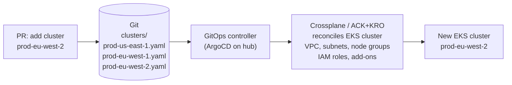

# Fleet Management

## Clusters as code

Managing a fleet of clusters manually — creating them via console, applying configuration by hand — produces snowflakes. Each cluster accumulates individual configuration decisions that aren't tracked, can't be reproduced, and diverge over time.

Treat cluster provisioning the same way you treat application deployment: declarative, version-controlled, continuously reconciled.



A new cluster is a PR. The PR goes through code review. It merges. The cluster exists. If the cluster config drifts from the declared state, the controller reconciles it back. Decommissioning a cluster is deleting the file and merging the PR.

## Crossplane vs ACK+KRO

Both provision cloud resources via Kubernetes CRDs. The decision is operational preference and ecosystem maturity.

| Factor | Crossplane | ACK + KRO |
|---|---|---|
| Maturity | CNCF Graduated — broad enterprise adoption | ACK GA per service; KRO beta |
| Multi-cloud | Yes — 60+ providers | AWS-only (ACK); KRO is orchestration layer |
| Configuration model | Composite Resources (XRDs) — powerful, complex | YAML-only ResourceGraphDefinitions — simpler |
| Custom logic | Go-based Compositions; Rego policies | CEL expressions inline in YAML |
| Dependency ordering | Manual via readiness checks | Automatic via KRO DAG resolution |
| CRD footprint | Very high — hundreds of CRDs installed per provider | Per-service controllers — smaller per-provider footprint |
| Operational overhead | High — Crossplane + provider pods + XRDs | Medium — per-service ACK controllers |

**Crossplane** is right when: multi-cloud is a requirement, your platform team has Go expertise to write Compositions, or you need the breadth of the Crossplane ecosystem (Terraform provider, 60+ cloud providers).

**ACK + KRO** is right when: AWS-only, you want to minimize the "hidden tax" of controller maintenance, and you want cluster-and-application definitions to share the same YAML-and-CEL model without custom Go operators.

### KRO cluster blueprint example

```yaml
apiVersion: kro.run/v1alpha1
kind: ResourceGraphDefinition
metadata:
  name: eks-cluster-blueprint
spec:
  schema:
    spec:
      clusterName: string
      region: string
      nodeInstanceType: string | default="m6i.xlarge"
      nodeCount: integer | default=3
  resources:
  - id: vpc
    template:
      apiVersion: ec2.services.k8s.aws/v1alpha1
      kind: VPC
      spec:
        cidrBlocks: ["10.0.0.0/16"]
  - id: cluster
    dependsOn: [vpc]           # KRO enforces order automatically
    template:
      apiVersion: eks.services.k8s.aws/v1alpha1
      kind: Cluster
      spec:
        name: ${schema.spec.clusterName}
        resourcesVPCConfig:
          vpcID: ${resources.vpc.status.vpcID}
```

KRO's CEL dependency resolution ensures the VPC exists before EKS cluster creation attempts. No manual readiness polling, no Crossplane `readinessChecks` complexity.

## Cluster lifecycle operations

**Upgrades as code**: update the EKS version in the cluster YAML, open a PR, merge — the controller initiates the upgrade. The upgrade follows the same review process as any other infrastructure change.

**Add-on management**: EKS add-ons (VPC CNI, CoreDNS, kube-proxy, ADOT, EBS CSI) should be declared in the cluster definition. The controller reconciles add-on versions during cluster upgrades, preventing version skew.

```yaml
spec:
  addons:
  - name: vpc-cni
    addonVersion: v1.18.0-eksbuild.1
  - name: coredns
    addonVersion: v1.11.1-eksbuild.4
  - name: aws-ebs-csi-driver
    addonVersion: v1.28.0-eksbuild.1
```

**Drift reconciliation**: Crossplane/ACK continuously compares declared state against actual AWS resource state. If someone modifies a node group via the AWS console, the controller reverts it. This is the correct behavior for a platform cluster — unapproved manual changes are not allowed.

## Fleet inventory and labeling

Every cluster in the fleet should carry standard labels that drive ApplicationSet generators and policy selectors:

```yaml
metadata:
  labels:
    environment: production
    region: us-east-1
    tier: workload              # vs "management" for hub clusters
    compliance: pci             # drives policy selection
    team: platform
```

These labels are the control surface for fleet-wide operations: "deploy this workload to all production clusters", "apply this policy to all PCI-scoped clusters", "route traffic to clusters in this region."

See [workload-federation.md](workload-federation.md) for ApplicationSet cluster generators that use these labels.
See [fleet-policy-and-observability.md](fleet-policy-and-observability.md) for policy enforcement driven by cluster labels.
