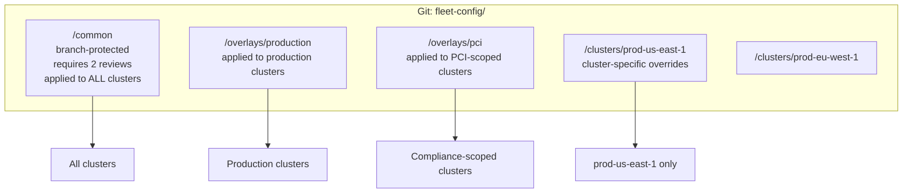
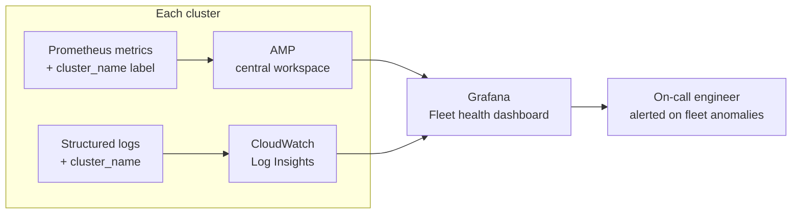

# Fleet Policy and Observability

## The consistency problem at fleet scale

A single cluster is easy to reason about: apply Kyverno policies, check compliance, done. Twenty clusters introduce drift: cluster 14 has an older policy version, cluster 7 has an exemption nobody remembers approving, cluster 19 was added last month and the security team's policies weren't applied.

Fleet consistency requires treating policy as code and observability as infrastructure — both must be provisioned, versioned, and continuously reconciled.

## Policy-as-code: hierarchical Git structure



**`/common`** contains the non-negotiable fleet baseline:

- Require resource limits on all containers
- Block privileged containers
- Require `team` and `environment` labels
- Default-deny NetworkPolicy applied at namespace creation

These policies apply everywhere, no exceptions. The branch is protected — requires 2 reviewers, no direct pushes.

**`/overlays`** contains environment or compliance-tier policies that apply to subsets of the fleet, driven by cluster labels.

**`/clusters/<name>`** contains legitimate per-cluster overrides — a legacy workload exemption in one cluster that can't be fixed immediately. These overrides must be time-bounded: a comment with a resolution date, tracked in a ticket.

## ApplicationSet for fleet-wide policy delivery

```yaml
apiVersion: argoproj.io/v1alpha1
kind: ApplicationSet
metadata:
  name: fleet-security-policies
spec:
  generators:
  - clusters: {}           # all registered clusters
  template:
    metadata:
      name: "security-policies-{{name}}"
    spec:
      source:
        repoURL: https://github.com/example/fleet-config
        path: common/policies/
      destination:
        server: "{{server}}"
        namespace: kyverno   # or kube-system for OPA
      syncPolicy:
        automated:
          prune: true
          selfHeal: true     # revert any manual policy changes
```

Self-healing is critical for policy — if a cluster admin manually deletes a policy object to work around it, the GitOps controller restores it within seconds. Policy bypass requires a Git PR, which is auditable.

## Fail-open vs fail-closed at fleet scale

Each cluster's admission webhook must independently make the fail-open vs fail-closed decision. A fleet where some clusters are fail-closed and others are fail-open has inconsistent security posture — an attacker targets the fail-open clusters.

**Fleet-wide enforcement rule**: all production clusters must be fail-closed for security-critical policies (image registry, privilege escalation). The admission webhook pods must be highly available (3 replicas, PDB, multi-AZ).

**Detecting fail-open drift**:

```yaml
# Kyverno policy: validate webhook failure policy
apiVersion: kyverno.io/v1
kind: ClusterPolicy
metadata:
  name: validate-webhook-failurepolicy
spec:
  validationFailureAction: Enforce
  rules:
  - name: check-failure-policy
    match:
      resources:
        kinds: [ValidatingWebhookConfiguration]
    validate:
      message: "Security webhooks must use Fail failure policy"
      pattern:
        webhooks:
        - failurePolicy: Fail
```

This policy validates that webhook configurations themselves have the correct `failurePolicy`. It catches drift where someone changed a webhook to `Ignore` to resolve a deployment issue and forgot to revert it.

## Multi-cluster metrics aggregation

Every cluster ships metrics to a central AMP workspace with a mandatory `cluster_name` label. This enables fleet-wide PromQL:

```promql
# CPU utilization across all production clusters
sum by (cluster_name, namespace) (
  rate(container_cpu_usage_seconds_total{
    container!="",
    cluster_name=~"prod-.*"
  }[5m])
)

# Policy violation rate per cluster
sum by (cluster_name) (
  rate(kyverno_policy_results_total{result="fail"}[1h])
)
```

**Fleet-level alerts**: some alerts are meaningful only at fleet scope:

```yaml
- alert: PolicyViolationSurge
  expr: |
    sum by (cluster_name) (
      rate(kyverno_policy_results_total{result="fail"}[1h])
    ) > 10
  annotations:
    summary: "Cluster {{$labels.cluster_name}} has high policy violation rate"
```

A surge in policy violations in one cluster signals either a bad deployment pushing non-compliant workloads or a policy misconfiguration — both need investigation.

## Fleet health dashboard

A fleet health view should surface, per cluster:

- ArgoCD sync status (all apps synced vs OutOfSync count)
- Kyverno policy violation count
- Karpenter node provisioning failures
- Control plane API server error rate
- Admission webhook availability



## Forensic observability across encrypted traffic

In a multi-cluster fleet with mTLS (service mesh or Cilium), cross-cluster traffic is encrypted — traditional network tap tools can't inspect it. Post-incident reconstruction requires metadata exported from the data plane.

**Required exports per cluster:**

- Cilium Hubble flows: connection allowed/denied, source/destination SPIFFE identity, policy verdict
- Envoy access logs: HTTP method, path, response code, latency, source identity
- Kubernetes audit logs: who changed what resource, when, from which client

Export all of these to a centralized SIEM (Security Lake, OpenSearch, Splunk). An incident in cluster A that involves service B in cluster B requires correlating logs from both clusters by trace ID and SPIFFE identity.

See [fleet-management.md](fleet-management.md) for cluster labeling that drives the ApplicationSet policy selectors.
See [../07-Observability/prometheus-at-scale.md](../07-Observability/prometheus-at-scale.md) for the remote write configuration that feeds fleet metrics to AMP.
