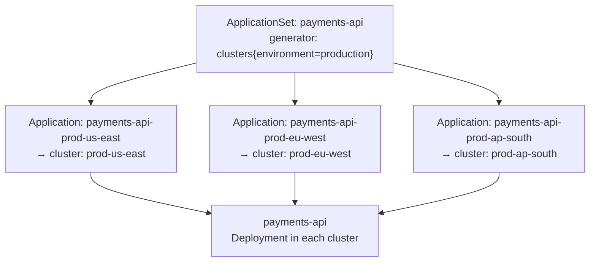
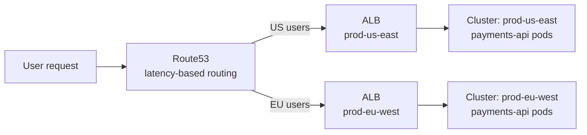
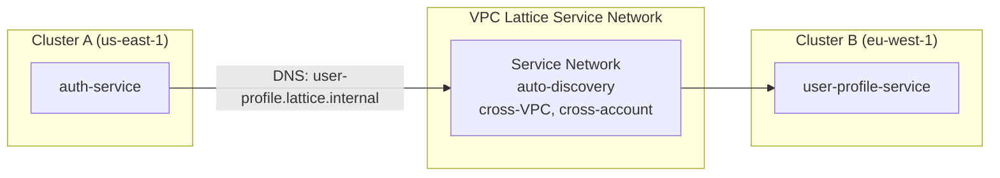

# Workload Federation

## The deployment problem at fleet scale

Running the same workload across 10 clusters manually means 10 separate deployments to maintain, 10 places where configuration can diverge, and 10 places to apply every future change. Workload federation solves this with a single source of truth that generates per-cluster deployments automatically.

## ApplicationSets as the delivery engine

ArgoCD ApplicationSets with the cluster generator create per-cluster Application objects from a single template. Every cluster matching the label selector gets the workload deployed.

```yaml
apiVersion: argoproj.io/v1alpha1
kind: ApplicationSet
metadata:
  name: payments-api
  namespace: argocd
spec:
  generators:
  - clusters:
      selector:
        matchLabels:
          environment: production
          tier: workload
  template:
    metadata:
      name: "payments-api-{{name}}"
    spec:
      project: payments
      source:
        repoURL: https://github.com/example/payments
        targetRevision: main
        path: manifests/
        helm:
          valueFiles:
          - values.yaml
          - "values-{{metadata.labels.region}}.yaml"   # per-region overrides
      destination:
        server: "{{server}}"
        namespace: payments
      syncPolicy:
        automated:
          prune: true
          selfHeal: true
```

Adding a new production cluster automatically deploys the payments API to it — no changes to the ApplicationSet. The `values-{{region}}.yaml` pattern allows per-region configuration (different ingress endpoints, region-specific resource sizing) while sharing the base template.



## Traffic routing across clusters

Deploying the same workload to multiple clusters is half the problem. The other half is routing user traffic to the right cluster — and routing inter-service traffic across cluster boundaries.

### External traffic: weighted DNS or global load balancer

For user-facing traffic across regions, weighted Route53 records or a global load balancer (CloudFront, Global Accelerator) distributes requests:



For active-active failover, health checks on Route53 records detect cluster unavailability and shift traffic within 30–60 seconds of a health check failure.

### Internal traffic: VPC Lattice service network

For service-to-service traffic that crosses cluster boundaries (an auth service in cluster A calling a user profile service in cluster B), VPC Lattice provides automatic service discovery and routing without VPC peering or Transit Gateway.



Each service registers with the VPC Lattice service network via a `ServiceExport` (using the Kubernetes Gateway API + AWS LBC). Consuming services use the Lattice-assigned DNS name — no manual endpoint configuration, no VPC peering setup.

**VPC Lattice vs service mesh for cross-cluster traffic:**

- VPC Lattice: AWS-managed, no sidecar overhead, works across EKS/Lambda/ECS, but no L7 policy (HTTP method, header-based rules)
- Cilium Mesh / Istio with federation: full L7 control and mTLS verification, but requires operating mesh components in every cluster and configuring trust federation

Use VPC Lattice when you need simple cross-cluster discovery without mesh complexity. Add mesh federation when you need mTLS identity verification or L7 traffic policies across cluster boundaries.

## Canary rollouts across the fleet

ApplicationSets support progressive rollout across clusters using ArgoCD's rollout ordering:

```yaml
spec:
  strategy:
    rollingSync:
      steps:
      - matchExpressions:
        - key: environment
          operator: In
          values: [staging]
      - pause: {}                          # manual approval gate
      - matchExpressions:
        - key: region
          operator: In
          values: [us-east-1]             # canary: one production region
      - pause:
          duration: 30m                   # automated soak period
      - matchExpressions:
        - key: environment
          operator: In
          values: [production]            # full fleet rollout
```

This rolls the change to staging first, waits for human approval, deploys to one production region as a canary, soaks for 30 minutes, then completes the fleet rollout. A problem caught in the canary region stops the rollout before it reaches all clusters.

See [dr-topology.md](dr-topology.md) for how workload federation interacts with disaster recovery requirements.
See [cross-cluster-networking.md](cross-cluster-networking.md) for VPC Lattice configuration details.
