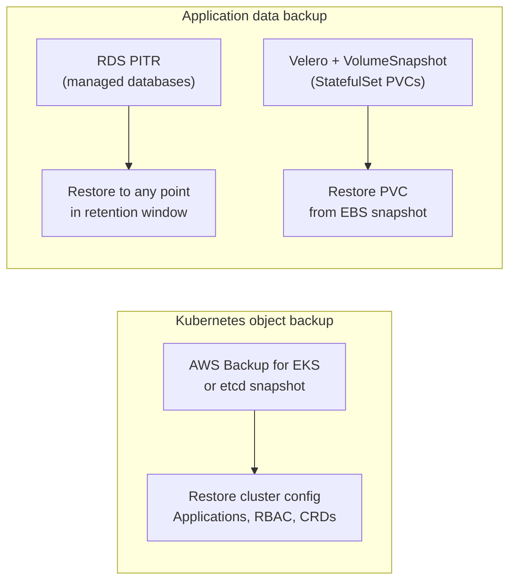
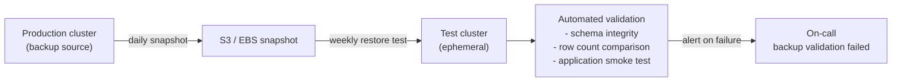

# Backup and Snapshots

## Two distinct backup problems

Kubernetes storage backup covers two separate concerns that require different tools:

1. **Kubernetes object state**: Deployments, ConfigMaps, Secrets, CRDs, ArgoCD Applications, Kyverno policies — the cluster configuration
2. **Application data**: the contents of PersistentVolumes — database rows, files, message queue offsets

These require different backup strategies. A tool that backs up Kubernetes objects doesn't protect your database data, and a tool that snapshots EBS volumes doesn't capture your cluster configuration.



## VolumeSnapshot API

The Kubernetes VolumeSnapshot API provides a CSI-agnostic way to take point-in-time snapshots of PVCs. The EBS CSI driver implements this — a VolumeSnapshot triggers an EBS snapshot.

```yaml
# Create a snapshot
apiVersion: snapshot.storage.k8s.io/v1
kind: VolumeSnapshot
metadata:
  name: kafka-data-snapshot-20240115
  namespace: kafka
spec:
  volumeSnapshotClassName: ebs-vsc
  source:
    persistentVolumeClaimName: data-kafka-0

---
# VolumeSnapshotClass (configure once)
apiVersion: snapshot.storage.k8s.io/v1
kind: VolumeSnapshotClass
metadata:
  name: ebs-vsc
driver: ebs.csi.aws.com
deletionPolicy: Retain       # keep snapshot even if VolumeSnapshot object is deleted
```

**Crash-consistent vs application-consistent**: a VolumeSnapshot captures the disk state at the snapshot moment. If the application is mid-write, the snapshot captures in-flight data — the restored volume may be inconsistent. For most databases with WAL (PostgreSQL, MySQL), crash-consistent snapshots are recoverable. For applications that don't have a recovery mechanism, this is a risk.

## Application-consistent backups with Velero hooks

Velero coordinates backup with the application using pre and post hooks — commands run inside the pod before and after the snapshot.

```yaml
apiVersion: velero.io/v1
kind: Backup
metadata:
  name: kafka-backup
spec:
  includedNamespaces: [kafka]
  hooks:
    resources:
    - name: kafka-pre-backup
      includedNamespaces: [kafka]
      labelSelector:
        matchLabels:
          app: kafka
      pre:
      - exec:
          container: kafka
          command:
          - /bin/sh
          - -c
          - kafka-leader-election.sh --pause   # pause leader rebalancing
          timeout: 60s
      post:
      - exec:
          container: kafka
          command:
          - /bin/sh
          - -c
          - kafka-leader-election.sh --resume
          timeout: 60s
```

Pre-hooks quiesce the application (flush in-memory state to disk, pause writes). Post-hooks resume normal operation. The window between pre and post is when the snapshot is taken — keep it short to minimize application impact.

**Velero storage backend**: Velero stores backup metadata and Kubernetes object exports in S3. EBS snapshots are stored natively in AWS (not copied to S3 — they reference the EBS snapshot ID). Configure a dedicated S3 bucket with appropriate lifecycle policies for backup retention.

## AWS Backup for EKS

AWS Backup for EKS integrates directly with EKS to back up Kubernetes resources and EBS volumes on a schedule without deploying in-cluster agents.

```yaml
# AWS Backup plan (via ACK or CloudFormation)
BackupPlan:
  BackupPlanName: eks-cluster-backup
  Rules:
  - RuleName: daily-backup
    TargetBackupVault: eks-backup-vault
    ScheduleExpression: "cron(0 2 * * ? *)"     # 2am daily
    StartWindowMinutes: 60
    CompletionWindowMinutes: 180
    Lifecycle:
      DeleteAfterDays: 30
```

AWS Backup captures:
- Kubernetes objects (Deployments, StatefulSets, ConfigMaps, Secrets, CRDs)
- EBS volumes associated with PVCs
- Cross-account and cross-region copy for DR

**Limitation**: AWS Backup for EKS does not support application-consistent hooks. For databases requiring quiesce-before-snapshot, Velero with hooks is still necessary.

## Managed database backup: the right default

For RDS and Aurora, AWS handles backup automatically:
- Automated daily snapshots with configurable retention (up to 35 days)
- Transaction logs continuously backed up — PITR to any second within retention
- Cross-region automated backups for DR

**Do not replicate what RDS already does.** Don't run Velero against an RDS endpoint or take EBS snapshots of the RDS storage — the RDS backup mechanism is more reliable and more efficient.

For application databases, PITR to a specific point is the recovery operation. Practice it in staging — know how long restoration takes before you need it in an incident.

## Backup validation

Untested backups are not backups. Schedule regular restoration tests:



A backup you've never restored from is an assumption, not a guarantee. Automate restoration into a test environment and validate the restored data weekly. The on-call alert for "backup validation failed" is more important than most production alerts.

See [stateful-workloads.md](stateful-workloads.md) for StatefulSet configuration that creates the PVCs being backed up.
See [../08-Multi-Cluster/dr-topology.md](../08-Multi-Cluster/dr-topology.md) for cross-region backup as a DR component.
