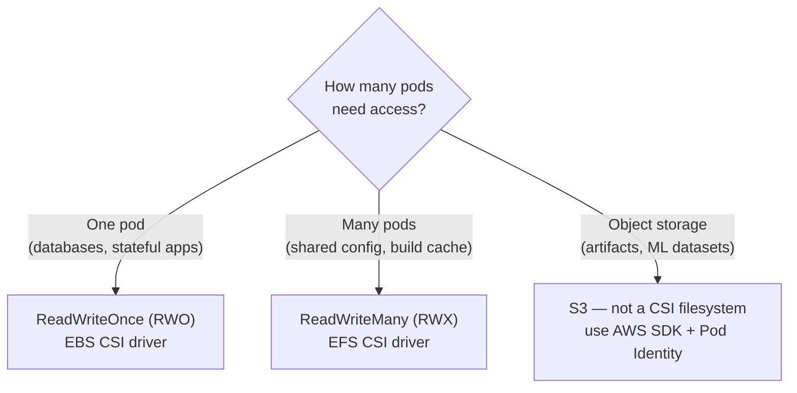
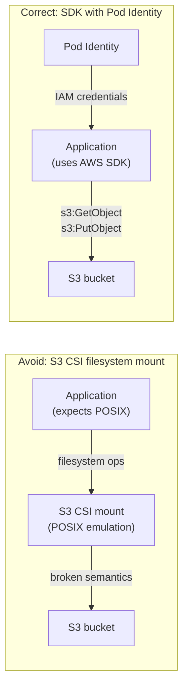

# CSI Driver Selection

## Access mode determines the driver

The first question is access mode: does the workload need exclusive access to a volume from one pod (RWO), or shared access from multiple pods simultaneously (RWX)?



## EBS CSI driver: block storage for databases

EBS provides block storage — a virtual disk attached to a single EC2 instance at a time. It is the right choice for any workload with high IOPS requirements: relational databases, message brokers, time-series databases.

**Key constraints:**
- **Single AZ**: an EBS volume exists in one AZ. The pod using it must run in the same AZ. Use `WaitForFirstConsumer` binding mode to enforce co-location.
- **Single node attach**: one EBS volume can only be attached to one EC2 instance at a time. `ReadWriteOnce` access mode enforces this at the Kubernetes layer.
- **Multi-attach (io2 only)**: io2 volumes support multi-attach to up to 16 instances in the same AZ — but this requires the application to handle concurrent access correctly (clustered filesystems only). Not a substitute for RWX shared storage.

```yaml
apiVersion: storage.k8s.io/v1
kind: StorageClass
metadata:
  name: ebs-gp3
provisioner: ebs.csi.aws.com
volumeBindingMode: WaitForFirstConsumer
parameters:
  type: gp3
  iops: "3000"          # baseline; can increase up to 16000
  throughput: "125"     # MiB/s; can increase up to 1000
  encrypted: "true"
```

**EBS CSI add-on on EKS**: install as an EKS managed add-on for AWS-managed lifecycle. The add-on requires an IAM role with EBS permissions — provision via Pod Identity.

## EFS CSI driver: shared filesystem

EFS provides an NFS-based shared filesystem accessible from multiple pods across nodes and AZs simultaneously.

**When EFS is appropriate:**
- Multiple pods need read/write access to the same files concurrently
- Workloads that use file locking or expect POSIX filesystem semantics with shared access
- Shared build caches, CI/CD artifact stores, configuration shared across pods

**EFS performance model:**
- Throughput scales with storage consumed in bursting mode — small filesystems have low burst throughput
- Provisioned throughput: pay for dedicated throughput regardless of storage size — necessary for consistent performance
- Latency: 1–3ms vs EBS <1ms — not suitable for latency-sensitive databases

```yaml
apiVersion: storage.k8s.io/v1
kind: StorageClass
metadata:
  name: efs-shared
provisioner: efs.csi.aws.com
parameters:
  provisioningMode: efs-ap         # use EFS Access Points for namespace isolation
  fileSystemId: fs-0abc12345
  directoryPerProvisioner: "true"  # each PVC gets its own directory
```

EFS Access Points provide namespace-level isolation between tenants — each PVC provisioned via an EFS-backed StorageClass gets its own directory with enforced UID/GID, preventing one tenant from accessing another's files on the shared filesystem.

## S3: object storage — not a filesystem

A CSI driver for S3 (Mountpoint for Amazon S3 CSI) exists and mounts S3 buckets as a filesystem. **Avoid this for production application workloads** that expect standard POSIX filesystem semantics:
- No atomic renames (rename is copy + delete)
- No file locking
- Eventual consistency on list operations
- High latency for small random reads

Applications written for a filesystem will behave incorrectly when the filesystem is backed by S3 object semantics.

**The correct pattern for S3**: provision buckets via ACK or Crossplane, grant access via Pod Identity, and use the AWS SDK directly in the application.



S3 CSI is useful for read-heavy, large-object workloads (ML model loading, static asset serving) where the application is written to tolerate object storage semantics. Not a general-purpose shared filesystem replacement.

## Driver comparison

| Driver | Access mode | AZ scope | Latency | Throughput | Best for |
|---|---|---|---|---|---|
| EBS CSI | RWO | Single AZ | <1ms | Up to 1000 MiB/s | Databases, stateful apps |
| EFS CSI | RWX | Multi-AZ | 1–3ms | Provisioned or burst | Shared filesystems, build caches |
| S3 CSI | ROX / RWX | Regional | 10–100ms | High for large objects | ML model loading, static assets |

See [storageclass-and-pvc-design.md](storageclass-and-pvc-design.md) for StorageClass configuration that wraps these drivers.
See [storage-performance-and-operations.md](storage-performance-and-operations.md) for EBS volume type selection and IOPS tuning.
