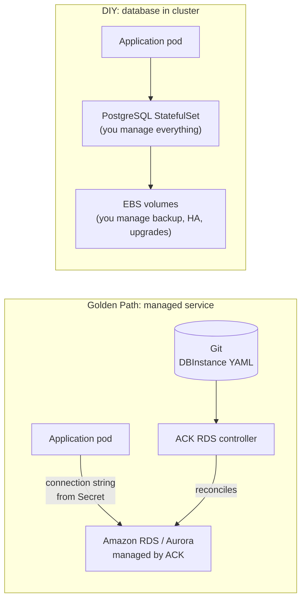

# Stateful Workloads on Kubernetes

## The golden path: managed services for application databases

For standard application databases — PostgreSQL, MySQL, Redis — the production golden path is a managed cloud service (RDS, Aurora, ElastiCache) provisioned via Kubernetes-native tooling (ACK, Crossplane), not a database StatefulSet inside the cluster.



**What managed RDS gives you that a StatefulSet doesn't:**

- Automated multi-AZ failover (< 60 seconds)
- Point-in-time recovery (PITR) to any second within the retention window
- Automated minor version patching
- Storage autoscaling (no PVC resize operations)
- Performance Insights and Enhanced Monitoring built in

**What you give up**: flexibility. RDS doesn't support every PostgreSQL extension. Some workloads need specific storage engine configuration that managed services don't expose.

**Decision rule**: use RDS unless you have a specific technical requirement that a managed service can't satisfy. The "hidden tax" of operating a production PostgreSQL StatefulSet — HA setup, backup procedures, failover testing, upgrade runbooks — is substantial.

## When StatefulSets are the right tool

StatefulSets are necessary for distributed systems that require:

- **Stable network identity**: each pod gets a stable DNS name (`kafka-0.kafka.namespace.svc`, `kafka-1.kafka...`) that persists across restarts
- **Ordered deployment and scaling**: pods are created and deleted in order (0, 1, 2...) — critical for quorum-based systems
- **Per-pod persistent storage**: each pod gets its own PVC via `volumeClaimTemplates`

**Workloads that belong on StatefulSets:**

- Kafka (brokers need stable identity for partition leadership)
- Zookeeper (quorum requires stable membership)
- Cassandra (gossip protocol uses stable hostnames)
- etcd (used as a data store within the cluster, not the K8s etcd)
- SPIRE server (identity infrastructure — see note below)

```yaml
apiVersion: apps/v1
kind: StatefulSet
metadata:
  name: kafka
spec:
  serviceName: kafka                 # headless service for stable DNS
  replicas: 3
  podManagementPolicy: OrderedReady  # 0 must be ready before 1 starts
  volumeClaimTemplates:
  - metadata:
      name: data
    spec:
      accessModes: [ReadWriteOnce]
      storageClassName: ebs-gp3
      resources:
        requests:
          storage: 500Gi
```

## StatefulSet operational requirements

Running production StatefulSets requires platform capabilities that don't exist by default:

**Backup**: `volumeClaimTemplates` PVCs are not backed up automatically. You must configure VolumeSnapshot schedules or use Velero with pre/post hooks. See [backup-and-snapshots.md](backup-and-snapshots.md).

**Upgrade coordination**: StatefulSet rolling updates are ordered but not application-aware. Kafka requires leader election to complete before proceeding to the next broker. Use `maxUnavailable: 1` and validate partition reassignment before each pod update.

**Storage expansion**: resizing PVCs in a StatefulSet requires patching the `volumeClaimTemplates` — which is immutable on the StatefulSet spec. The procedure is: patch each individual PVC directly, then update the StatefulSet template to match. Newer Kubernetes versions (1.27+) support this more cleanly.

**Scaling preconditions**: never scale a Kafka StatefulSet down without rebalancing partitions first. Never scale a Zookeeper quorum to an even number. Scaling stateful distributed systems is application-specific — the platform must document and enforce the correct procedure.

## SPIRE server storage consideration

SPIRE root and intermediate servers maintain identity records for all workloads in the cluster. The default embedded SQLite storage is not production-grade:

- SQLite is single-file, not HA
- No PITR
- Not recoverable from a pod crash that corrupts the file mid-write

**Production SPIRE storage**: back the SPIRE server with Aurora MySQL or PostgreSQL via RDS. This gives SPIRE the same HA and backup properties as any other production database.

```yaml
# SPIRE server config
server:
  dataStore:
    sql:
      databaseType: mysql
      connectionString: "spire:password@tcp(aurora-endpoint:3306)/spire"
```

This is the same pattern as the application golden path: use managed RDS, not in-cluster storage, for stateful platform components.

## Operator pattern for complex stateful workloads

For workloads complex enough that manual StatefulSet management is impractical (Kafka, Cassandra, Elasticsearch), use a Kubernetes Operator:

- **Strimzi**: Kafka Operator — manages broker configuration, topic management, user auth, upgrade coordination
- **CassKop**: Cassandra Operator
- **CloudNativePG**: PostgreSQL Operator (if you specifically need Postgres features RDS doesn't offer)

Operators encode the operational knowledge of running the stateful system — they know how to safely scale, upgrade, and recover from failures. They reduce but don't eliminate the operational burden compared to managed services.

See [backup-and-snapshots.md](backup-and-snapshots.md) for backup procedures specific to StatefulSet workloads.
See [../06-Autoscaling/scaling-stateful-workloads.md](../06-Autoscaling/scaling-stateful-workloads.md) for StatefulSet scaling risks and PVC lifecycle management.
