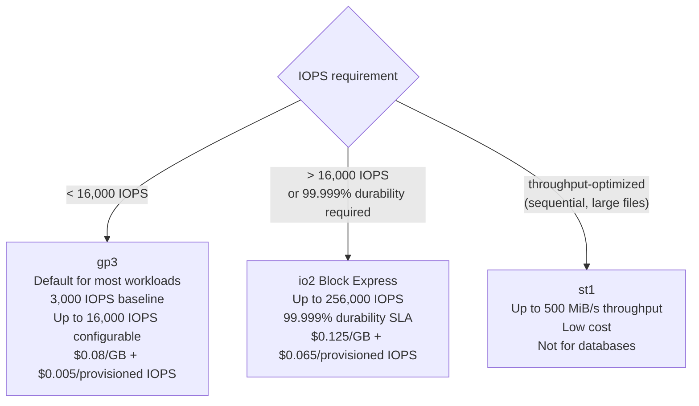
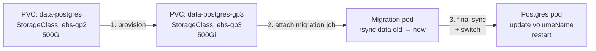

# Storage Performance and Operations

## EBS volume type selection

The volume type decision determines the performance ceiling and cost of every PVC backed by EBS.



**gp3 is the right default**: IOPS and throughput are independently configurable and not tied to volume size (unlike gp2 which tied IOPS to GB). A 100 GiB gp3 volume can be provisioned with 10,000 IOPS — a gp2 volume of the same size would cap at 300 IOPS.

**io2 Block Express is for specific cases**: >16,000 IOPS requirements, applications needing 99.999% volume durability (not just availability), or io2 multi-attach for clustered filesystems. The cost premium (3× gp3) is only justified when you've measured that gp3 is a bottleneck.

**StorageClass per volume type:**

```yaml
---
apiVersion: storage.k8s.io/v1
kind: StorageClass
metadata:
  name: ebs-gp3
provisioner: ebs.csi.aws.com
volumeBindingMode: WaitForFirstConsumer
parameters:
  type: gp3
  iops: "3000"
  throughput: "125"
  encrypted: "true"
---
apiVersion: storage.k8s.io/v1
kind: StorageClass
metadata:
  name: ebs-gp3-high-iops
provisioner: ebs.csi.aws.com
volumeBindingMode: WaitForFirstConsumer
parameters:
  type: gp3
  iops: "10000"       # provisioned IOPS — adds cost
  throughput: "500"
  encrypted: "true"
---
apiVersion: storage.k8s.io/v1
kind: StorageClass
metadata:
  name: ebs-io2
provisioner: ebs.csi.aws.com
volumeBindingMode: WaitForFirstConsumer
parameters:
  type: io2
  iops: "32000"
  encrypted: "true"
```

Use ResourceQuota per StorageClass to restrict access to expensive volume types — tenants default to `ebs-gp3`; `ebs-io2` requires explicit platform approval.

## Identifying storage bottlenecks

Before provisioning more IOPS, measure whether storage is actually the bottleneck:

```promql
# EBS volume utilization (requires CloudWatch metrics via ADOT)
# io_wait on node indicates storage pressure
rate(node_cpu_seconds_total{mode="iowait"}[5m]) > 0.1

# PVC IOPS vs provisioned limit
# Use CloudWatch Container Insights volume metrics
```

Common storage bottlenecks:

- **IOPS saturation**: `iowait` spikes, application latency increases, CloudWatch `VolumeQueueLength` > 1
- **Throughput saturation**: sequential scan workloads hitting the volume's MiB/s ceiling
- **Instance-level limits**: the EC2 instance has an EBS bandwidth limit separate from the volume limit — a small instance with a large io2 volume may be instance-limited, not volume-limited

Always check both the volume limits and the instance's `ebs_bandwidth_mbps` limit before increasing volume IOPS.

## PVC online resize

EBS CSI supports online volume expansion without pod restart, provided the StorageClass has `allowVolumeExpansion: true`.

```bash
# Resize a PVC — patch the request
kubectl patch pvc data-kafka-0 -n kafka \
  -p '{"spec": {"resources": {"requests": {"storage": "1Ti"}}}}'
```

The EBS CSI driver calls the AWS ModifyVolume API. The modification takes 60–180 seconds depending on volume size. The filesystem inside the volume is also expanded automatically (ext4, xfs) — no manual `resize2fs` required.

**Constraints:**

- Can only increase size, never decrease (EBS limitation)
- One modification in progress per volume at a time — don't submit multiple resize operations
- Some instance types require a detach/reattach cycle for the OS to recognize the new size — verify with a test before relying on online resize in production

## StorageClass migration (gp2 → gp3)

Existing clusters provisioned before gp3 was widely adopted may have volumes on gp2. Migrating to gp3 reduces cost (gp3 is ~20% cheaper) and improves performance predictability.

**Migration procedure without downtime:**



1. Provision a new PVC with the target StorageClass at the same or larger size
2. Run a migration pod that mounts both PVCs and rsyncs data
3. Stop the application pod briefly, perform a final incremental sync, update the pod spec to reference the new PVC, restart
4. Validate, then delete the old PVC (reclaim policy `Retain` — the EBS volume persists for forensic recovery)

For databases, use a database-native logical copy (pg_dump/pg_restore, mysqldump) rather than filesystem-level rsync — this ensures a consistent, valid database state on the target volume.

## Orphaned PVC monitoring

PVCs survive StatefulSet scale-down and pod deletion. Without active monitoring, orphaned volumes accumulate cost silently.

```yaml
# Prometheus alert: PVC not mounted by any pod for 24h
- alert: OrphanedPVC
  expr: |
    kube_persistentvolumeclaim_info{phase="Bound"}
    unless on(persistentvolumeclaim, namespace)
    kube_pod_spec_volumes_persistentvolumeclaims_info
  for: 24h
  labels:
    severity: warning
  annotations:
    summary: "PVC {{ $labels.namespace }}/{{ $labels.persistentvolumeclaim }} not mounted"
```

Additionally, alert on PVs in `Released` state — these are EBS volumes that were retained after PVC deletion but have not been reclaimed:

```yaml
- alert: ReleasedPersistentVolume
  expr: kube_persistentvolume_status_phase{phase="Released"} == 1
  for: 1h
  labels:
    severity: warning
```

A `Released` PV means storage cost is being incurred for a volume no workload is using.

See [storageclass-and-pvc-design.md](storageclass-and-pvc-design.md) for StorageClass configuration and reclaim policy design.
See [backup-and-snapshots.md](backup-and-snapshots.md) for snapshot procedures that use these volume types.
