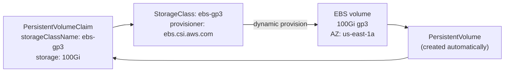
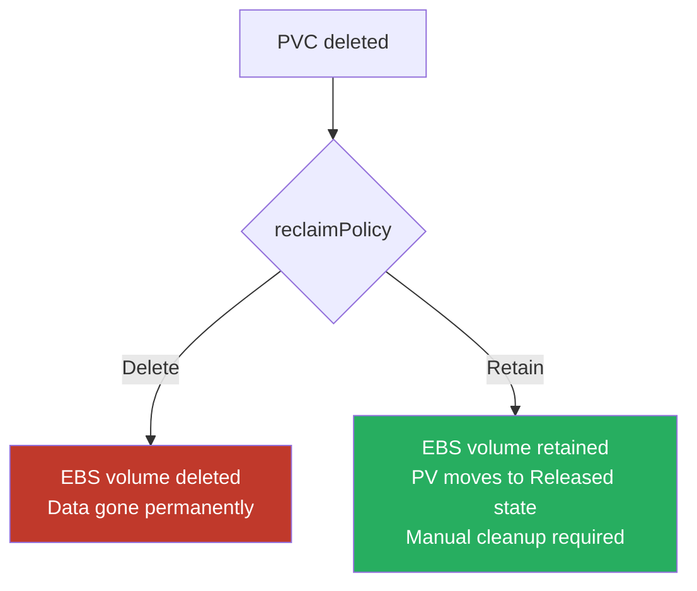

# StorageClass and PVC Design

## Dynamic provisioning as the baseline

Static provisioning — a platform engineer manually creates a PersistentVolume for each request — doesn't scale. Dynamic provisioning via StorageClass creates the volume automatically when a PVC is submitted. Every production cluster should use dynamic provisioning exclusively.



Static PVs are appropriate only for pre-existing volumes that must be imported (legacy migrations, volumes created outside Kubernetes). New workloads should always use PVCs against a StorageClass.

## Volume binding mode: WaitForFirstConsumer

The default binding mode (`Immediate`) provisions the EBS volume as soon as the PVC is created — before any pod is scheduled. In a multi-AZ cluster, this means the volume may be created in AZ-a while the pod that needs it gets scheduled to AZ-b. The pod fails to start: `volume node affinity conflict`.

`WaitForFirstConsumer` delays provisioning until a pod using the PVC is scheduled. The scheduler picks a node, determines its AZ, and the CSI driver provisions the volume in that AZ.

```yaml
apiVersion: storage.k8s.io/v1
kind: StorageClass
metadata:
  name: ebs-gp3
provisioner: ebs.csi.aws.com
volumeBindingMode: WaitForFirstConsumer    # production standard for multi-AZ
reclaimPolicy: Delete
parameters:
  type: gp3
  encrypted: "true"
  kmsKeyId: arn:aws:kms:us-east-1:123456789:key/abc123
allowVolumeExpansion: true
```

`WaitForFirstConsumer` is the **production standard** for any StorageClass backed by AZ-scoped storage (EBS, local NVMe). For EFS (multi-AZ by default), `Immediate` is fine.

## Reclaim policies

When a PVC is deleted, the reclaim policy determines what happens to the underlying volume.



| Policy | Use case | Risk |
|---|---|---|
| `Delete` | Dev/test, ephemeral workloads, scratch space | Data loss on accidental PVC deletion |
| `Retain` | Production databases, stateful workloads | Orphaned volumes accumulate cost without cleanup |

**Production rule**: `Retain` for any PVC attached to a production database or stateful workload. `Delete` for ephemeral scratch volumes and development environments.

With `Retain`, the PV enters `Released` state after the PVC is deleted. It cannot be rebound until manually reclaimed. Platform teams need a process to review and clean up `Released` PVs — an orphaned 1 TiB EBS volume at $0.08/GB/month is $80/month of invisible cost.

## Encryption enforcement

All production StorageClasses should enforce encryption-at-rest with a customer-managed KMS key. This ensures:
- Encryption cannot be bypassed by tenants creating PVCs
- KMS key policy controls who can decrypt the volume
- Compliance requirements (HIPAA, PCI-DSS) are satisfied automatically

```yaml
parameters:
  encrypted: "true"
  kmsKeyId: arn:aws:kms:us-east-1:123456789:key/prod-storage-key
```

Use an admission policy (Kyverno) to block PVCs that request a StorageClass without encryption:

```yaml
apiVersion: kyverno.io/v1
kind: ClusterPolicy
metadata:
  name: require-encrypted-storageclass
spec:
  validationFailureAction: Enforce
  rules:
  - name: check-encrypted-storageclass
    match:
      resources:
        kinds: [PersistentVolumeClaim]
    validate:
      message: "PVCs must use an encrypted StorageClass"
      deny:
        conditions:
        - key: "{{ request.object.spec.storageClassName }}"
          operator: AnyIn
          value: ["standard", "gp2", ""]    # unencrypted classes
```

## PVC quotas in ResourceQuota

PVCs without quotas allow tenants to provision unbounded storage — a common source of budget incidents.

```yaml
apiVersion: v1
kind: ResourceQuota
metadata:
  name: storage-quota
  namespace: payments
spec:
  hard:
    requests.storage: "500Gi"              # total storage across all PVCs
    persistentvolumeclaims: "20"           # max number of PVCs
    ebs-gp3.storageclass.storage.k8s.io/requests.storage: "500Gi"  # per-class limit
    ebs-gp3.storageclass.storage.k8s.io/persistentvolumeclaims: "20"
```

Per-StorageClass quotas prevent a tenant from using an expensive storage tier (io2) even if their overall quota has headroom. This is the enforcement mechanism that makes tiered StorageClass offerings (cheap gp3 vs expensive io2) work in practice.

See [csi-driver-selection.md](csi-driver-selection.md) for StorageClass backing store selection.
See [storage-performance-and-operations.md](storage-performance-and-operations.md) for PVC resize and StorageClass migration procedures.
