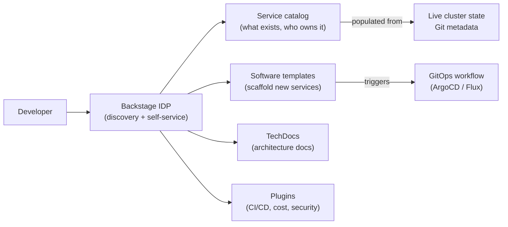
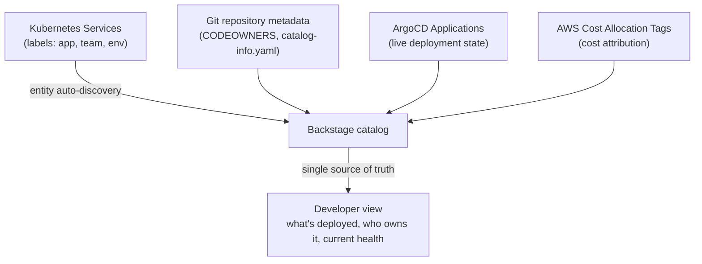

# Backstage and the Internal Developer Portal

## What Backstage actually is

Backstage is a frontend framework for building an internal developer portal (IDP) — a single interface for discovery, documentation, and self-service. It is not a platform itself; it is the interface that exposes the platform to developers.



## When Backstage is premature

Backstage is a framework, not a product. It requires engineering investment to configure, plugin selection and maintenance, custom catalog entity definitions, and ongoing operational overhead. **Below ~100 engineers**, this investment typically exceeds the productivity return:

- A small team with <10 services doesn't need catalog discovery — everyone knows what exists
- Template scaffolding is valuable only when there are enough new service creation events to justify the template maintenance overhead
- Backstage's plugin ecosystem is large but inconsistent in quality — evaluating and maintaining plugins is ongoing work

For smaller teams, a curated Git repository of starter templates + a wiki with service ownership is a lower-cost alternative that provides 80% of the value without the operational overhead.

At scale (50+ teams, 200+ services), the catalog becomes genuinely valuable for understanding what exists, who to contact, and what state production services are in.

## Catalog rot: the primary failure mode

The #1 Backstage failure mode is deploying it as a manually-populated documentation site. Manual catalog entries go stale within 6 months as teams rename services, change owners, or decommission systems without updating the catalog.

**Production catalog data must be auto-populated from authoritative sources:**



Require teams to commit a `catalog-info.yaml` to every service repository. Backstage auto-discovers entities from Git via the catalog ingestion engine — no manual entry needed.

```yaml
# catalog-info.yaml (in every service repo)
apiVersion: backstage.io/v1alpha1
kind: Component
metadata:
  name: payments-api
  description: Payment processing service
  annotations:
    github.com/project-slug: org/payments-api
    backstage.io/techdocs-ref: dir:.
    argocd/app-name: payments-api-prod
  tags: [payments, critical]
spec:
  type: service
  lifecycle: production
  owner: group:payments-team
  system: payments-platform
```

## Portal without workflow integration is documentation

A Backstage instance that shows what exists but doesn't trigger action is an expensive wiki. The value multiplier is workflow integration:

- **Software templates** that scaffold a new service repo AND create an ArgoCD Application AND register the catalog entity — all in one operation
- **CI/CD plugins** that surface current pipeline state without leaving Backstage
- **Cost plugins** that show per-service AWS spend directly on the catalog entity page

Without these integrations, developers click through Backstage, find what they need, then go to the actual tools to act on it — the portal becomes a navigation step that adds friction instead of removing it.

See [golden-path-templates.md](golden-path-templates.md) for template design that integrates with GitOps workflows.
See [service-catalog-design.md](service-catalog-design.md) for catalog entity design and ownership modeling.
