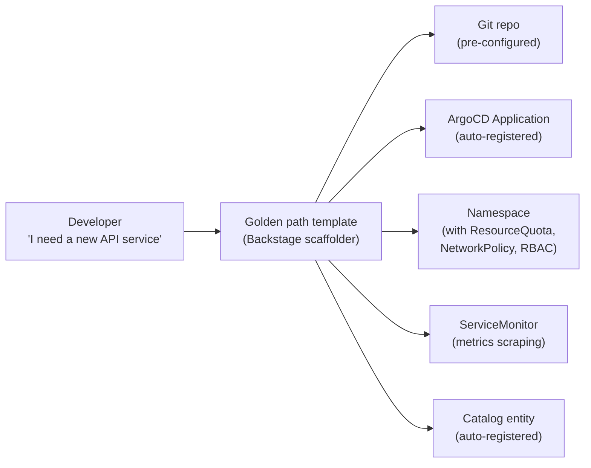

# Golden Path Templates

## What a golden path is

A golden path is an opinionated, pre-approved deployment blueprint that satisfies security, compliance, and operational requirements by default. Developers use it to create new services without making infrastructure decisions — the right choices are already embedded.

The goal is cognitive load reduction: a developer should be able to deploy a new service to production without understanding the details of RBAC configuration, resource limit tuning, observability setup, or network policy design.



Everything the platform team would configure manually for a new service is created automatically, consistently, and in compliance with organizational policy.

## What belongs in a good template

A template that only scaffolds application code misses the platform value. A production golden path template provisions the full platform footprint for a new service:

| Component | What the template provisions |
|---|---|
| Application code | Starter repo with Dockerfile, CI pipeline, pre-commit hooks |
| Kubernetes manifests | Deployment, Service, HPA with sane defaults |
| RBAC | ServiceAccount with least-privilege ClusterRole |
| Resource governance | ResourceQuota, LimitRange for the service namespace |
| Networking | NetworkPolicy allowing ingress from load balancer only |
| Observability | ServiceMonitor, structured logging config, trace context injection |
| ArgoCD | Application registered in the GitOps app-of-apps |
| Catalog | `catalog-info.yaml` committed to the repo |

A template that requires developers to configure these components themselves is not a golden path — it is a starting point that leaves infrastructure decisions to the developer.

## Helm vs Kustomize: complementary roles

These tools serve different purposes in the template ecosystem:

**Helm** is for **base packaging** — complex applications with conditional logic, chart dependencies, and reusable parameterization. Use Helm for:

- Platform components that are deployed across clusters (cert-manager, external-secrets, ArgoCD)
- Application base charts with many configurable parameters
- Charts sourced from upstream community repositories

**Kustomize** is for **last-mile customization** — patching an existing Helm chart or Kubernetes manifest to add environment-specific overlays without forking. Use Kustomize for:

- Injecting sidecars or annotations into upstream community charts
- Overriding specific values by environment (dev/staging/prod) without duplicating the full chart
- Applying organizational conventions (labels, resource limits) to third-party charts

### Production pattern: immutable Helm bases + Kustomize post-rendering

```yaml
# ArgoCD Application using Kustomize post-renderer over a Helm chart
apiVersion: argoproj.io/v1alpha1
kind: Application
spec:
  source:
    repoURL: https://charts.bitnami.com/bitnami
    chart: kafka
    targetRevision: 26.0.0
    helm:
      values: |
        replicaCount: 3
  # Kustomize patches applied after Helm render
  plugin:
    name: kustomize-post-renderer
```

This treats the upstream Helm chart as an immutable dependency. Organizational patches (adding SPIFFE annotations, injecting Istio labels) are applied via Kustomize without modifying the upstream chart — upgrades remain clean.

## Templates built without developer input get routed around

A golden path that doesn't match how developers actually work becomes an obstacle. Teams create workarounds — manually provisioning namespaces, bypassing the template, provisioning infrastructure outside the platform. This shadow IT:

- Violates security policies the template was designed to enforce
- Creates untracked infrastructure with no ownership
- Undermines the platform adoption metrics

The fix is involving developers early in template design. Run usability testing on new templates before publishing. Track template abandonment rates (started but not completed) as a leading indicator of poor fit.

## The drift trap: template updates don't propagate

A service deployed from a golden path 18 months ago is using the organizational knowledge that existed 18 months ago. Resource limits may no longer reflect current guidance. Security annotations may be outdated. NetworkPolicies may not account for new platform components.

**Strategies for managing template drift:**

1. **Stamp version labels**: add `platform.example.com/template-version: v2.1` to all resources provisioned by a template. Query clusters periodically to find services running old template versions.

2. **Notify-don't-enforce**: when a newer template version is available, surface it in Backstage as a non-blocking notification. Require teams to acknowledge or remediate within a defined window.

3. **Separate stable from volatile components**: split templates into "structural" (namespace, RBAC, ArgoCD Application — changes rarely) and "operational" (resource limits, security annotations — changes frequently). Platform-managed components can be pushed as ArgoCD-managed config; application-specific configuration stays in the team's repo.

See [backstage-and-developer-portal.md](backstage-and-developer-portal.md) for Backstage scaffolder integration.
See [platform-api-design.md](platform-api-design.md) for CRD-based abstractions that templates can provision.
See [../05-GitOps/app-of-apps-and-applicationsets.md](../05-GitOps/app-of-apps-and-applicationsets.md) for the ArgoCD ApplicationSet pattern that golden path templates register new services into.
