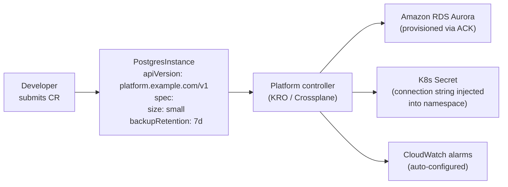
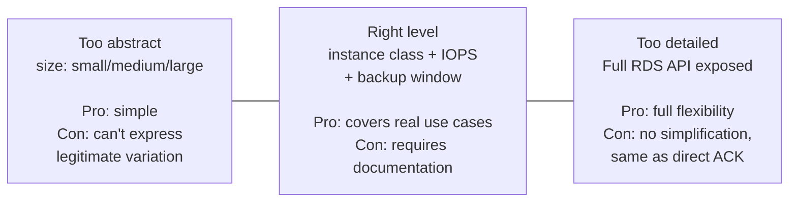

# Platform API Design

## CRDs as the platform API surface

Kubernetes Custom Resource Definitions (CRDs) provide a unified API for both workload configuration and cloud infrastructure provisioning. The platform team defines CRDs that abstract away implementation details — a developer submits a `PostgresInstance` CR; the platform controller provisions an RDS cluster, creates a Secret with connection details, and manages the lifecycle.



This model gives developers a simple, validated API. The complexity of ACK, IAM role provisioning, security group configuration, and monitoring setup is hidden inside the controller — developers don't need to understand it.

## KRO vs Crossplane: the decision

Both tools implement the CRD-as-platform-API pattern but with different philosophies.

| Dimension | KRO (ResourceGraphDefinitions) | Crossplane (XRDs) |
|---|---|---|
| Maturity | Beta — collaborative project by AWS, GCP, Azure | CNCF-graduated, production deployments since 2020 |
| Operational complexity | Low — YAML + CEL, no custom Go code required | High — complex provider architecture, large CRD footprint, high memory usage |
| Logic expression | CEL for field extraction and conditional rendering | Composition patches, transforms, and Go functions |
| Dependency ordering | Native DAG — auto-determines creation/deletion order | Manual with `readinessChecks` and `dependsOn` |
| Multi-cloud | AWS-centric (designed alongside ACK) | Full multi-cloud with 60+ providers |
| Best for | AWS-focused platforms prioritizing low operational overhead | Multi-cloud, complex compositions, organizations with senior Crossplane engineers |

**KRO (Kube Resource Orchestrator)** auto-generates lightweight per-ResourceGraphDefinition controllers. A KRO ResourceGraphDefinition (RGD) is a YAML document that maps a developer-facing schema to a set of underlying resources, with CEL expressions for conditional rendering and field extraction.

```yaml
apiVersion: kro.run/v1alpha1
kind: ResourceGraphDefinition
metadata:
  name: postgres-instance
spec:
  schema:
    apiVersion: platform.example.com/v1
    kind: PostgresInstance
    spec:
      size:
        type: string
        enum: [small, medium, large]
      backupRetention:
        type: integer
        default: 7
  resources:
  - id: rdsInstance
    template:
      apiVersion: rds.services.k8s.aws/v1alpha1
      kind: DBCluster
      spec:
        engine: aurora-postgresql
        # CEL: dynamic field based on developer input
        dbClusterInstanceClass: "${schema.spec.size == 'large' ? 'db.r6g.2xlarge' : 'db.r6g.large'}"
        backupRetentionPeriod: "${schema.spec.backupRetention}"
  - id: connectionSecret
    includeWhen:
    - "${rdsInstance.status.endpoint != ''}"    # only after RDS is ready
    template:
      apiVersion: v1
      kind: Secret
      ...
```

The `includeWhen` and `readyWhen` CEL expressions allow KRO to automatically determine the creation order (DAG) — it provisions resources in dependency order without the developer specifying it.

**Crossplane XRDs** are more powerful for multi-cloud compositions but require more operational investment:

```yaml
apiVersion: apiextensions.crossplane.io/v1
kind: CompositeResourceDefinition
metadata:
  name: xpostgresinstances.platform.example.com
spec:
  group: platform.example.com
  names:
    kind: XPostgresInstance
  versions:
  - name: v1alpha1
    schema:
      openAPIV3Schema:
        properties:
          spec:
            properties:
              size:
                type: string
```

Crossplane generates a CRD from the XRD definition, then a Composition maps claims to provider-specific resources (AWS RDS, GCP CloudSQL, Azure PostgreSQL). The composition model supports multi-cloud portability at the cost of significant complexity.

## Policy enforcement on platform CRDs

Both KRO and Crossplane require admission control to prevent misuse:

```yaml
# Kyverno: prevent duplicate S3 bucket names across namespaces
apiVersion: kyverno.io/v1
kind: ClusterPolicy
metadata:
  name: unique-s3-buckets
spec:
  validationFailureAction: Enforce
  rules:
  - name: check-bucket-name-unique
    match:
      resources:
        kinds: [S3Bucket]    # ACK S3 CRD
    validate:
      message: "S3 bucket name must be globally unique"
      deny:
        conditions:
        - key: "{{ request.object.spec.bucketName }}"
          operator: AnyIn
          # Check existing buckets across all namespaces
          value: "{{ request.object.spec.bucketName | ... }}"
```

Common policies on platform CRDs:
- **Naming conventions**: enforce `{team}-{service}-{env}` bucket names, RDS identifiers
- **Size caps**: prevent developers from requesting oversized instances without approval
- **Allowed regions**: prevent provisioning in non-compliant regions
- **Required labels**: enforce cost attribution and ownership tags on all provisioned resources

## Abstraction depth tradeoff

The platform API is a contract. Making it too simple hides necessary configuration; making it too detailed defeats the purpose of abstraction.



The right abstraction level covers 90% of use cases with a simple API. The remaining 10% of edge cases are handled by formal platform enhancement requests — not by leaking implementation details into the developer API.

See [../04-Security/iam-federation.md](../04-Security/iam-federation.md) for Pod Identity patterns used to grant platform controllers cloud provider access.
See [platform-as-a-product.md](platform-as-a-product.md) for managing the CRD API lifecycle as a product roadmap.
